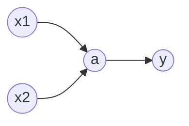

# 一、函数

> [!CAUTION]
>
> 已知 x 和 y 如何推导出函数的公式呢？

简单的我们可以一眼看出方程表达式，比如 x=[1,2,3,4],y=[2,4,6,8],这个我们一看就知道是 y=2x。但是有很多我们我发一眼看出来的，怎么办？

需要在坐标轴上标注这些点，然后设置函数表达式为 y=wx+b，我们只需要调整 w 和 b 的值就可以让这个函数逐渐趋近于 x 和 y 表示的点。

但是这个一直都是线性函数，会发现线性函数无法满足数据需要，这个时候就要将线性函数变更为非线性函数(比如平方 y=(wx+b)^2，三角函数 y=sin(wx+b)等等)。

> **激活函数**
>
> y=g(wx+b)
>
> f(x1,x2)=g(wx1+wx2+b)

为了满足函数需要，可以套娃 g(w3g(w1x1+w2x2+b)+b3),通过这种方式也可以无限逼近线性函数。

 **这就是一个简单的神经网络**

输入层，隐藏层和输出层可以无限增加扩展，变成一个复杂的神经网络。

> [!caution]
>
> **线性数据拟合**
>
> 我们先从线性函数开始。

线性函数的有时候不可能正好对应每个 （x,y）的点，这个时候需要判断拟合程度（当前线性函数和真实数据之间的差异）

\[
\sum_{i=1}^{N}|y_i-\hat{y_i}|
\]
就是真实点到线线函数点的距离绝对值求和。

这个就是拟合度，我们也叫做 **损失函数**。

但是由于绝对值在现实处理需要分各种情况，所以我们可以采用平方的方式来处理。
\[
\frac{1}{N}\sum_{i=1}^{N}(y_i-\hat{y_i})^2
\]
这个就是**均方误差**，这个就是损失函数的一种。

我们的目标就是让这个损失函数也就是误差最小来算出 w 和 b 的值。

现在我们举一个简单的例子：

> 数据：(1,1)(2,2)(3,3)(4,4)
>
> 线性模型：y=wx
>
> 那么损失函数就是: 
> \[
> \frac {1} {4}\left ( {\left ( {{y}_{1}-w{x}_{1}} \right )^2+({y}_{2}-w{x}_{2})^2+({y}_{3}-w{x}_{3})^2+({y}_{4}-w{x}_{4})} \right)^2
> \]
> 推导下来就是
> $$
> L(w) = \frac {1} {4}\left ( {\left ( {1-w1} \right )^2+(2-w2)^2+(3-w3)^2+(4-w4)^2} \right)
> $$
> 继续计算
> $$
> L(w) = 7.5 - 15w + 7.5w^2
> $$
> 求导
> $$
> L^{'}w=-15 + 15w
> $$
> 这个时候求导数的最小值 0 的时候
>
> w=1
>
> 所以线性函数就是 y=x

 

如果函数是:
$$
y = wx + b
$$
这个时候就不是对一个参数进行求导，多元函数就不只是求导数了，而是让每个参数的偏导数等于 0.
$$
\frac{\partial L(w,b)}{\partial w}=0
$$

$$
\frac{\partial L(w,b)}{\partial b}=0
$$

偏导数求解的时候是：

求 w 的让 b 变为一个常量

求 b 的让 w 变为一个常量

这个中不断测试 w 和 b 值的方式就 **线性回归**

> 不断测试就先假设一个 w 和 b 的值然后计算损失函数 L(w,b),使之调整为最小就是 w,b 的值。

> w变化一个值，使得 L(w,b)参数变化的值，就是求 w 的偏导数
> $$
> \frac{\partial L(w,b)}{\partial w}
> $$
> b 的变化也是一样，就是对 b 的偏导数

我们要做的就是要 w 和 b 不断向偏导数的反方向变化
$$
w=w-\frac{\partial L(w,b)}{\partial w} 
 , 
b=b-\frac{\partial L(w,b)}{\partial b}
$$
具体变化的快慢我们再增加一个系数 α 来表示，这个系数就是 **学习率**
$$
w=w-α \frac{\partial L(w,b)}{\partial w} 
 , 
b=b-α \frac{\partial L(w,b)}{\partial b}
$$
这些偏导数所构成的向量就叫做 **梯度**

不断变化 w 和 b 使得损失函数逐渐减小的过程求出 w 和 b 就叫做**梯度下降**

