# Jenkins 的 Docker 部署

## 一、什么是 Jenkins


> Jenkins is a self-contained, open source automation server which can be used to automate all sorts of tasks related to building, testing, and delivering or deploying software.(Jenkins是一个自成一体的开源自动化服务器，可用于自动化与构建、测试、交付或部署软件相关的各种任务。)
>
> Jenkins can be installed through native system packages, Docker, or even run standalone by any machine with a Java Runtime Environment (JRE) installed.(Jenkins可以通过本机系统包、Docker安装，甚至可以由任何安装了Java运行时环境（JRE）的机器独立运行。)

&emsp;&emsp;你是否为手动构建项目烦恼？你是否为手动项目部署烦恼？你是否为手动测试感到麻烦？……；没错 Jenkins 就是为解决你的各种问题和烦恼而来，它是一款开源的自动化服务器，操作简单、上手快。是一款不可多得的开发辅助工具。


&emsp;&emsp;**详细资料可以查看**[官网](https://www.jenkins.io)或者[中文官网](https://www.jenkins.io/zh/)。


## 二、为什么使用Jenkins

1. 持续集成 (CI) 和持续交付 (CD):
   Jenkins 可以自动检测代码库中的更改，并触发构建、测试和部署流程。
   这有助于尽早发现错误和问题，从而缩短修复时间。

2. 自动化流程:
   Jenkins 可以自动化常见的开发任务，如编译、测试、打包和部署。
   减少了手动执行这些任务的时间和出错的可能性。

3. 提高生产力:
   通过自动化常规任务，开发团队可以专注于编写高质量的代码。
   更快的反馈循环意味着更快的迭代速度和更短的开发周期。

4. 易于集成:
   Jenkins 支持大量的插件，可以很容易地与其他工具和服务集成。
   这些插件覆盖了从版本控制系统到测试框架、再到部署工具的各个方面。

5. 灵活性和可扩展性:
   Jenkins 是高度可配置的，并且可以通过安装插件来扩展其功能。
   可以根据项目需求定制工作流程和构建策略。

6. 强大的社区支持:
   Jenkins 拥有一个活跃的社区，提供了大量的文档、教程和支持资源。
   社区贡献了大量的插件和最佳实践案例。

7. 成本效益:
   Jenkins 是开源软件，免费使用。
   虽然可能需要一些初始设置成本，但长期来看可以节省大量的人力成本。

8. 安全性:
   Jenkins 提供了安全特性，比如访问控制和权限管理。
   可以设置不同的权限级别，确保只有授权的用户才能访问特定的功能。

9. 报告和可视化:
   Jenkins 提供了详细的构建报告和仪表板视图，帮助团队监控项目状态。
   可以查看构建历史、测试结果和其他重要指标。

10. 跨平台兼容性:
    Jenkins 可以在多种操作系统上运行，包括 Linux、macOS 和 Windows。
    这使得 Jenkins 成为一个非常灵活的选择，无论是在本地还是云端部署。

    

## 三、怎么使用 Jenkins（Docker）

&emsp;&emsp;个人更愿意使用 docker 来部署 jenkins，为什么呢？主要是因为便捷，jenkins 的 docker 镜像已经嵌入了环境功能，比如 java、git 等等，接下来看看怎么部署、配置、使用。

### (一)、docker 部署

#### 1、 下载jenkins的镜像

```
docker pull jenkins/jenkins:lts-jdk17
```

 &emsp;&emsp;由于我这边打包的项目使用的是jdk17，所以我就下载使用了这个版本的镜像，可以根据个人的需要在镜像仓库选择自己需要的镜像版本。

#### 2、准备

1. 这边采用了 docker-compose 进行编排部署，所以我们还需要准备 jenkins.yml 文件。

```yaml
version : '3.8'
services:
  jenkins:
    image: jenkins/jenkins:lts-jdk17
    container_name: jenkins
    restart: always
    user: root
    # 限制日志的大小
    logging:
      driver: json-file
      options:
        max-size: "100m"
        max-file: "5"
    ports:
      - "20000:8080"
    volumes:
      # 工具包
      - ./tool:/var/tool
      # jenkins的数据
      - ./data:/var/jenkins_home 
      # 时间同步
      - /etc/localtime:/etc/localtime 
```

2. 工具包 tool

   &emsp;&emsp;由于我的项目中使用了 maven ，node 等等，所以需要先去官网下载这些工具，然后映射到 docker 容器的内部进行配置。

#### 3、 启动

```shell
docker-compose -f jenkins.yml up -d
```

在启动的过程中管理密码会在日志中打印出来，所以查看日志的命令是：

```shell
docker logs -f -t -n 100 jenkins
```

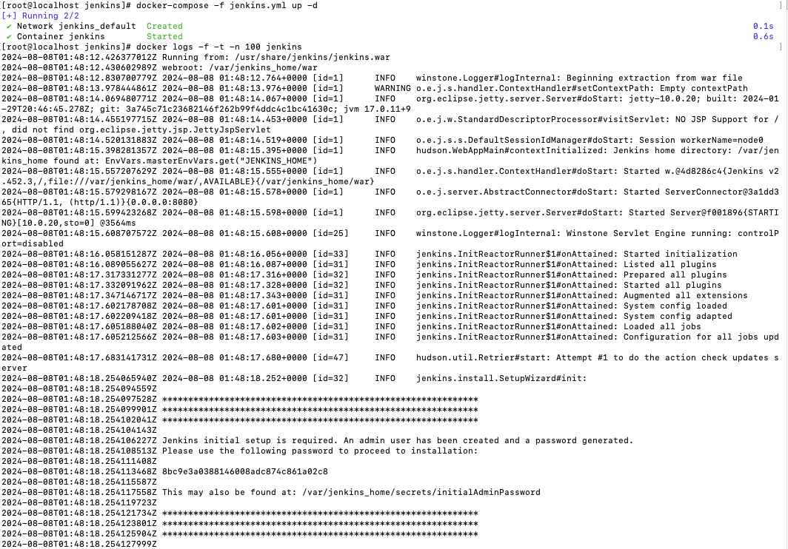

这个地方需要记住地下输出的密码串，这个密码串在管理员开始登陆的时候是需要使用的。


### (二)、jenkins 配置

#### 1、 打开

```
http://192.168.2.84:20000
```

&emsp;&emsp;通过 docker-compose 的配置我们可以看到，这个容器的端口就是 20000 ，我们部署的服务器 IP=192.168.2.84 ，个人可以根据跟人的服务器 IP 进行打开。


 #### 2、 插件配置

&emsp;&emsp;第一进入的时候，如果对jenkins不熟悉，建议使用推荐安装插件。

<div style="display: flex; align-items: center; justify-content: space-between;">
  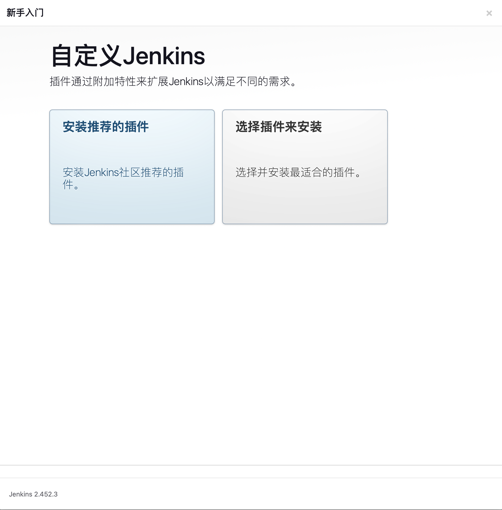
  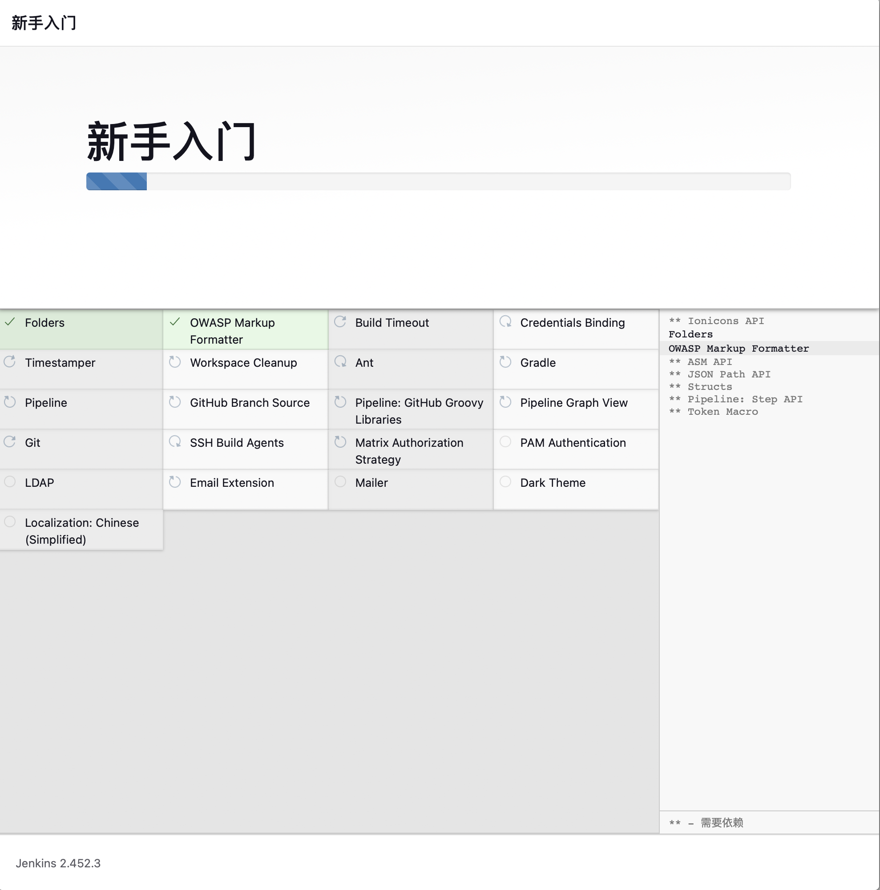
</div>


&emsp;&emsp;除了自动安装的插件，我们还需要自己安装一些需要使用的插件，插件安装的页面是：

```
Manager jenkins(系统管理) -> Plugins(插件管理) 
```


<div style="display: flex; align-items: center; justify-content: space-between;">
  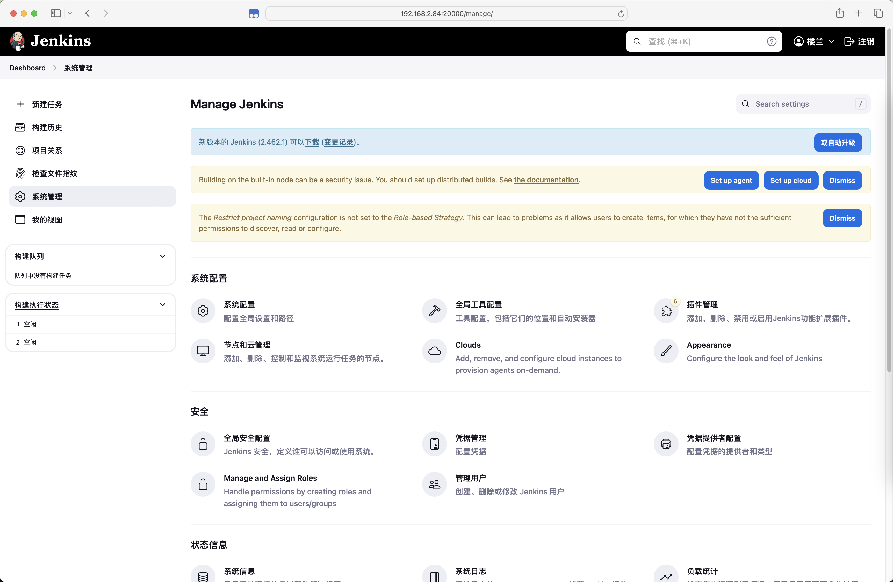
  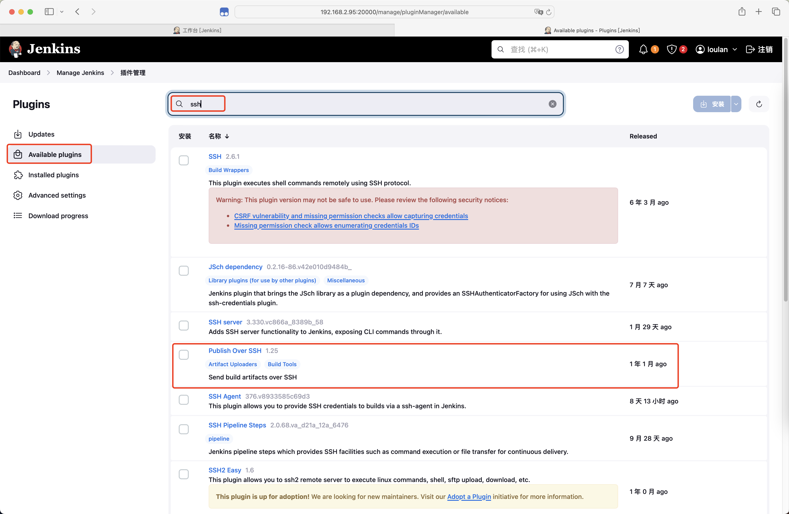
</div>


&emsp;&emsp;我们需要安装 ssh 的远程推送软件，有需要的可以安装 maven 插件(我才用的命令打包，所以没安装)，还可以安装本地语言插件，然后将界面进行汉化。


#### 3、系统配置

&emsp;&emsp;有些东西的使用需要我们进行配置，比如我们映射进来的 maven 和 node 是无法直接命令运行的，需要配置环境变量；还有远程 ssh 推送，需要配置 ssh 的服务器等等。

```
Manager jenkins(系统管理) -> 系统配置
```


<div style="display: flex; align-items: center; justify-content: space-between;">
  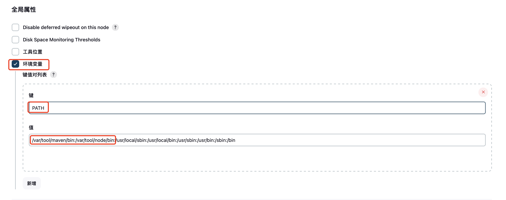
  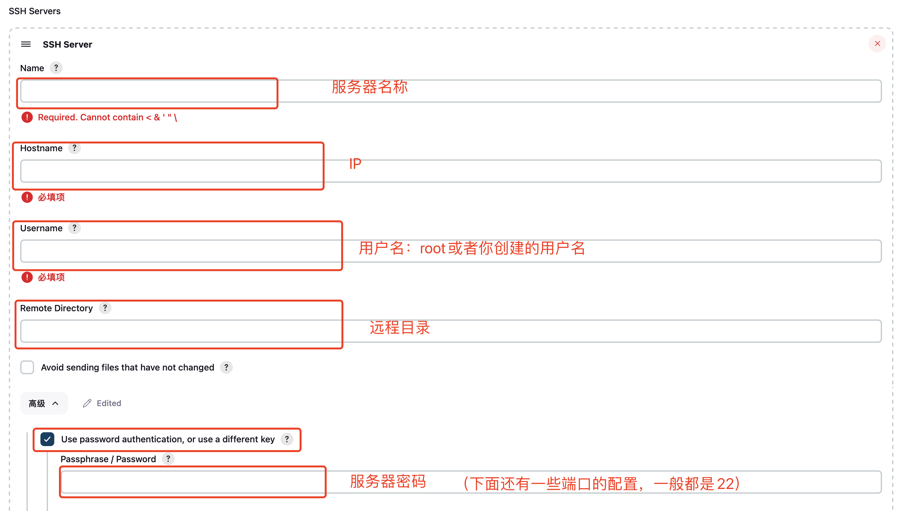
</div>


&emsp;&emsp;这里环境变量的配置就相当于我们 windows 的 PATH 的配置，配置了之后我们的 mvn、npm 等命令才可以使用。

&emsp;&emsp;项目都是在 jenkins 服务器上构建完成，但是构建完成之后我们需要将构建完成的包上传到指定的服务器才能使用，所以这里的 Push Over SSH 插件的配置就是干这个用的。


### (三)、自动化部署

#### 1、 新建任务

<div style="display: flex; align-items: center; justify-content: space-between;">
  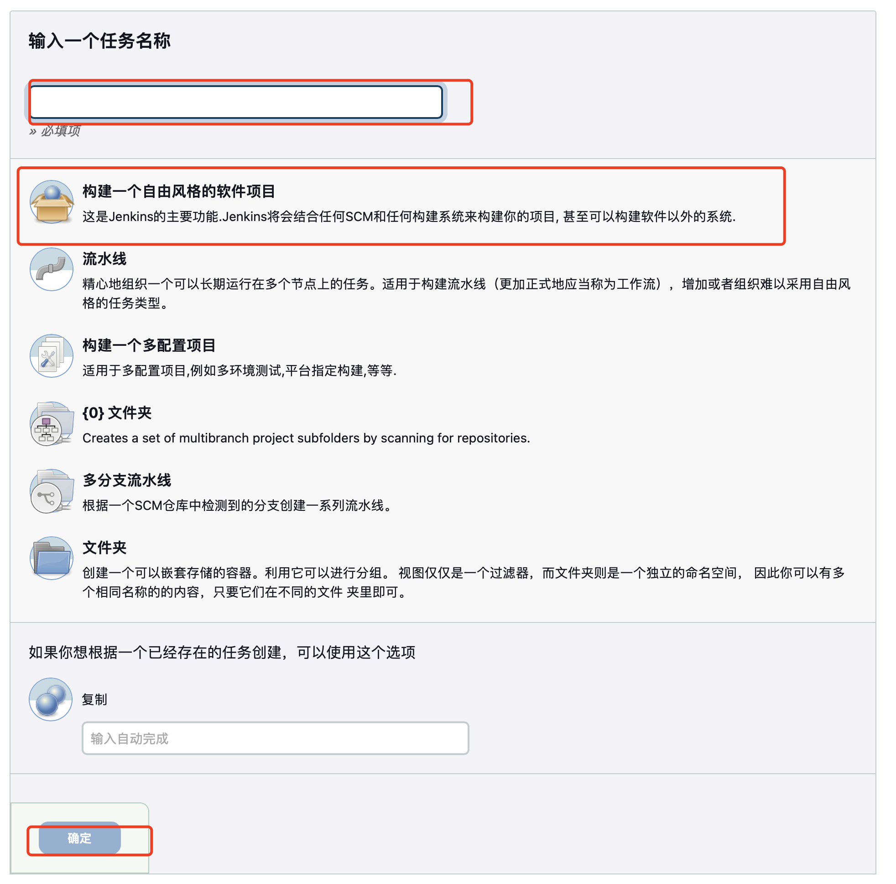
  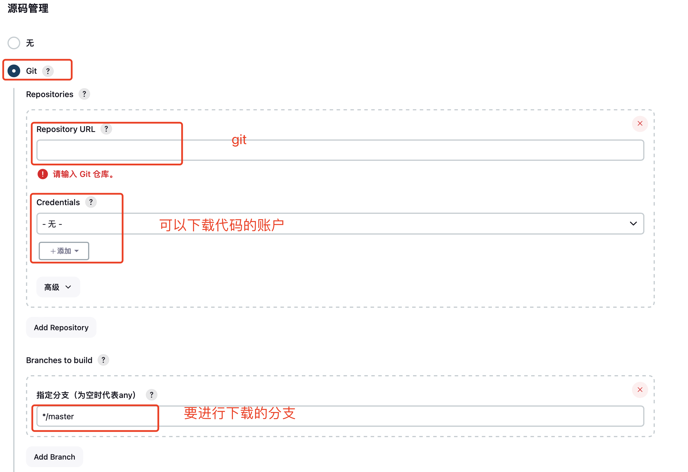
</div>

<div style="display: flex; align-items: center; justify-content: space-between;">
  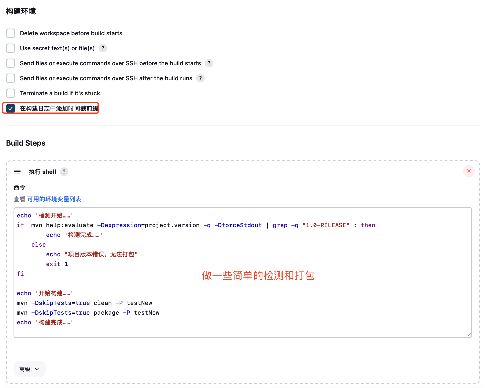
  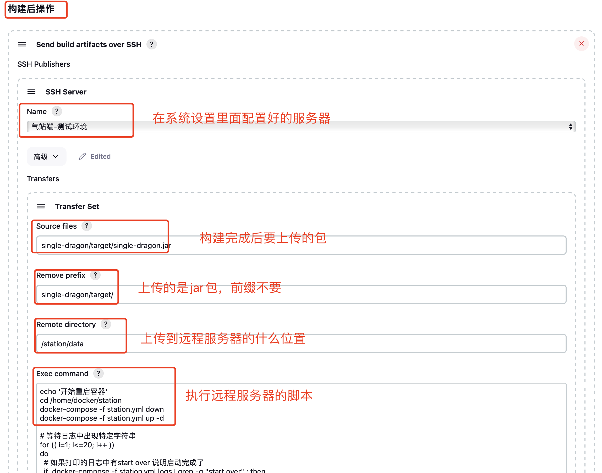
</div>


&emsp;&emsp;这个是构建一个简单的 java 的 maven 项目，构建脚本和构建后脚本如下:


**这个是构建脚本，先检查项目然后在使用 maven 命令进行构建**

```shell
echo '检测开始……'
if  mvn help:evaluate -Dexpression=project.version -q -DforceStdout | grep -q "1.0-RELEASE" ; then  
    	echo '检测完成……' 
	else
    	echo "项目版本错误，无法打包" 
    	exit 1
fi

echo '开始构建……'
mvn -DskipTests=true clean -P testNew
mvn -DskipTests=true package -P testNew
echo '构建完成……'
```


**这个是构建后项目 jar 包上传到远程服务器后需要执行的脚本命令**

```shell
echo '开始重启容器'
cd /home/docker/station
docker-compose -f station.yml down
docker-compose -f station.yml up -d

# 等待日志中出现特定字符串  
for (( i=1; I<=20; i++ ))  
do  
  # 如果打印的日志中有start over 说明启动完成了
  if  docker-compose -f station.yml logs | grep -q "start over" ; then  
    echo "容器即将完成，请稍等……"
    sleep 3  
    echo "启动成功"  
    exit 0  
  fi  
  echo "容器启动中……"
  sleep 3  # 每3秒检查一次  
done
echo "容器启动失败"
exit 1
```

&emsp;&emsp;该项目采用的是docker部署的，所以这里进行关闭和启动，并对启动的关键字进行了检查。这里可以进行更多的操作，比如可以在上传服务开始前先执行一个脚本，让其备份原来的 jar 包。


#### 2、启动任务

<div style="display: flex; align-items: center; justify-content: space-between;">
  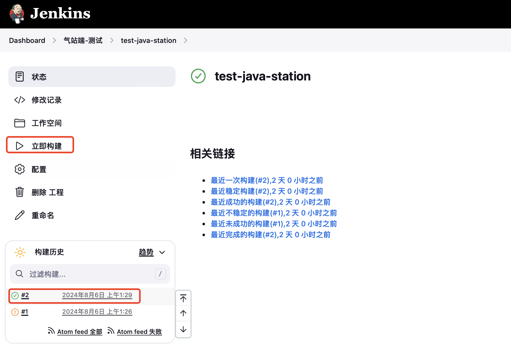
  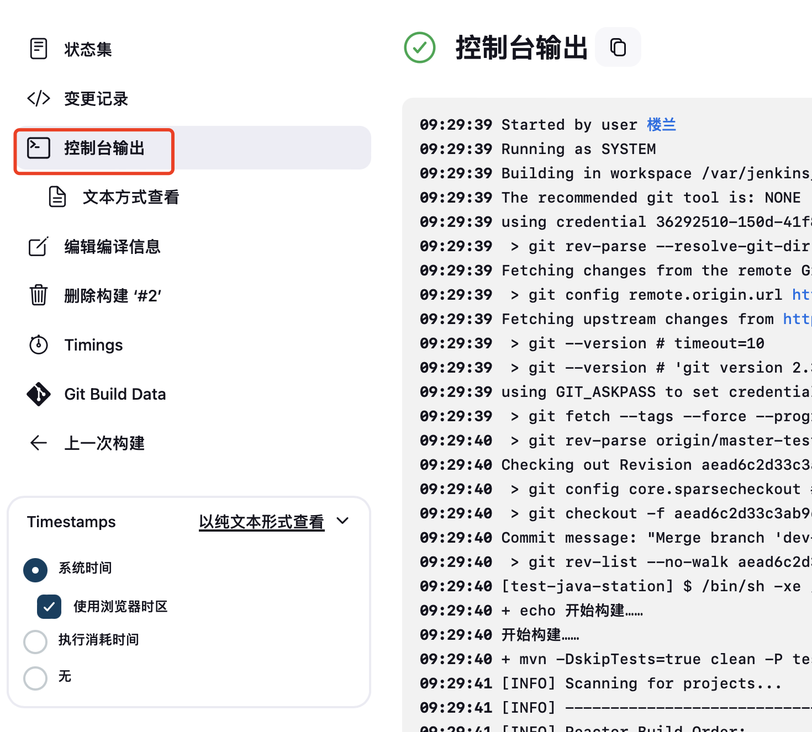
</div>


&emsp;&emsp;任务新建完成之后，我们就可以试试自动化部署的功能啦。如图所示我们可以看到构建日志，即使构建失败也能立马找到问题的所在。是不是比手动部署更酸爽。