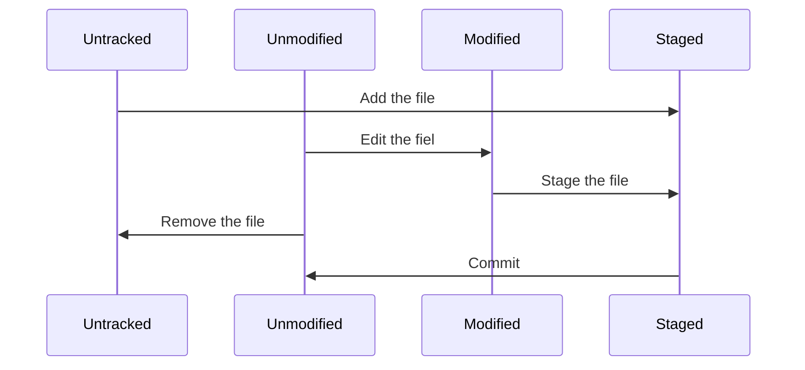

# Git基础

## 目录

[git init](#git init )

[git clone](#git clone  `<URl>`)

[git status](#git status)

[git add](#git add `<files>`)

[git diff](#git diff)

[git commit](#git commit )

[git rm](#git rm)

[git mv](#git mv)

[git log](#git log)

## 命令

#### 三种状态

>  现在请注意，如果你希望后面的学习更顺利，请记住下面这些关于 Git 的概念。 Git 有三种状态，你的文件可能处于其中之一： 已提交（committed）、已修改（modified） 和 已暂存（staged）。

- 已修改：表示修改了文件，但还没保存到数据库中。
- 已暂存：表示对一个已修改文件的当前版本做了标记，使之包含在下次提交的快照中。
- 已提交：表示数据已经安全地保存在本地数据库中


#### git文件状态变换周期




#### git init

> 该命令将创建一个名为 .git 的子目录，这个子目录含有你初始化的 Git 仓库中所有的必须文件，这些文件是 Git 仓库的骨干。 但是，在这个时候，我们仅仅是做了一个初始化的操作，你的项目里的文件还没有被跟踪


#### git clone  `<URl>`

> Git 克隆的是该 Git 仓库服务器上的几乎所有数据，而不是仅仅复制完成你的工作所需要文件。 当你执行 git clone 命令的时候，默认配置下远程 Git 仓库中的每一个文件的每一个版本都将被拉取下来

```shell
git clone https://github.com/loulangogogo/blog.git
```


#### git status

> 可以用 git status 命令查看哪些文件处于什么状态。


&emsp;&emsp;如果在克隆仓库后立即使用此命令，会看到类似这样的输出：

```shell
% git status
On branch main
Your branch is up to date with 'origin/main'.

nothing to commit, working tree clean
```

&emsp;&emsp;这说明你现在的工作目录相当干净。换句话说，所有已跟踪文件在上次提交后都未被更改过。 此外，上面的信息还表明，当前目录下没有出现任何处于未跟踪状态的新文件，否则 Git 会在这里列出来。 最后，该命令还显示了当前所在分支，并告诉你这个分支同远程服务器上对应的分支没有偏离。 现在，分支名是 “main”，这是默认的分支名。


&emsp;&emsp;如何你在项目下创建一个新的文件，并使用命令查看状态

```shel
% echo 'Hello World' > test.md
% git status
On branch main
Your branch is up to date with 'origin/main'.

Untracked files:
  (use "git add <file>..." to include in what will be committed)
	test.md

nothing added to commit but untracked files present (use "git add" to track)
```

&emsp;&emsp;从输出中可以看到 Untracked files 下多了一个 test.md 文件，未跟踪的文件意味着 Git 在之前的快照（提交）中没有这些文件；Git 不会自动将之纳入跟踪范围，除非你明明白白地告诉它“我需要跟踪该文件”。 这样的处理让你不必担心将生成的二进制文件或其它不想被跟踪的文件包含进来。


> **git status 命令的输出十分详细，但其用语有些繁琐。 Git 有一个选项可以帮你缩短状态命令的输出，这样可以以简洁的方式查看更改。 如果你使用 git status -s 命令或 git status --short 命令，你将得到一种格式更为紧凑的输出。**

```shell
% git status -s
?? test.md
```

&emsp;&emsp;新添加的未跟踪文件前面有 ?? 标记，新添加到暂存区中的文件前面有 A 标记，修改过的文件前面有 M 标记。 输出中有两栏，左栏指明了暂存区的状态，右栏指明了工作区的状态。


#### git add `<files>`

> 使用命令 git add 开始跟踪一个文件。
>
>  git add 命令使用文件或目录的路径作为参数；如果参数是目录的路径，该命令将递归地跟踪该目录下的所有文件。

```shell
% git add test.md
% git status
On branch main
Your branch is up to date with 'origin/main'.

Changes to be committed:
  (use "git restore --staged <file>..." to unstage)
	new file:   test.md

% git status -s
A  test.md
```

&emsp;&emsp;只要在 Changes to be committed 这行下面的，就说明是已暂存状态。 如果此时提交，那么该文件在你运行 git add 时的版本将被留存在后续的历史记录中。 


&emsp;&emsp;如果修改了文件就会出现下面的情况：

```shell
% echo "niyhao" > test.md
% git status
On branch main
Your branch is up to date with 'origin/main'.

Changes to be committed:
  (use "git restore --staged <file>..." to unstage)
	new file:   test.md

Changes not staged for commit:
  (use "git add <file>..." to update what will be committed)
  (use "git restore <file>..." to discard changes in working directory)
	modified:   test.md

% git status -s
AM test.md

```

&emsp;&emsp;怎么回事？ 现在 test 文件同时出现在暂存区和非暂存区。 这怎么可能呢？ 好吧，实际上 Git 只不过暂存了你运行 git add 命令时的版本。 如果你现在提交，test 的版本是你最后一次运行 git add 命令时的那个版本，而不是你运行 git commit 时，在工作目录中的当前版本。 所以，运行了 git add 之后又作了修订的文件，需要重新运行 git add 把最新版本重新暂存起来：

```shell
% git add test.md
% git status -s
A  test.md
```

#### git diff

> 如果 git status 命令的输出对于你来说过于简略，而你想知道具体修改了什么地方，可以用 git diff 命令。

```shell
# 此命令比较的是工作目录中当前文件和暂存区域快照之间的差异。
git diff

# 这条命令将比对已暂存文件与最后一次提交的文件差异
git diff --staged

# 和 --staged是一样的
git diff --cached
```


&emsp;&emsp;查看已经执行完 git add 之后文件的状态

```shell
% git status -s
A  test.md
% git diff
% git diff --staged
diff --git a/test.md b/test.md
new file mode 100644
index 0000000..9daeafb
--- /dev/null
+++ b/test.md
@@ -0,0 +1 @@
+test
```

&emsp;&emsp;从这里可以看到当前所有文件已经进入暂存，所以 git diff 命令之后没有任何的输出，但是由于文件没有提交，所以 git diff --staged 输出的是已暂存文件与最后一次提交的文件差异(没有提交过)。现在我们修改一下文件（就会有未进入暂存的）：

```shell
% echo "hello" > test.md

% git status -s
AM test.md

% git diff
diff --git a/test.md b/test.md
index 9daeafb..ce01362 100644
--- a/test.md
+++ b/test.md
@@ -1 +1 @@
-test
+hello

% git diff --staged
diff --git a/test.md b/test.md
new file mode 100644
index 0000000..9daeafb
--- /dev/null
+++ b/test.md
@@ -0,0 +1 @@
+test
```

&emsp;&emsp;从这里可以看出，有未进入暂存的使用 git diff 就会显示出来差异。


#### git commit 

> 提交时记录的是放在暂存区域的快照。 任何还未暂存文件的仍然保持已修改状态，可以在下次提交时纳入版本管理。 每一次运行提交操作，都是对你项目作一次快照，以后可以回到这个状态，或者进行比较。

```shell
git commit -m "提交信息"
```


&emsp;&emsp;通过这种方式提交的内容，只是已经进入暂存区的内容会被进行提交，没有进入暂存区的内容是不会被提交的。那么有没有可以直接将未进入暂存区的内容能够一块提交的操作（毕竟 git add 命令操作还是比较麻烦的），答案是：有的。

&emsp;&emsp;给 git commit 加上 -a 选项，Git 就会自动把所有**已经跟踪过**的文件暂存起来一并提交，从而跳过 git add 步骤：

```shell
git commit -a -m "提交信息"
```


```shell
% git status -s
 M test.md
A  test2.md
?? test3.md
# 从这里可以看到，test.md 属于修改过、未进入暂存、跟踪过；test2.md 属于未修改，进入暂存、跟踪过；test3.md 属于未跟踪过的

% git commit -a -m "测试"
[main 80ae6ec] 测试
 2 files changed, 2 insertions(+), 1 deletion(-)
 create mode 100644 test2.md
 
% git status -s
?? test3.md
```

&emsp;&emsp;**从最后的结果可以看出，只要跟踪过的文件都可以直接进行提交，但是没有跟踪过的文件是不会被提交的。**

---

**有时候发现提交内容缺了一部分内容或者，信息写错了，那么 --amend 可以重新提交。**

> git commit --amend

&emsp;&emsp;这个命令会将暂存区中的文件提交。 如果自上次提交以来你还未做任何修改（例如，在上次提交后马上执行了此命令）， 那么快照会保持不变，而你所修改的只是提交信息。

```shell
% git log -2
commit a7bdbf97a2592f1c3b6865391600c8d149aea3fc (HEAD -> main)
Author: loulan <loulangogogo@163.com>
Date:   Wed Aug 14 10:18:48 2024 +0800

    test2

commit 04a746488b64a4eae99943ab58b4bde87f19eaa8
Author: loulan <loulangogogo@163.com>
Date:   Wed Aug 14 10:18:20 2024 +0800

    内容添加

% git commit --amend -m "test3"
[main fb379f6] test3
 Date: Wed Aug 14 10:18:48 2024 +0800
 1 file changed, 1 insertion(+)
 create mode 100644 test.md

% git log -2
commit fb379f6287e2150f3e535cb41fe96af38b8c505a (HEAD -> main)
Author: loulan <loulangogogo@163.com>
Date:   Wed Aug 14 10:18:48 2024 +0800

    test3

commit 04a746488b64a4eae99943ab58b4bde87f19eaa8
Author: loulan <loulangogogo@163.com>
Date:   Wed Aug 14 10:18:20 2024 +0800

    内容添加
```

&emsp;&emsp;通过该案例可以看出，一开存在提交的版本快照为 test2 但是执行 --amend 命令之后，test2 变更为了 test3。**在修补最后的提交时，与其说是修复旧提交，倒不如说是完全用一个 新的提交 替换旧的提交， 理解这一点非常重要。从效果上来说，就像是旧有的提交从未存在过一样，它并不会出现在仓库的历史中。**


#### git rm

> 要从 Git 中移除某个文件，就必须要从已跟踪文件清单中移除（确切地说，是从暂存区域移除），然后提交。 可以用 git rm 命令完成此项工作，并连带从工作目录中删除指定的文件，这样以后就不会出现在未跟踪文件清单中了。

> **git rm `<files>`**

```shell
% git rm test.md
rm 'test.md'

% git status -s
D  test.md

% git commit -m "删除"
[main 09c9a20] 删除
 2 files changed, 2 deletions(-)
 delete mode 100644 test.md
```


&emsp;&emsp;如果要删除之前修改过或已经放到暂存区的文件，则必须使用强制删除选项 **-f**（译注：即 force 的首字母）。 这是一种安全特性，用于防止误删尚未添加到快照的数据，这样的数据不能被 Git 恢复。

> **git rm -f  `<files>`**

```shell
% git status -s
A  test.md

% git rm test.md
error: the following file has changes staged in the index:
    test.md
(use --cached to keep the file, or -f to force removal)
# 这是一个进入暂存的文件，执行删除的之后发生了错误

% git rm -f test.md
rm 'test.md'
# 添加 -f 之后成功删除
```


&emsp;&emsp;我们想把文件从 Git 仓库中删除（亦即从暂存区域移除），但仍然希望保留在当前工作目录中。 换句话说，你想让文件保留在磁盘，但是并不想让 Git 继续跟踪。为达到这一目的，使用 **--cached** 选项：

> **gir rm --cached `<files>`**

```shell
% git rm --cached test.md
rm 'test.md'

% git status -s
D  test.md
?? test.md

% git commit -m "删除暂存文件"
[main be6ece6] 删除暂存文件
 1 file changed, 1 deletion(-)
 delete mode 100644 test.md

% git status -s
?? test.md
```

&emsp;&emsp;从中可以看出，这种方式的删除只是从 git 暂存区中删除了这个文件，但是这个磁盘上的文件还是存在的。**这种方式的删除很多时候用在不小心将不该跟踪的文件进行了添加跟踪。**


```shell
git rm *.log
```


#### git mv

> 不像其它的 VCS 系统，Git 并不显式跟踪文件移动操作。 如果在 Git 中重命名了某个文件，仓库中存储的元数据并不会体现出这是一次改名操作。

```shell
git mv test.md test.json
```

运行这个命令相当于执行了下面三条命令：

```shell
mv test.md test.json
git rm test.md
git add test.json
```


执行案例：

```shell
% git status -s
 M test.md

% git mv test.md test.json

% git status -s
RM test.md -> test.json

% git commit -a -m "ceshi"
[main 373c2da] ceshi
 2 files changed, 1 insertion(+), 1 deletion(-)
 create mode 100644 test.json
 delete mode 100644 test.md
```


#### git log

> 在提交了若干更新，又或者克隆了某个项目之后，你也许想回顾下提交历史。 完成这个任务最简单而又有效的工具是 git log 命令。

```shell
# -2 表死显示日志条目的数量
git log -2

# -p 或 --patch ，它会显示每次提交所引入的差异（按 补丁 的格式输出）。 除了显示基本信息之外，还附带了每次提交的变化。 当进行代码审查，或者快速浏览某个搭档的提交所带来的变化的时候，这个参数就非常有用了
git log -p

# --stat 选项在每次提交的下面列出所有被修改过的文件、有多少文件被修改了以及被修改过的文件的哪些行被移除或是添加了。 在每次提交的最后还有一个总结。
git log --stat

# -pretty。 这个选项可以使用不同于默认格式的方式展示提交历史。 这个选项有一些内建的子选项供你使用。 比如 oneline 会将每个提交放在一行显示，在浏览大量的提交时非常有用。 另外还有 short，full 和 fuller 选项，它们展示信息的格式基本一致，但是详尽程度不一。
# format ，可以定制记录的显示格式。
git log --pretty=online
git log --pretty=short
git log --pretty=full
git log --pretty=format:"%h - %an, %ar : %s"

# --author 选项显示指定作者的提交。
# --grep 选项搜索提交说明中的关键字。
# --since 和 --until 这种按照时间作限制的选项很有用
```


#### git checkout

> git checkout — <file> 是一个危险的命令。 你对那个文件在本地的任何修改都会消失——Git 会用最近提交的版本覆盖掉它。 除非你确实清楚不想要对那个文件的本地修改了，否则请不要使用这个命令。
