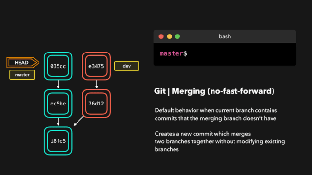

## Fetching

## Pulling

## 合并（merge）

> Fast-forward (—ff)

> No-fast-foward (—no-ff)

## 合并冲突（merge）

## 变基（rebase）

## 交互式变基（rebase）

## 软重置（reset）

## 硬重置（reset）

## 还原（revert）

## 拣选（cherry-pick）

## Reflog

