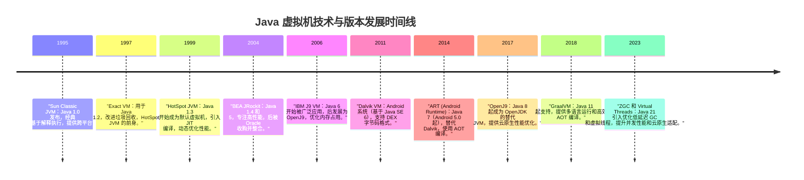

## 第一章 走近 Java

### 1.2 Java 技术体系

> Kotlin、Clojure、JRuby、Groovy 等都是运行在 Java 虚拟机上的编程语言。
>
> JDK = Java设计语言 + JVM + Java类库

- Java Card: 支持 Java 程序运行在小内存设备上的平台。
- Java Me：支持 Java 程序运行在移动终端上的平台。
- Java SE：支持面向桌面级应用的平台。这条产品线在 JDK 6 以前被称为 J2SE。
- Java EE：支持使用多层架构的企业应用的 Java 平台。这条产品线在 JDK 6 以前被称为 J2EE。在 JDK 10 以后被 Oracle 放弃，捐献给了 Eclipse 基金会管理，此后被称为 Jakarta EE。

### 1.3 Java 发展史

```mermaid
timeline
    title Java 发展史时间线 (详细版)

    1991 : "Java 语言诞生，James Gosling 在 Sun Microsystems 开始 Green Project"
    1995 : "发布 Java 1.0，初步定义跨平台特性，Java Applet 引入"
    1996 : "JDK 1.1 发布，引入 JDBC 和 RMI，改进内存管理"
    1997 : "Java 2 (JDK 1.2) 发布，Java SE/EE/ME 划分，Swing 和集合框架引入"
    1998 : "Java 2 继续发展，发布 J2EE，推动企业级开发"
    2004 : "Java 5 (JDK 1.5) 发布，支持泛型、枚举、自动装箱、注解"
    2006 : "Java 6 (JDK 1.6) 发布，增强 Web 服务支持和脚本语言支持"
    2009 : "Oracle 收购 Sun Microsystems，Java 进入新阶段"
    2011 : "Java 7 发布，引入 try-with-resources、NIO 2、Fork/Join 框架"
    2014 : "Java 8 发布，Lambda 表达式、Stream API 和 java.time 时间 API 引入"
    2017 : "Java 9 发布，模块化系统 (Project Jigsaw)，引入 JShell"
    2018 : "Java 10 发布，引入本地变量类型推断 (var) 和 AppCDS"
    2018 : "Java 11 发布 (LTS)，标准化 HTTP 客户端 API，移除 Java Web Start 和 Applet"
    2019 : "Java 12 发布，Shenandoah 垃圾回收器，Switch 表达式预览"
    2019 : "Java 13 发布，文本块 (Text Blocks)，增强动态归档类数据共享"
    2020 : "Java 14 发布，Switch 表达式正式启用，记录类型预览"
    2020 : "Java 15 发布，Sealed Classes 预览，改进 ZGC 垃圾回收"
    2021 : "Java 16 发布，正式支持 Records，改进封装 API"
    2021 : "Java 17 发布 (LTS)，支持 Sealed Classes 和 Pattern Matching"
    2022 : "Java 18 发布，新增简单 Web 服务器，UTF-8 默认字符集"
    2022 : "Java 19 发布，虚拟线程 (Virtual Threads) 预览，结构化并发 API"
    2023 : "Java 20 发布，虚拟线程和模式匹配继续优化"
    2023 : "Java 21 发布 (LTS)，虚拟线程和模式匹配正式支持"
    2024 : "Java 22 发布，继续性能优化和支持云原生应用"
```

### 1.4 Java 虚拟机家族

