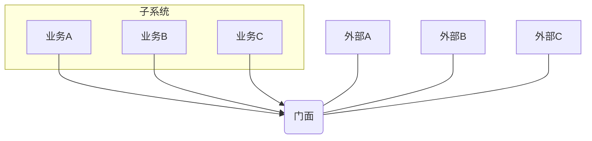

# 结构型-门面模式

## 什么是门面模式

> Provide a unified interface to a set of interfaces in a subsystem.Facade defines a higher-level interface that makes the subsystem easier to use.（要求一个子系统的外部与其内部的通信必须通过一个统一的对象进行。门面模式提供一个高层次的接口，使得子系统更易于使用。）

门面模式（Facade Pattern）也叫做**外观模式**，是一种比较常用的封装模式。

&emsp;&emsp;**简单地说，门面对象是外界访问子系统内部的唯一通道，不管子系统内部是多么杂乱无章，只要有门面对象在，就可以做到“金玉其外，败絮其中”。**


```java
package io.github.loulangogogo.test09;

/*********************************************************
 ** 测试门面模式
 ** <br><br>
 ** Date: Created in 2024/8/16 09:10
 ** @author loulan
 ** @version 0.0.0
 *********************************************************/
public class TestMM {
    public static void main(String[] args) {
        Facade facade = new Facade();
        facade.doSomethingA();
        facade.doSomethingB();
        facade.doSomethingC();
    }
}

/**
 * 门面对象类
 * @param
 * @return
 * @exception
 * @author     :loulan
 * */
class Facade{
    private A a;
    private B b;
    private C c;

    public Facade(){
        a = new A();
        b = new B();
        c = new C();
    }

    public void doSomethingA(){
        a.doSomethingA();
    }

    public void doSomethingB(){
        b.doSomethingB();
    }

    public void doSomethingC(){
        c.doSomethingC();
    }
}


class A{
    public void doSomethingA(){
        System.out.println("A");
    }
}

class B{
    public void doSomethingB(){
        System.out.println("B");
    }
}

class C{
    public void doSomethingC(){
        System.out.println("C");
    }
}

```





## 为什么使用门面模式

- **减少系统的相互依赖**
  想想看，如果我们不使用门面模式，外界访问直接深入到子系统内部，相互之间是一种强耦合关系，你死我就死，你活我才能活，这样的强依赖是系统设计所不能接受的，门面模式的出现就很好地解决了该问题，所有的依赖都是对门面对象的依赖，与子系统无关。
- **提高了灵活性**
  依赖减少了，灵活性自然提高了。不管子系统内部如何变化，只要不影响到门面对象，任你自由活动。
- **提高安全性**
  想让你访问子系统的哪些业务就开通哪些逻辑，不在门面上开通的方法，你休想访问到。

## 怎么使用门面模式

- 为一个复杂的模块或子系统提供一个供外界访问的接口
- 子系统相对独立——外界对子系统的访问只要黑箱操作即可
  比如利息的计算问题，没有深厚的业务知识和扎实的技术水平是不可能开发出该子系统的，但是对于使用该系统的开发人员来说，他需要做的就是输入金额以及存期，其他的都不用关心，返回的结果就是利息，这时候，门面模式是非使用不可了。
- 预防低水平人员带来的风险扩散
  比如一个低水平的技术人员参与项目开发，为降低个人代码质量对整体项目的影响风险，一般的做法是“画地为牢”，只能在指定的子系统中开发，然后再提供门面接口进行访问操作。

---

> 1. 一个子系统可以有多个门面：当需要提供给外界访问的系统需要多个门面的时候
> 2. 门面不参与子系统的业务逻辑