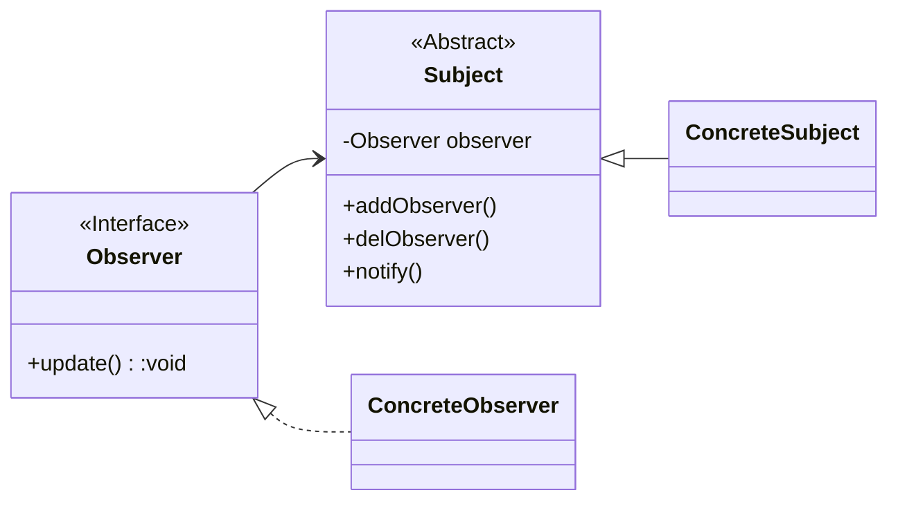

# 行为型-观察者模式

## 什么是观察者模式

> 观察者模式（Observer Pattern）也叫做发布订阅模式（Publish/subscribe）,它是一个在项目中经常使用的模式，其定义如下：
> Define a one-to-many dependency between objects so that when one object changes state,all its dependents are notified and updated automatically.（定义对象间一种一对多的依赖关系，使得每当一个对象改变状态，则所有依赖于它的对象都会得到通知并被自动更新。


**说白了就是被观察者的每个操作都发个消息给观察者。**





```java
package io.github.loulangogogo.test11;

import java.util.Vector;

/*********************************************************
 ** 测试观察者模式
 **
 ** @author loulan
 ** @since 8
 *********************************************************/
public class TestGCZ {
    public static void main(String[] args) {
        ConcreteSubject subject = new ConcreteSubject();

        Observer observer = new ConcreteObserver();
        subject.addObserver(observer);
        subject.doSomething();
    }
}

/*********************************************************
 ** 具体被观察者
 **
 ** @author loulan
 ** @since 8
 *********************************************************/
class ConcreteSubject extends Subject {

    public void doSomething() {
        // 业务代码
        super.notify("业务代码执行");
    }
}

/*********************************************************
 ** 被观察者抽象类
 **
 ** @author loulan
 ** @since 8
 *********************************************************/
abstract class Subject {
    private Vector<Observer> observers = new Vector<>();

    // 添加观察者
    public void addObserver(Observer observer) {
        observers.add(observer);
    }
    // 删除观察者
    public void delObserver(Observer observer) {
        observers.remove(observer);
    }
    // 通知观察者
    public void notify(String msg) {
        for (Observer observer : observers) {
            observer.update(msg);
        }
    }
}

/*********************************************************
 ** 具体观察者
 **
 ** @author loulan
 ** @since 8
 *********************************************************/
class ConcreteObserver implements Observer {

    @Override
    public void update(String msg) {
        System.out.println("观察者收到消息：" + msg);
    }
}

/*********************************************************
 ** 观察者接口
 **
 ** @author loulan
 ** @since 8
 *********************************************************/
interface Observer {
    void update(String msg);
}
```


## 为什么使用观察者模式

-  观察者和被观察者之间是抽象耦合
  如此设计，则不管是增加观察者还是被观察者都非常容易扩展，而且在Java中都已经实现的抽象层级的定义，在系统扩展方面更是得心应手。
- 建立一套触发机制
  根据单一职责原则，每个类的职责是单一的，那么怎么把各个单一的职责串联成真实世界的复杂的逻辑关系呢？比如，我们去打猎，打死了一只母鹿，母鹿有三个幼崽，因失去了母鹿而饿死，尸体又被两只秃鹰争抢，因分配不均，秃鹰开始斗殴，然后羸弱的秃鹰死掉，生存下来的秃鹰，则因此扩大了地盘……这就是一个触发机制，形成了一个触发链。观察者模式可以完美地实现这里的链条形式。


## 怎么使用观察者模式

- 关联行为场景。需要注意的是，关联行为是可拆分的，而不是“组合”关系。
- 事件多级触发场景。
- 跨系统的消息交换场景，如消息队列的处理机制。


> JDK 本身是存在 观察者接口 和 被观察者接口的：
>
> 观察者： **java.util.Observer**
>
> 被观察者： **java.util.Observable**
>
> 但是这两个接口在 JDK9 的时候被标记为弃用。理由如下：
>
> **Observable和Observer接口已弃用。观察者和可观察对象支持的事件模型是非常有限的，可观察对象传递通知的顺序是未指定的，状态变化也不是与通知一对一对应的。对于更丰富的事件模型，请考虑使用java。bean包。对于线程间可靠和有序的消息传递，请考虑使用java.util.concurrent包中的一种并发数据结构。有关响应式流风格的编程，请参阅java.util.concurrent.Flow API。**