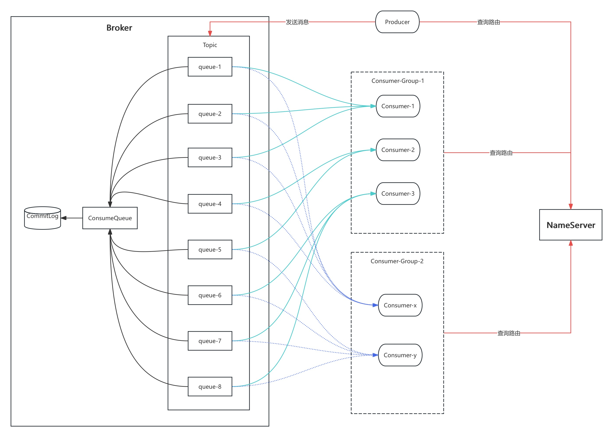
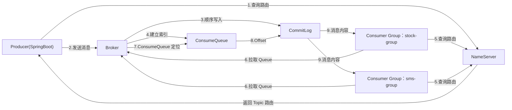

# 一、RocketMQ整体架构



## （一）部署重要的两个部分

> **NameServer**
>
> - 类似于“注册中心”或“服务发现中心”，就是电话本，记录着 broker 的地址。
> - 生产建议 2-4 个

> **Broker**
>
> - RocketMQ的消息服务器，存储中心，消息存储在这里
> - 布置多个相当于互为备份的存储
> - 作用
>   - 保存消息
>   - 创建 topic
>   - 创建 queue
>   - 接受 producer 的消息
>   - 给 consumer 提供消息
>   - 消息重试
>   - 死信队列
>   - 消费进度管理
>   - 主从同步
> - 也就是说 RocketMQ 的主要功能基本全在 Broker

## （二）生产者于消费者

> **Producer**
>
> - 这个是 java、python 等创建的生产者，用于生成消息
> - 生产者会向 topic 发送消息（topic 不存在会自动创建）
> - 所有的生产者必须有生产分组（据统计 90% 的生产消息都是普通消息，生产分组并不重要）
>
> **producer.group**
>
> - 生产者分组
>
> - 普通消息都使用不到。(应用过程中 90% 的应用都是普通消息)
>
> - 生产分组最重要的应用在**事务消息**
>
> - 主要是在事务消息中标识同一类的业务消息，用于事务检查和故障恢复
>
>   - 先发送**半消息（Half Message）**。
>   - Broker 收到后**不会投递**给 Consumer。
>   - Producer 执行本地事务（例如数据库插入）。
>   - 成功就 Commit，失败就 Rollback。
>   - 如果 Broker 一直没收到结果，就会回查 Producer。
>
>   ```java
>   // 发送事务消息
>   rocketMQTemplate.sendMessageInTransaction();
>   //-------------------------------------------------
>   @Component
>   @RocketMQTransactionListener(
>           txProducerGroup = "order-producer-group"
>   )
>   public class OrderTransactionListener
>           implements RocketMQLocalTransactionListener {
>     	// broker 收到 HalfMessage 就会调用这个，这个执行业务并后RocketMQLocalTransactionState.COMMIT或ROLLBACK
>     	RocketMQLocalTransactionState executeLocalTransaction(final Message msg, final Object arg);
>   		// 如果 broker 一直收不到提交回滚信息（可能生产者挂掉了），就会回调执行检查事务，然后这里检查业务事务消息是否已经成功，然后哦执行提交回滚
>       RocketMQLocalTransactionState checkLocalTransaction(final Message msg);
>   }
>   ```
>
> - 生产者分组只有使用事务的使用才有用，所以一般在 yml 里面配置 producer.group 一个生产者都用这个，因为都是普通消息，如果遇到事务消息，那么就需要自己定义一个RocketMQTemplate 对象并设置分组，为某一个事务的专用生产者。

>**Consumer**
>
>- 以前容易混淆以为topic 就是队列，消费者就是消费这个，但是其实**消费者分组下才有 consumer**。
>- 一个消费者分组下可以有多个消费者，消费的都是同一个业务的消息，所以消费者分组的存在是为了负载均衡，一个分组内的消费者针对对一个消息，只有一个消费者能够消费到。（**同一个分组下多个消费者一般在服务集群的时候才会出现**）
>- **一个 topic 下可以有多个消费者分组**，这样不同分组可以同时消费到同一个消息，但是**同一个分组不能消费多个 topic**。
>- 可以认为分组是消费者的集合，简单一点理解就是分组就是消费者。

## （三）Topic 与 Queue

> [!IMPORTANT]
>
> **Topic**
>
> topic 是一个逻辑概念，如果非要一个定义的话，那就是“消息命名空间”，它本身几乎不存储任何的数据。
>
> 
>
> - 生产者向 topic 发送消息，消费者分组关联 topic，然后消息就被消费者分组内的消费者进行消费。
> - 一个 topic 可以关联多个不同的消费者分组，每个分组都可以消费一次同一条消息。

消息不存在 topic 里面，那么消息存储在哪里呢？

> **Queue**
>
> - queue 才是真正的队列
>
> - 它是物理消费单元，可以说消息存储在这里。（很准确一点是 queue 下的 CommitLog 文件下）
>
> - queue 是挂在 topic 下的，一个 topic 下有多个 queue
>
>   - springboot 的操作下基本上没有看到对 queue 的操作，因为都被封装了，一般默认一个 topic 下有 8 个 queue
>   - topic 收到一条消息实际上是存储在其下的某一个 queue 里面（**只存储在一个里面**）。
>
> - topic 和消费者分组关联，但是实际上是 queue 和消费者关联
>
>   - topic 下的每一个 queue 都会和同一个消费分组下的消费者有关联（不会有空缺）
>
>   - 同一个 queue 不会被同一个分组的多个消费者关联（防止了同一个分组下的重复消费）。示例图如下：
>
>     ```mermaid
>     flowchart LR
>     
>         subgraph Topic["Topic：order-topic"]
>             Q0["Queue0"]
>             Q1["Queue1"]
>             Q2["Queue2"]
>             Q3["Queue3"]
>         end
>     
>         subgraph StockGroup["Consumer Group：stock-group"]
>             S1["Consumer-1"]
>             S2["Consumer-2"]
>         end
>     
>         subgraph SmsGroup["Consumer Group：sms-group"]
>             M1["Consumer-1"]
>             M2["Consumer-2"]
>         end
>     
>         %% stock-group
>         Q0 --> S1
>         Q1 --> S2
>         Q2 --> S1
>         Q3 --> S2
>     
>         %% sms-group
>         Q0 -.-> M1
>         Q1 -.-> M2
>         Q2 -.-> M1
>         Q3 -.-> M2
>     ```
>
>   - 这样就保证了，无论消息保存在 topic 下的哪个 queue 中，都能被分组中的某一个消费者消费到
>
>   - 同时这样就会出现一个这样的问题，如果一个分组下的消费消费者超过了 queue 的数量（比如服务集群了 10 个）
>
>     - 这个时候需要进行 topic 下的 queue 的扩展。
>
>       - 通过 mqadmin 扩展
>
>         ```shell
>         mqadmin updateTopic \
>           -n 127.0.0.1:9876 \
>           -c DefaultCluster \
>           -t order-topic \
>           -r 16 \
>           -w 16
>         ```
>
>         | 参数 | 说明                          |
>         | ---- | ----------------------------- |
>         | `-t` | Topic 名称                    |
>         | `-c` | Broker 所属 Cluster           |
>         | `-r` | ReadQueueNums（读 Queue 数）  |
>         | `-w` | WriteQueueNums（写 Queue 数） |
>
>       - RocketMQ提供的 DefultMQAdminExt 扩展
>
>         ```java
>         DefaultMQAdminExt admin = new DefaultMQAdminExt();
>         admin.setNamesrvAddr("127.0.0.1:9876");
>         admin.start();
>                 
>         TopicConfig config = new TopicConfig();
>         config.setTopicName("order-topic");
>         config.setReadQueueNums(16);
>         config.setWriteQueueNums(16);
>                 
>         admin.createAndUpdateTopicConfig("broker-a", config);
>                 
>         admin.shutdown();
>         ```
>
>         


# 二、执行流程

## （一）概念流程

1. 生产者准备向 topic 发送消息
2. 去 NameServer 中获取 Broker 地址（查询路由）
3. 获取到地址后向 topic 中发送消息
4. topic 将消息保存到其下的某一个 queue 中
5. 消费者从 NameServer 查询路由
6. 然后从对应的 queue 中拉取数据
7. 进行消息的消费

## （二）物理流程



