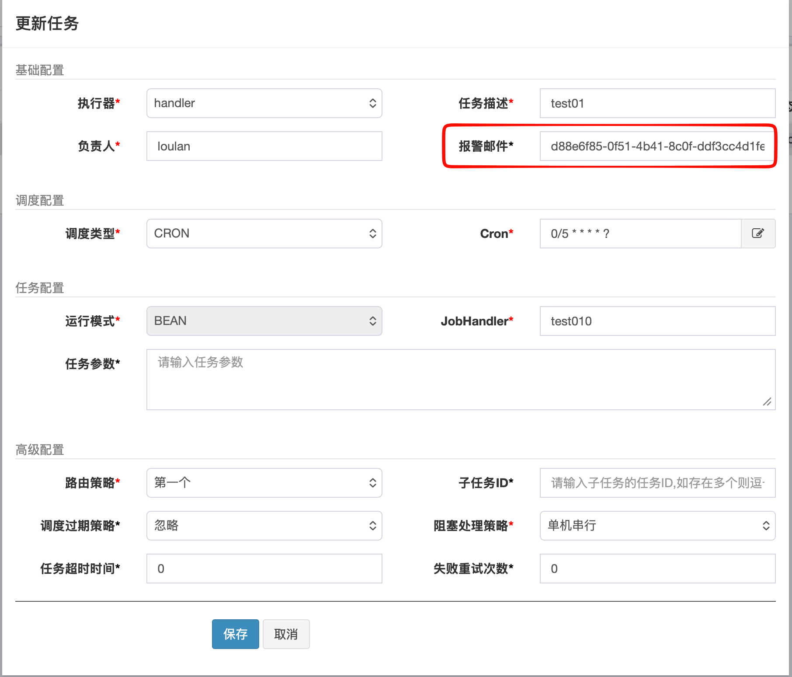
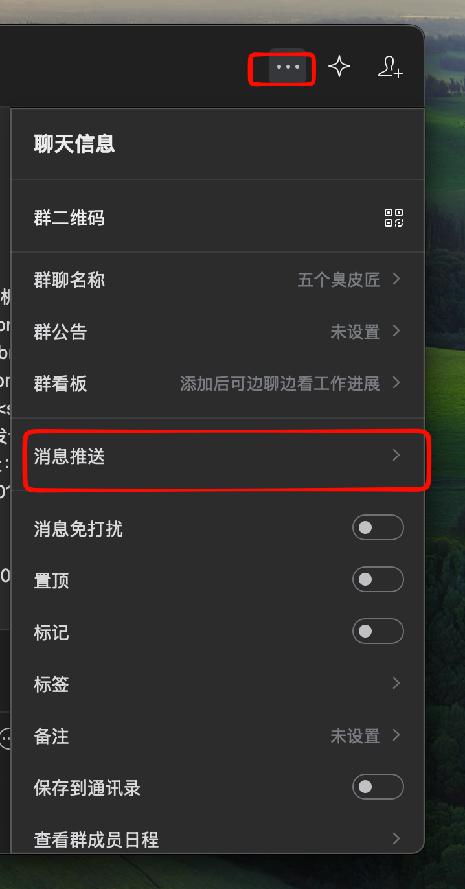
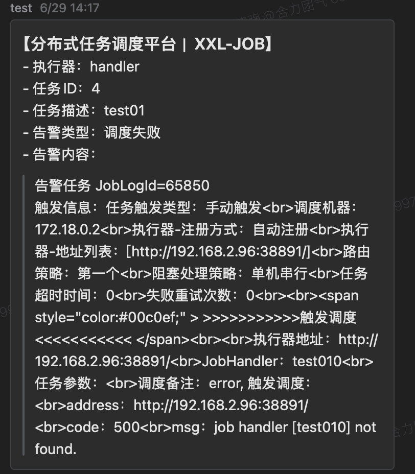
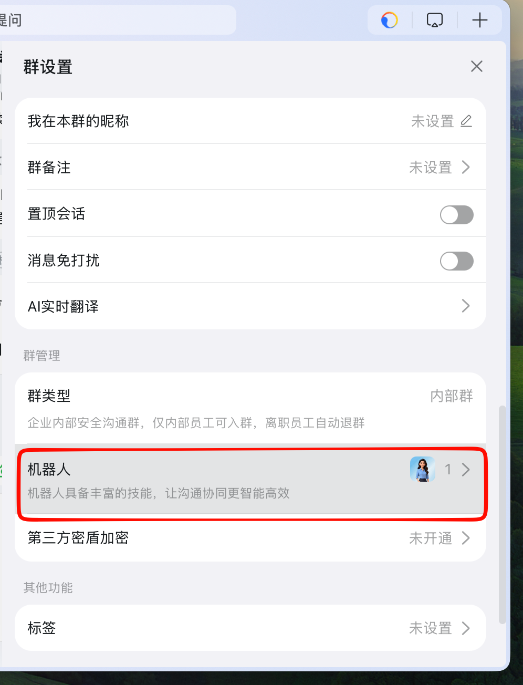
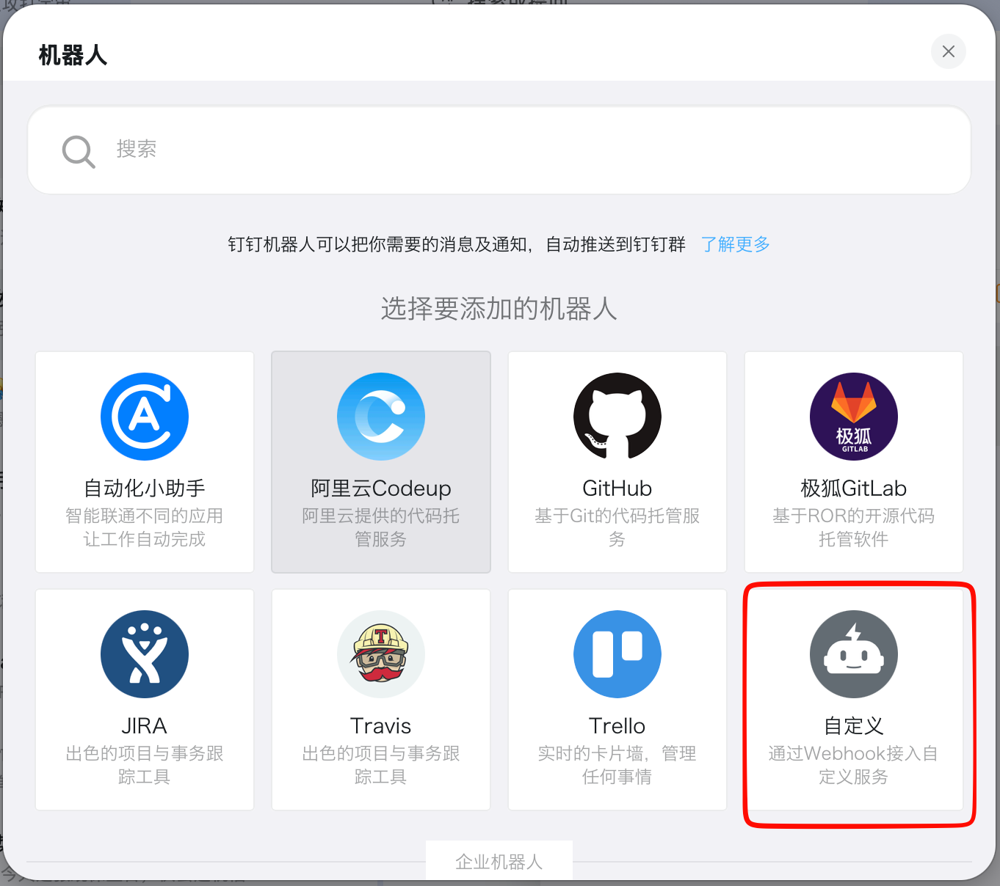
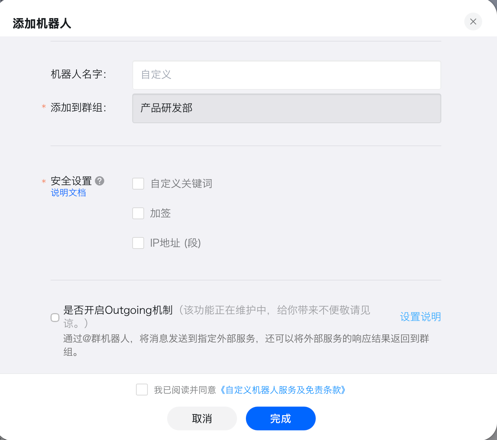

# XXL-JOB采用钉钉、微信、邮箱进行告警通知

## 一、安装启动

### 1. 下载docker

> docker push osmiling/xxl-job:3.4.2.2

> 镜像地址 https://hub.docker.com/r/osmiling/xxl-job

### 2. 配置docker-compose.yml

需要提前安装好mysql数据库[xxl-job.sql⁠](https://github.com/xuxueli/xxl-job/blob/3.4.2-release/doc/db/tables_xxl_job.sql)。

```yaml
version: '3.1'

services:
  xxl-job:
    image: osmiling/xxl-job:3.4.2.2
    container_name: xxl-job
    logging:
      driver: json-file
      options:
        max-size: "100m"
        max-file: "5"
    restart: always
    ports:
      - "8080:8080"
    environment:
      JOB_ACCESS_TOKEN: w5UcpZUOXqYFsZCYly532eS6qawVHxAA
      DB_HOST: 127.0.0.1
      DB_PORT: 3306
      DB_NAME: xxl_job
      DB_USER: root
      DB_PASSWORD: root
      MAIL_ENABLE: false
      QW_ENABLE: true
      DD_ENABLE: false
      MAIL_HOST: smtp.163.com
      MAIL_PORT: 465
      MAIL_USER: XXXXXXX@163.com
      MAIL_PASSWORD: SSHACHHXCOKDROBD
      MAIL_FROM: XXXXXXX@163.com
    volumes:
        - /etc/localtime:/etc/localtime #将外边时间直接挂载到容器内部，权限只读
        - ./logs:/data/applogs/xxl-job # 将文件日志挂在到宿主机

```

> 这里有三个配置是
>
> MAIL_ENABLE: false
>
> QW_ENABLE: false
>
> DD_ENABLE: false
>
> 这三个配置默认都是方式，当你需要那个通知的时候开启哪一个就好了。**只能开启一个，因为开启多个也没用，配置的地方就一个。**

### 3. 启动访问

> http://127.0.0.1:8080/xxl-job-admin


## 通知配置

### 1. 邮箱通知

> MAIL_ENABLE: true
>
> QW_ENABLE: false
>
> DD_ENABLE: false



在这个位置填入邮箱（可以逗号分隔多个邮箱）就可以通过邮件接受内容了。


### 2. 微信通知

> MAIL_ENABLE: false
>
> QW_ENABLE: true
>
> DD_ENABLE: false



**进入企业微信群，点击右上角的三个点 --> 消息推送 --> 添加 ，进入之后可以设置名称，下面有一个 webhook地址，我们需要将地址中的 key提取出来。**

> https://qyapi.weixin.qq.com/cgi-bin/webhook/send?key=c99d3ae4-4430-493asd2b1-dc8e23-7b6ad031
>
> c99d3ae4-4430-493asd2b1-dc8e23-7b6ad031

将这个key填写到报警邮箱的位置，就可以进行微信群消息的推送了。



### 3. 钉钉消息推送

> MAIL_ENABLE: false
>
> QW_ENABLE: false
>
> DD_ENABLE: true
>
> **钉钉的配置和企业微信类似**








进入钉钉群 --> 群设置 --> 机器人 --> 自定义机器人 --> 添加 ,自行定义机器人名称，安全设置有多种方式，目前的安装的docker对 加签 方式支持不太好（好像是因为告警邮箱输入限制100字符导致的）。点击完成之后也是可以获取到 webhook地址，里面包含access_token.

将这个access_token 填写到告警邮箱里面就可以进行正常的告警通知了。