# 概述

&emsp;&emsp;做开发的，玩服务器的，尤其是玩虚拟机服务器的会遇到磁盘空间不足的情况。如果你有 UI 界面那就不用说了，你可以类似 windows 通过界面的操作来进行磁盘的扩容，但是如果使用的知识服务器的，那么扩容就需要通过命令来操作了。

&emsp;&emsp;**我这边使用的是 centos 7 的 linux 服务器，而且是在虚拟机进行的操作。**

## 一、VM 虚拟机扩容磁盘

> **vm 虚拟机扩容磁盘是有要求的**
>
> 1. 必须是关机的状态
> 2. 必须删除原来的快照

**接下来的操作就很简单，只要用过 vm 虚拟机摸索一下也能操作出来（编辑虚拟机，针对磁盘进行扩展）。**

  <image src="../images/202408/291424.png" alt="Left Image" style="max-width: 50%;">
  <image src="../images/202408/291425.png" alt="Right Image" style="max-width: 50%;">

**扩容完成启动虚拟机进行磁盘命令扩容。**

# 二、磁盘和分区情况查看

> **df -h**
>
> 查看当前磁盘使用情况

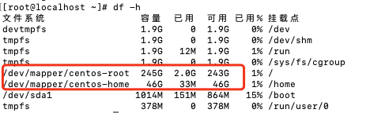

> **fdisk -l**
>
> 当前分区情况查看

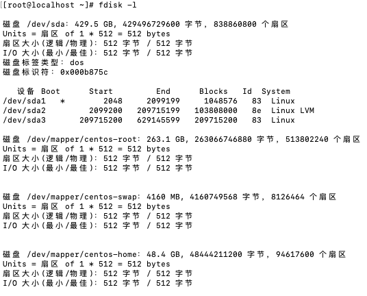

**从图片内容可以看到，我这边服务器有大约100G没有分区使用**

# 三、磁盘分区操作

**‌在‌ Linux 系统中，/dev/sda 表示第一个 ‌SATA 接口的硬盘。**

> **fdisk /dev/sda**
>
> 磁盘分区表的操作命令，可以对磁盘分区进行 增、删、改、查。
>
> - **p** ：查看分区情况
> - **n** ：进行分区操作
> - **w** ：保存操作
> - **m** ：获取帮助

### 1. 查看分区情况（p）

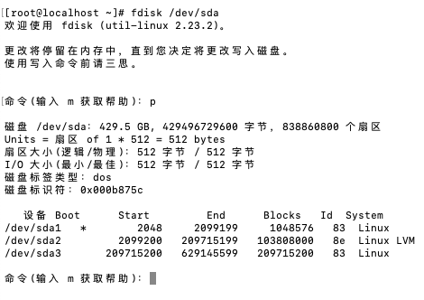

&emsp;&emsp;**从这里可以看出，这里已经存在 3 个分区了，以及分区大小的信息。**

### 2. 新增分区（n)

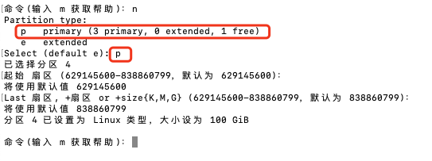

&emsp;&emsp;**输入 n 之后，这里会让你选择是 主分区 还是 扩展分区，我们这边是进行 主分区 的，所以选择 p，之后会让你设置分区号、分区起始位置，分区结束位置。由于我们是将所有未分区空间都进行设置，所以都选择默认，直接连点 回车键 便可以了。**

### 3. 保存新增操作(w)

&emsp;&emsp;**如果你操作完成之后没有进行这一步的保存，那么你的操作就是无效的，所以新增分区之后记得保存。**

### 4. 重启生效

> **reboot**
>
> 分区新增操作保存之后。该分区还无法直接读取生效，需要进行重启 (原理我也没明白)。

# 四、 格式化分区

> **vgdisplay**
>
> 查看虚拟卷组信息

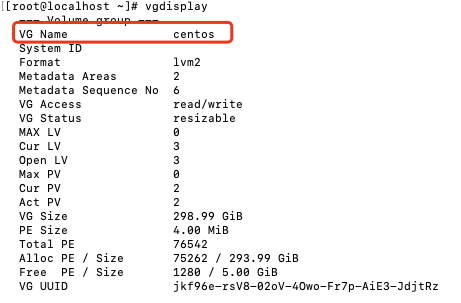

### 1. 格式化

> **pvcreate /dev/sda4**
>
> 对新增分区进行格式化. sda4是我们前面新增的分区

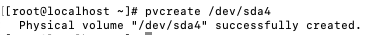

### 2. 扩展到卷组

> vgextend centos /dev/sda4
>
> vgextend 虚拟卷组名 新增的分区。将指定分区扩展到卷组。卷组名称就是上面查询到的卷组名

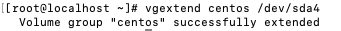

### 3. 查看卷组信息

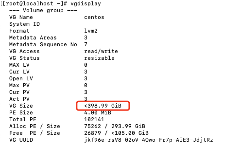

&emsp;&emsp;**从这里可以看出，卷组的大小已经发生改变，说明我们已经成功扩展了卷组。**

# 五、文件系统扩容

> **我们这里要扩展的是 /dev/mapper/centos-home**

### 1. 查看文件系统

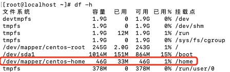

### 2. 逻辑卷扩容

> **lvextend -L +100G /dev/mapper/centos-home**
>
> lvextend -L +需要扩展的容量 需要扩展的文件系统名

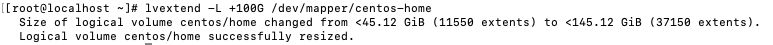

### 3. 扩展文件系统

> **xfs_growfs /dev/mapper/centos-home**
>
> xfs_growfs 文件系统名 （这里写你要扩展的文件系统名，就是你想要扩的部分）

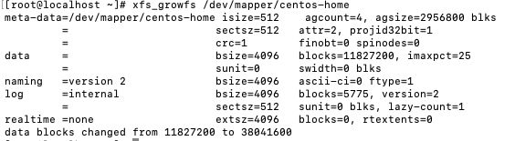

**这里注意不同的Linux有区别，比如红帽和乌班图命令就不一样，这里以红帽为例，如果是其他版本请自行搜索文件系统扩容命令**

> **cat /etc/fstab | grep centos-root**
>
> 查看文件系统

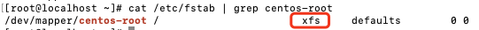

# 六、扩容完成

&emsp;&emsp;**到这里，扩容已经完成，我们可以通过 df -h 命令来啊查看扩容结果**

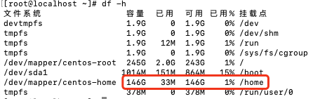