# 语法规则

### 关键字

> **sequenceDiagram** ： 这个关键词表示在 mermaid 中使用的是序列图
>
> **participant** ：定义参与序列的角色，相当于先定义角色在序列中的位置
>
> **as** ：设置参与者的别名

```text
sequenceDiagram
	participant A as a1
	participant C as c1
	participant B as b1
```


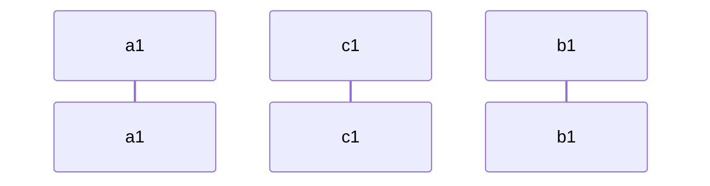


### 备注

> **note [ right of | left of | over ] [角色]: 备注内容**

```text
sequenceDiagram
	participant A as a1
	participant B as b1
	A ->> B : text
	note over A,B : 123456789
	note left of A : 123
```


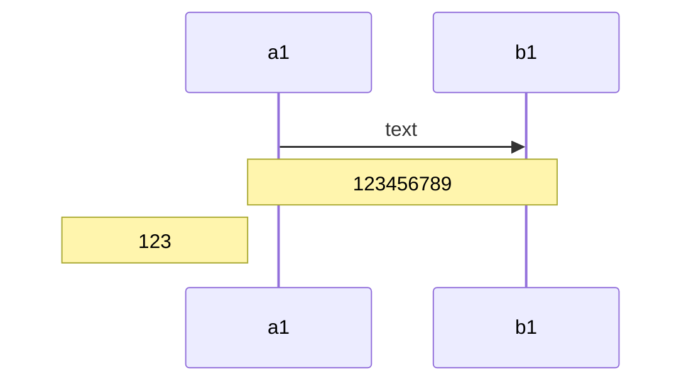

### 换行符

> **`<br>`** ： 来实现换行

```text
sequenceDiagram
	participant A as a1
	participant B as b1
	A ->> B : text<br/>text
	note over A,B : 1234<br/>56789
	note left of A : 123
```


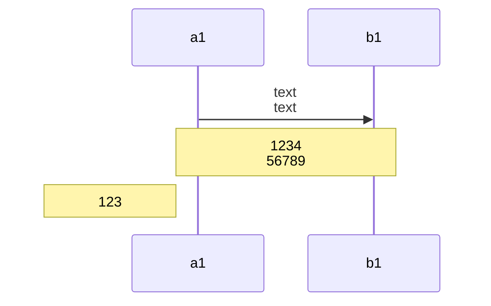

### 活动区域

> **(de)activate** : 可以设置活动区域，activate 和 deactivate 必须成对出现。
>
> 还有一种快捷表示法，即在消息箭头后附加 `+`/`-` 后缀

```text
sequenceDiagram
	participant A as a1
	participant B as b1
	A ->> B :text
	activate B
	B -->> A : text
	deactivate B
	C -> +D:text
	D --> -C : text
```


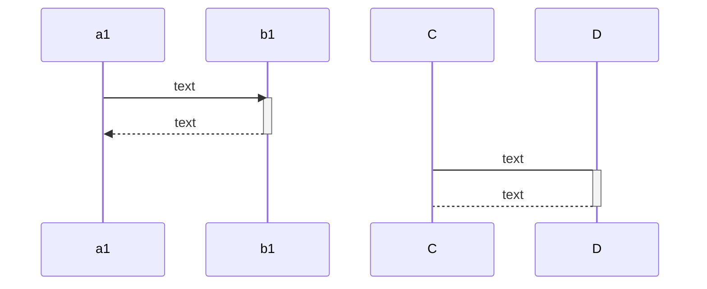


### 循环

> **loop text**
>
> **... statements ...** 
>
> **end**

```text
sequenceDiagram
    participant A as a1
		participant B as b1
		A ->> B :text
    loop 聊天
        A-->B: 关于吹牛逼!
    end

```

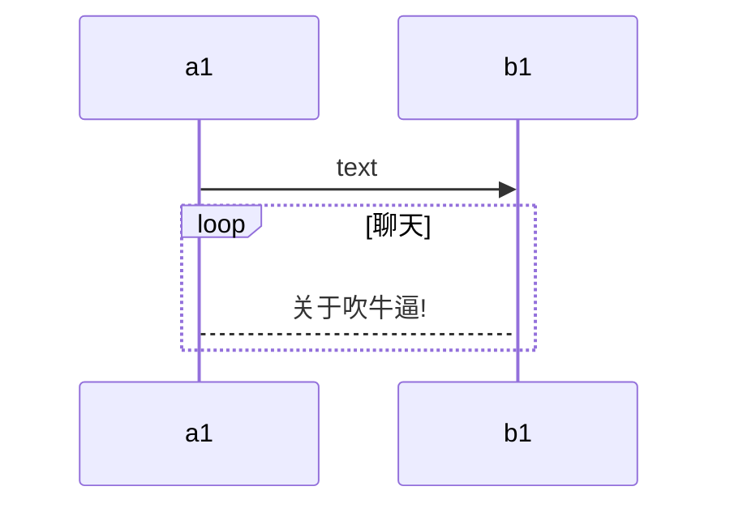

### 并行动作

> 用来表示时序图上某些动作是同时并行发生的

> **par [Action 1]**
> **... statements ...**
> **and [Action 2]**
> **... statements ...**
> **and [Action N]**
> **... statements ...**
> **end**

```text
sequenceDiagram
	participant A as a1
	participant C as c1
	participant B as b1
	par A-B
		A ->> B: hello
	and A-C
		A ->> C: hello
	end
	B ->> C : ok
```


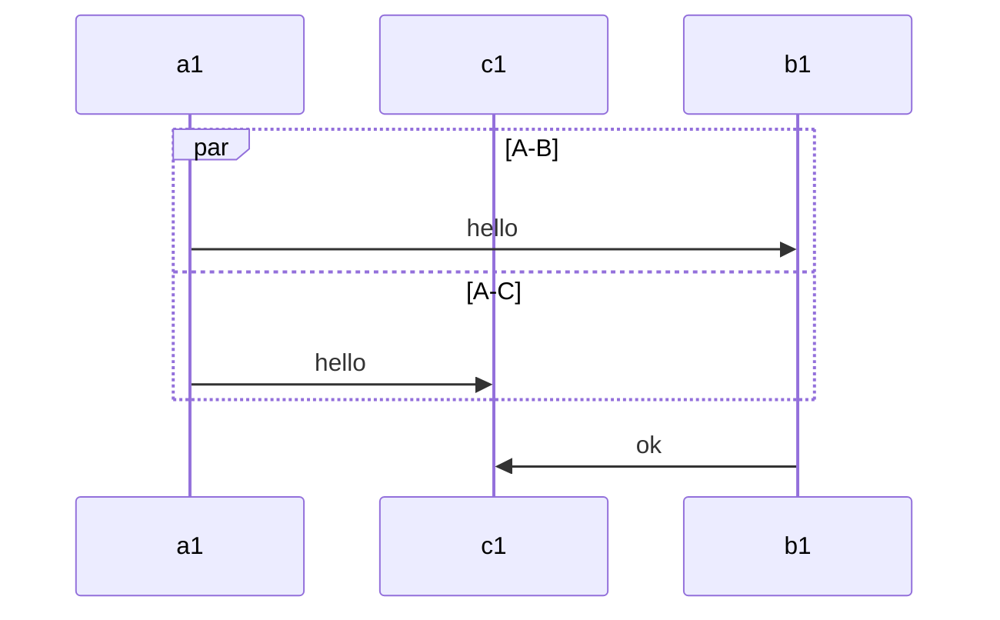

### 条件判断

> 可以根据不同条件情况执行不同的时序图

> **critical [Action that must be performed]**
> **... statements ...**
> **option [Circumstance A]**
> **... statements ...**
> **option [Circumstance B]**
> **... statements ...**
> **end**

```text
sequenceDiagram
	participant A as a1
	participant C as c1
	participant B as b1
	critical 1=1
		A ->> B : text
	option 1=2
		A ->> C : text
	option 2=3
		A ->> A : text
	end
	B ->> C : ok
```

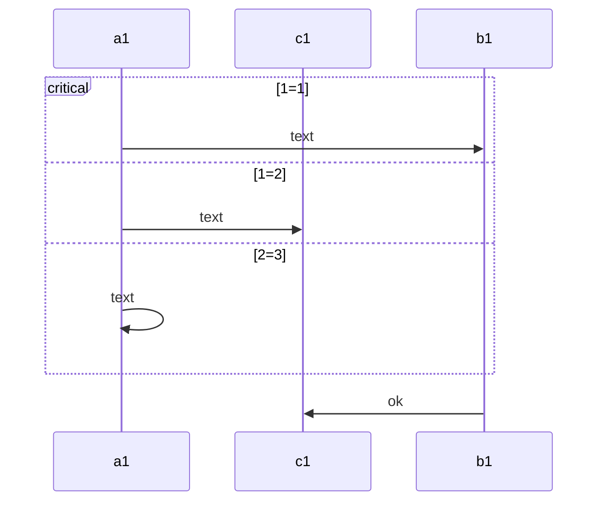

### 中断

> 可以用来表明指示序列的停止

> **break [something happened]**
> **... statements ...**
> **end**

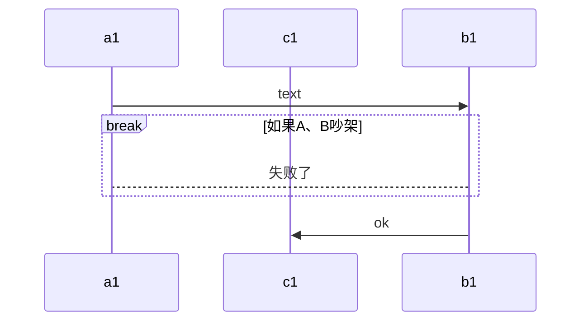

### 注释

> 可以在序列图中输入注释，解析器将忽略这些注释。注释需要独占一行，并且必须以 `%%`（双百分号）开头。注释开始后到下一个换行符的任何文本都将被视为注释，包括任何图表语法

```text
sequenceDiagram
	participant A as a1
	participant B as b1
	%% A ->> B : text
	B ->> A : xxxx
```

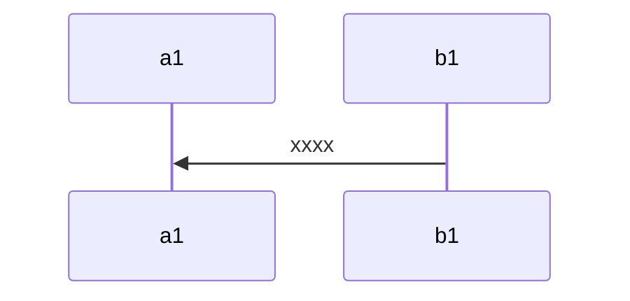

### 序列号

> 通过关键字 **autonumber** 可以自动添加序列号

```text
sequenceDiagram
	autonumber
	participant A as a1
	participant B as b1
	A ->> B : text
	B ->> A : xxxx
```


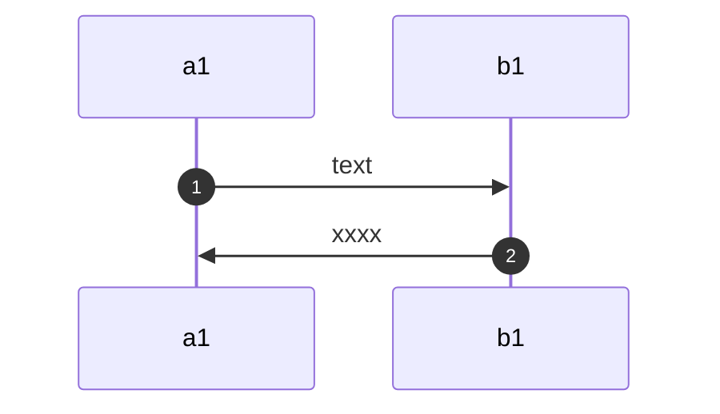

# 链接

| 类型   | 描述                           |
| :----- | :----------------------------- |
| `->`   | 没有箭头的实线                 |
| `-->`  | 没有箭头的虚线                 |
| `->>`  | 带箭头的实线                   |
| `-->>` | 带箭头的虚线                   |
| `-x`   | 末端有十字的实线               |
| `--x`  | 末端带有十字的虚线。           |
| `-)`   | 末尾带有空心箭头的实线（异步） |
| `--)`  | 末尾带有空心箭头的虚线（异步） |

```text
sequenceDiagram
	participant A as a1
	participant C as c1
	participant B as b1
	A -> B : text
	B --> C : text
	C ->>D : text
	D -->> E : text
	E -x F : text
	F --x E : text
	E -) D : text
	D --) C : text
```

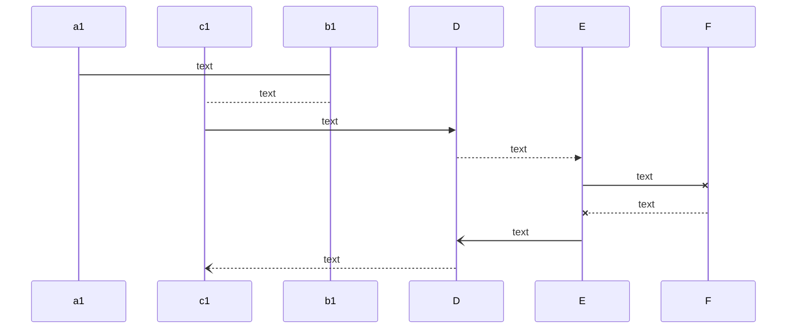

