# 一、节点

### 1、一个节点

> 流程的关键字 **flowchart**

```text
flowchart
	Node
```

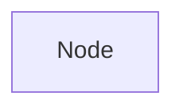

### 2、带文本的节点

> 文本框的形状后面说明，文本内容可以有双引号，也可以没有，但是如果使用 unicode 特殊字符需要使用双引号

```text
flowchart
    Node["这是文本内容"]
```


### 3、文本中使用markdown

> 使用 markdown 语法需要使用反引号

```text
flowchart
	Node["`这是**文本**内容`"]
```


# 二、方向

- TB - 从上到下
- TD - 自上而下/与自上而下相同
- BT - 从下到上
- RL - 右到左
- LR - 左到右

```text
flowchart TB
	node1 --- node2
	
flowchart RL
	node1 --- node2
```


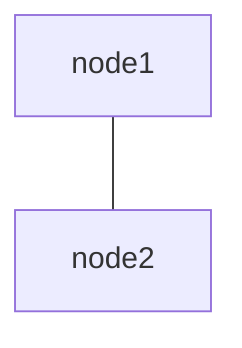

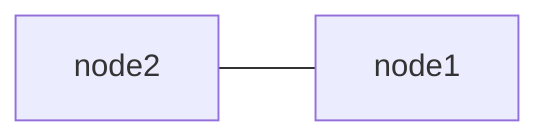

# 三、节点形状

### 1、长方形

>  **[ text ]** 

```text
flowchart LR
	Node[节点]
```

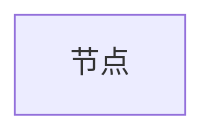

### 2、圆角节点

>  **( text )** 

```text
flowchart LR
	Node(节点)
```

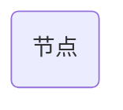

### 3、圆形节点

>  **(( text ))** 

```text
flowchart LR
    Node((节点))
```


### 4、双圆节点

> **((( text )))** 

```text
flowchart LR
    Node(((节点)))
```


### 5、左右全圆角节点 (体育场形状节点)

>  **([ text ])** 

```text
flowchart LR
	Node([节点])
```


### 6、子程序形状节点

>  **[[ text ]]** 

```text
flowchart LR
	Node[[节点]]
```

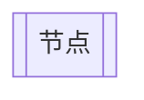

### 7、圆柱形节点

>  **[( )]** 

```text
flowchart LR
	Node[(节点)]
```

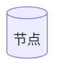

### 8、左凹形节点

>  **> text ]** 

```text
flowchart LR
	Node> 节点]
```


### 9、左右平行四边形节点

> **[/ text /]**
>
> **[\\ text \\]**

```text
flowchart LR
	Node[/节点/]
	Node1[\节点\]
```

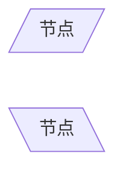

### 10、上下梯形节点

> **[/ text \\]**
>
> **[\\ text /]**

```text
flowchart LR
	Node[/节点\]
	Node1[\节点/]
```

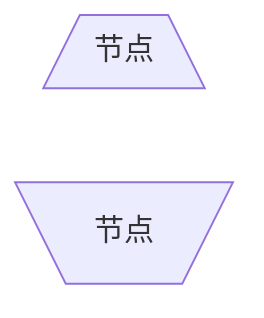

### 11、菱形节点

> **{ text }**

```text
flowchart LR
	Node{ 节点 }
```

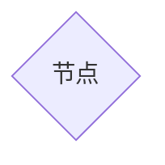

### 12、六边形节点

> **{{ text }}**

```text
flowchart LR
	Node{{节点}}
```


# 四、节点之间的链接

### 1、通用链接

| 长度           |   1    |    2    |    3     |
| :------------- | :----: | :-----: | :------: |
| 实线链接       | `---`  | `----`  | `-----`  |
| 实线带箭头     | `-->`  | `--->`  | `---->`  |
| 粗的实线       | `===`  | `====`  | `=====`  |
| 粗的实线带箭头 | `==>`  | `===>`  | `====>`  |
| 虚线           | `-.-`  | `-..-`  | `-...-`  |
| 虚线带箭头     | `-.->` | `-..->` | `-...->` |
| 看不见的链接   | `~~~`  | `~~~~`  | `~~~~~`  |

```text
flowchart LR
A --- B
B --> C
C === D
D ==> E
E -.- F
F -.-> G
G ~~~ H

```

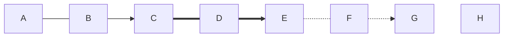

### 2、文本链接

> 文本链接是在通用链接的基础上添加文本的功能，目前添加文本的方式有两种：
>
> 1. 中间添加文本： 这个要注意是 左二 右三
> 2. 右侧添加文本： 其实这个更通用，不用管符号多少，在右边添加 `|text|` 文本

| 长度           |       1       |       2       |       3        |
| :------------- | :-----------: | :-----------: | :------------: |
| 实线链接       | `-- text ---` | `----|text|`  |  `-----`text   |
| 实线带箭头     |  `--text-->`  | `--->|text|`  | `---->|text|`  |
| 粗的实线       |  `==text===`  | `====|text|`  | `=====|text|`  |
| 粗的实线带箭头 |  `==text==>`  | `===>|text|`  | `====>|text|`  |
| 虚线           |  `-.text.-`   | `-..-|text|`  | `-...-|text|`  |
| 虚线带箭头     |  `-.text.->`  | `-..->|text|` | `-...->|text|` |

```text
flowchart LR
A -- text --- B
B -- text --> C
C == text === D
D == text ==> E
E -. text .- F
F -. text .-> G

A1 ---|text| B1
B1 -->|text| C1
C1 ===|text| D1
D1 ==>|text| E1
E1 -.-|text| F1
F1 -.->|text| G1
```

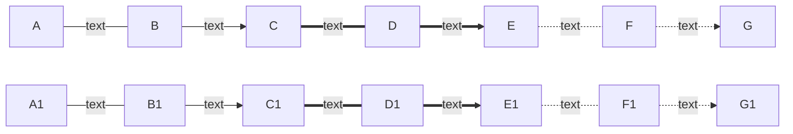


### 3、特殊箭头

- 圆边
- 交叉边缘

```text
flowchart LR
	A ---o B ---x C
```


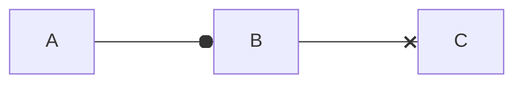

### 4、双向箭头

```text
flowchart LR
	A o--o B 
	A1 x--x B1
	A2 <--> B2
```


```mermaid
flowchart LR
	A o--o B 
	A1 x--x B1
	A2 <--> B2
```

### 5、链接的链接

```text
flowchart LR
A --- B
A --- C
B --- D
C --- D

A1 --- B1 & C1 --- D1
```

```mermaid
flowchart LR
A --- B
A --- C
B --- D
C --- D

A1 --- B1 & C1 --- D1
```

# 五、子图

### 1、实现流程图

> **subgraph title**
>
> ​	**内容**
>
> **end**

```text
flowchart
	A --- E
	C---E
	subgraph 子图1
		A---B
	end
	subgraph 子图2
		C---D
	end
```


```mermaid
flowchart
	A --- E
	C---E
	subgraph 子图1
		A---B
	end
	subgraph 子图2
		C---D
	end
```

> **子图内部可以继续包含子图**

```text
flowchart
	A --- E
	C---E
	subgraph 子图1
		子子图1 --- B
		A---B
		subgraph 子子图1
			A1---B1
		end
	end
	subgraph 子图2
		C---D
	end
```


```mermaid
flowchart
	A --- E
	C---E
	subgraph 子图1
		子子图1 --- B
		A---B
		subgraph 子子图1
			A1---B1
		end
	end
	subgraph 子图2
		C---D
	end
```

### 2、子图方向

> **direction RL**
>
> **通过关键字 direction 实现**

```text
flowchart LR
  subgraph TOP
    direction LR
    subgraph B1
        direction RL
        i1 -->f1
    end
    subgraph B2
        direction BT
        i2 -->f2
    end
  end
  A --> TOP --> B
  B1 --> B2

```


```mermaid
flowchart LR
  subgraph TOP
    direction LR
    subgraph B1
        direction RL
        i1 -->f1
    end
    subgraph B2
        direction BT
        i2 -->f2
    end
  end
  A --> TOP --> B
  B1 --> B2

```

> **如果子图内部的节点链接到外部，那么方向 direction 作用就会被忽略**

```text
flowchart LR
  subgraph TOP
    direction LR
    subgraph B1
        direction RL
        i1 -->f1
    end
    subgraph B2
        direction BT
        i2 -->f2
    end
    i1 === i2
  end
  A --> TOP --> B
  B1 --> B2

```

```mermaid
flowchart LR
  subgraph TOP
    direction LR
    subgraph B1
        direction RL
        i1 -->f1
    end
    subgraph B2
        direction BT
        i2 -->f2
    end
    i1 === i2
  end
  A --> TOP --> B
  B1 --> B2

```

# 六、相互作用（交互）

> **可以将单击事件绑定到节点，单击可以导致 JavaScript 回调或将在新浏览器选项卡中打开的链接。**
>
> **click nodeId callback **
>
> **click nodeId call callback()**

```text
flowchart LR
    A-->B
    click B "https://www.baidu.com"
    click A href "https://www.baidu.com"

```

```mermaid
flowchart LR
    A-->B
    click B "https://www.baidu.com"
    click A href "https://www.baidu.com"

```

# 七、注释

> **可以在流程图中输入注释，解析器将忽略这些注释。注释需要独占一行，并且必须以 `%%`（双百分号）开头。注释开始后到下一个换行符的任何文本都将被视为注释，包括任何流语法**

```text
flowchart LR
%% this is a comment A -- text --> B{node}
   A -- text --> B -- text2 --> C

```

```mermaid
flowchart LR
%% this is a comment A -- text --> B{node}
   A -- text --> B -- text2 --> C

```

# 八、样式

> **直接针对某个节点设置样式**

```text
flowchart LR
    A(节点)
    style A fill:#bbf,stroke:#f66,stroke-width:2px,color:#fff,stroke-dasharray: 5 5

```

```mermaid
flowchart LR
    A(节点)
    style A fill:#bbf,stroke:#f66,stroke-width:2px,color:#fff,stroke-dasharray: 5 5

```

> **通过设置 class 类 来设置样式。添加类的一种较短形式是使用 `:::` 运算符将类名附加到节点**

```text
flowchart LR
    A(节点):::someclass
    classDef someclass fill:#bbf,stroke:#f66,stroke-width:2px,color:#fff,stroke-dasharray: 5 5

```

```mermaid
flowchart LR
    A(节点):::someclass
    classDef someclass fill:#bbf,stroke:#f66,stroke-width:2px,color:#fff,stroke-dasharray: 5 5

```


```mermaid
flowchart TD
    B["fa:fa-twitter for peace"]
    B-->C["fab:fa-truck-bold a custom icon"]

```

