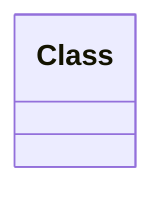
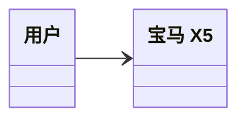
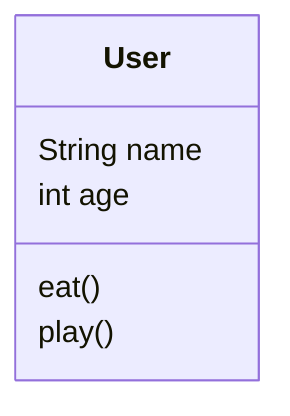
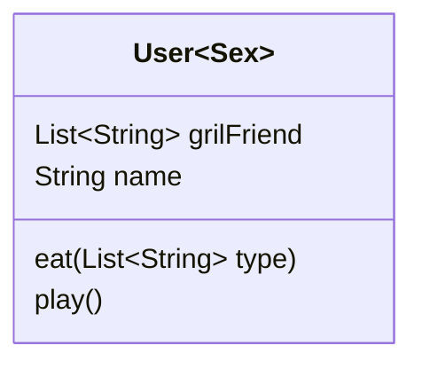
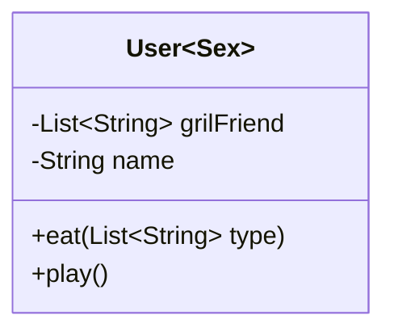
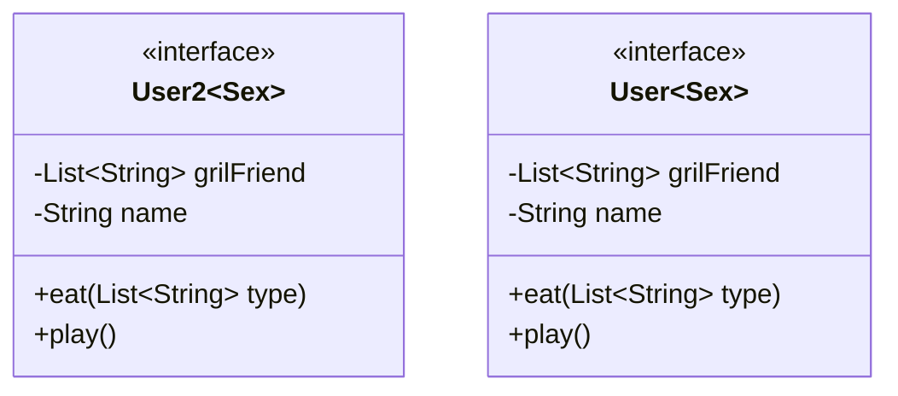
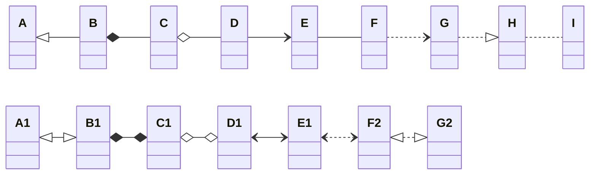
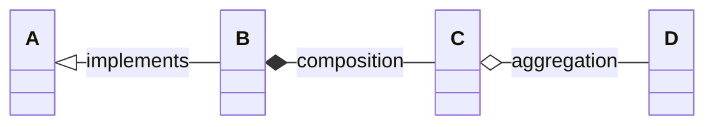
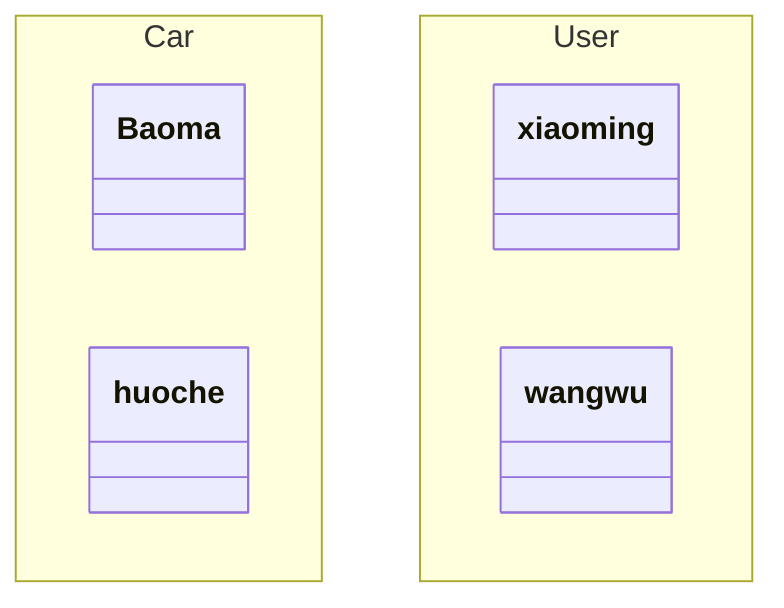
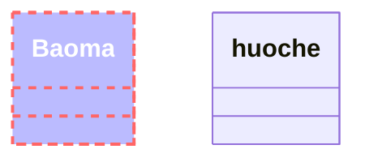

# 关键字

> **classDiagram** : 表示使用类图  
> **class** : 表示类  
> **direction** : 表示方向
```text
classDiagram
    class Class
```


# 类
### 类的定义
- 顶部隔间包含类的名称。它以粗体居中打印，第一个字母大写。它还可能包含描述类性质的可选注释文本。 
- 中间的部分包含类的属性。它们左对齐且第一个字母小写。 
- 底部隔间包含该类可以执行的操作。它们也是左对齐的，并且第一个字母是小写的。

#### 第一种方式

> 使用 class 关键字来定义  
```text
classDiagram
    class Class
```

#### 第二种方式

> 使用类关系直接定义显示
```text
classDiagram 
    User --> Car
```
````mermaid
classDiagram 
    direction LR
    User --> Car
````

### 类别标签
> **[" "]** 可以通过中括号里面使用引号直接为类提供标签
```text
classDiagram
    class Car["宝马 X5"]
    class User["用户"]
    User --> Car
```


### 属性方法

> 类的成员有 属性 和 方法  
> mermaid 通过 () 来进行区分，**有 () 的表示方法/函数，没有的表示属性**
- **使用 :（冒号）后跟成员名称来关联类的成员，这对于一次定义一个成员很有用。**

  ```text
  classDiagram
      class User
      User: String name
      User: int age
      User: eat()
      User: play()
  ```

  



- **使用 {} 括号关联类的成员，其中成员分组在大括号内。适合一次定义多个成员。**

  ```text
  classDiagram
      class User {
          String name
          int age
          eat()
          play()
      }
  ```

  ```mermaid
  classDiagram
      class User {
          String name
          int age
          eat()
          play()
      }
  ```

### 返回类型

  > 在函数方法的后面通过 **:** 来分开表示返回类型。
  >
  > 冒号和函数方法之间要有空格来隔开

  ```text
  classDiagram
      class User {
          String name
          int age
          eat() : int
          play() : String
      }
  ```

  

  ```mermaid
  classDiagram
      class User {
          String name
          int age
          eat() : int
          play() : String
      }
  ```

### 范型使用

  > 泛型可以表示为类定义的一部分，也可以表示为类成员/返回类型。为了将该项目表示为通用项，请将该类型括在 **`~`**（波形符）内。支持嵌套类型声明（例如 `List<List<int>>`），但当前不支持包含逗号的泛型。（如 `List<List<K, V>>`）

```text
classDiagram
	class User~Sex~ {
		List~String~ grilFriend
    String name
    eat(List~String~ type)
    play()
	}
```




### 访问权限

> 主要用来定义方法的 私有、公有

- **+** 公有的
- **-** 私有的
- **#** 受保护的

```text
classDiagram
	class User~Sex~ {
		-List~String~ grilFriend
    -String name
    +eat(List~String~ type)
    +play()
	}
```




### 类上注释

> 注释在开头 `<<` 和结尾 `>>` 内定义。
>
> 需要单独一行定义，或者打括号内一行定义

- `<<Interface>>` 表示一个接口类
- `<<Abstract>>` 表示一个抽象类
- `<<Service>>` 代表一个服务类
- `<<Enumeration>>` 表示一个枚举

```text
classDiagram
	class User2~Sex~ 
		<<interface>> User2
		User2: -List~String~ grilFriend
    User2: -String name
    User2: +eat(List~String~ type)
    User2: +play()
	
	class User~Sex~ {
		<<interface>>
		-List~String~ grilFriend
    -String name
    +eat(List~String~ type)
    +play()
	}
```





# 链接关系

| 类型  | 类型反向 | 类型双向 | 描述       |
| ----- | -------- | -------- | ---------- |
| <\|-- | --\|>    | <\|--\|> | 继承/泛化  |
| *--   | --*      | *--*     | 组合       |
| o--   | --o      | o--o     | 聚合       |
| -->   | <--      | <-->     | 关联       |
| ..>   | <..      | <..>     | 依赖       |
| <\|.. | ..\|>    | <\|..\|> | 实现       |
| --    | --       | --       | 链接(实线) |
| ..    | ..       | ..       | 链接(虚线) |

> - **泛化**‌（Generalization）：表示类与类之间或接口与接口之间的一种继承关系，指定了子类如何特化父类的所有特征和行为。
>
> - ‌**实现**‌（Realization）：也是一种继承关系，表示类是接口所有特征和行为的实现。
> - ‌**依赖**‌（Dependency）：表示一个类使用另一个类，这种使用关系具有偶然性、临时性，是非常弱的关系，但类B的变化会影响到类A。
> - ‌**关联**‌（Association）：体现两个类之间语义级别的一种强依赖关系，通常是长期性的，而且双方的关系一般是平等的。
> - ‌**聚合**‌（Aggregation）：是关联关系的一种特例，体现整体与部分的关系，整体与部分之间可分离，它们可以具有各自的生命周期。
> - ‌**组合**‌（Composition）：比聚合更强，体现一种严格的整体和部分关系，两者是不可分割的，它们的生命周期是一致的。

> 关系的的强弱： **依赖 < 关联 < 聚合 < 组合**
>
> **继承和实现就不多说了**

```text
classDiagram
	direction LR
	A <|-- B
	B *-- C
	C o-- D
	D --> E
	E -- F
	F ..> G
	G ..|> H
	H .. I
	A1 <|--|> B1
	B1 *--* C1
	C1 o--o D1
	D1 <--> E1
	E1 <..> F2
	F2 <|..|> G2
```


### 链接标签

> `[classA][Arrow][ClassB]:LabelText` 通过在类的后面添加冒号 **:** 来设置标签

```text
classDiagram
	direction LR
	A <|-- B : implements
	B *-- C : composition
	C o-- D : aggregation

```





# 定义命名空间

> 通过关键字 **namespace** 可以定义命名空间分组

```text
classDiagram
	namespace Car {
		class Baoma
		class huoche
	}
	namespace User {
		class xiaoming
		class wangwu
	}
```




# 样式

> 可以通过 style 直接定义类的样式

```text
classDiagram
		class Baoma
		class huoche
		style Baoma fill:#bbf,stroke:#f66,stroke-width:2px,color:#fff,stroke-dasharray: 5 5
```




