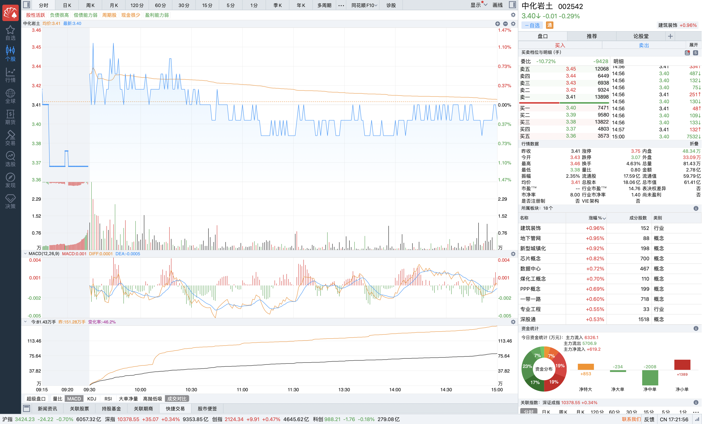

# 2025-06-27

### 一、说明

该股在6.23之前，整体呈现下跌趋势，经过一段时间的盘整，整体的价格的变动趋于平稳，在6.23日的时候加量分布图呈现集中的趋势，按照个人判断，后续价格将会上涨，即使不上涨，也不会跌的厉害（除非有大型利空消息的出现）。然后 6.24 日该股出现了明显的涨停。6.25 和 6.26 日该股在涨停的价格位置进行上下不超 0.1 元的波动。

### 二、情况

今日在3.99位置有大量的买入设置，在3.42有大量卖出设置，导致价格在这个价位区间波动。

### 三、分析

- **假设主力出货**
  - 可能主力在涨停之前已经收集了大量的筹码（ 6.23 日的时候筹码是比较集中的），涨停之后，主力利用中小散户上涨买入的心理进行出货，那么前两天的波动就是主力保持价位的出货。今天也是保持价位出货。
  - 但是连续三天的波动，价格不涨，已经会导致中小散户在心理上抵触继续买入，甚至可能导致中小散户的卖出。
  - 所以这个时候主力的货还能出去吗？
- **假设主力扫货**
  - 可能主力在涨停的位置，压制价格，给散户一种价格已经涨不动的心理，导致散户卖出，主力进行扫货。
  - 但是前两天的成交量是非常巨大的，而且超过了涨停那日的成交量，但是价格维持在了那个位置（表明多个主力之间进行拉扯，势均力敌）。
  - 今日价格依旧维持在这个位置，但是成交量已经放小（怀疑可能是主力在扫货）。

### 四、结论

> 今日价格微跌，成交量是前两日的一半。下跌动力不足，表明主力脚踏马上和马下，看人家心情。该股可持续持有，后续一两日如果持续下跌可退出等待时机买入，上升说明主力想要的利润不止这么点。