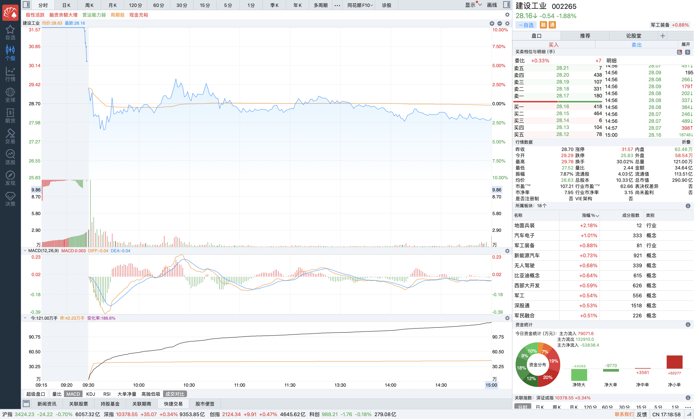

# 2025-06-27

### 一、说明

该股在 6.20 日之前整体呈现的是下降趋势，在 6.20 日的价量分布图已经呈现筹码集中，这个时候即使下跌也不会出现太大的下跌情况。6.23 日出现放量上涨，涨幅达到 7%，6.24、6.25、6.26 日均出现涨停，成交量呈现递减（但依旧是比较大的），递减是因为涨停，卖出的人少，所以导致成交量递减。（上涨原因极有可能是军工，伊朗与以色列的战争，今日已经结束和谈。以及国家发布的93阅兵）

### 二、情况

今日开盘集中竞价还是涨停，但是开盘之后价格直接跌到昨日涨停附近，然后在 28.71 元附近上下涨跌1元左右波动。知道结束，该股呈现下跌 1.8%。但是成交量是巨大的，成家量达到了近几日最高成交量的 1.4 倍左右。

### 三、分析

如此高的成交量，但是下跌只有1.8%，说明最近几日的买方的力量还是存在的，但是卖方也很大，而且卖方在此次较量中占上风。

重要的是，同花顺中显示，今日超大单的卖出量是特别巨大的，买量大的是小散单，怀疑是主力大单卖出，小单买入，如此来保持价格不至于下跌的太严重。

但是如此超大单的卖出体现，不会给小散户心理上造成冲击吗？导致小散户跟风卖出？。

### 四、结论

> 如此超大单的卖出，表明主力确实是在开始分批出货一部分，但是价格下跌又不是很严重。
>
> 可能是让小散户卖出，该股后一两日可能会出现小跌，但是后续会继续上涨。可持续持有等待下一个交易日的情况。
