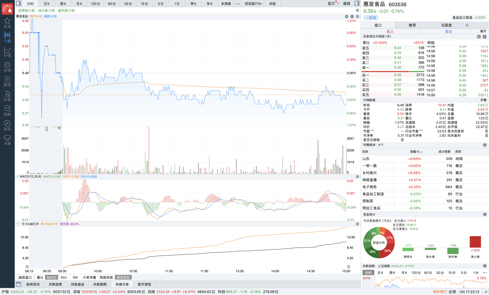

# 2025-06-27

### 一、说明

该股目前处于下降趋势的震荡整理阶段，整个趋势趋于平稳，价量分布图已经呈现集中状态。最近几日呈现下降趋势。成交量也递减趋势（但是相比7日前的成交量依旧是高的）。

### 二、情况

今日股市小幅波动，收盘呈现下跌 0.74%，主要以小散单的买入为主。

### 三、分析

由于该股的价量分布图整体呈现集中，而且是在下降趋势的震荡整理阶段，说明筹码已经大部分集中在了主力手里，那么整体价格不会太大幅度的下跌（除非发生极大利空消息）。

### 四、结论

> 最近几日可能还是会呈现小幅下跌的情况，可根据情况持续加仓。