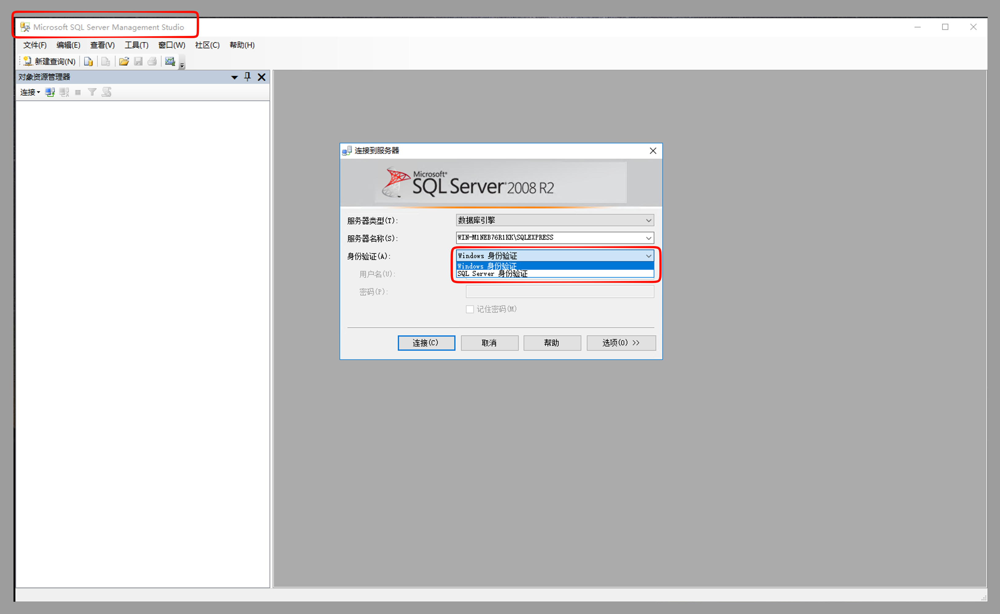

# windows

## 一、从系统查看sqlserver的安装情况

## 二、采用windows身份进行登录

1. 打开microsoft server managerment studio工具

2. 新建查询执行sql语句

   1. 查看所有登录账号

      > SELECT name
      >
      > FROM sys.server_principals
      >
      > WHERE type_desc='SQL_LOGIN';

   2. 修改账号密码

      > ALTER LOGIN sa
      > WITH PASSWORD='NewPassword123!';
      > GO
      >
      > ALTER LOGIN sa ENABLE;
      > GO

   3. 创建新的管理员

      > - 创建账号
      >
      >   > [!IMPORTANT]
      >   >
      >   > CREATE LOGIN admin
      >   > WITH PASSWORD='NewPassword123!';
      >   > GO
      >
      > - 设置管理员 2012 以上
      >
      >   > [!IMPORTANT]
      >   >
      >   > ALTER SERVER ROLE sysadmin
      >   > ADD MEMBER admin;
      >   > GO
      >
      > - 设置管理员 2012 以下
      >
      >   > [!IMPORTANT]
      >   >
      >   > EXEC sp_addsrvrolemember
      >   > 'admin',
      >   > 'sysadmin';
      >   > GO

   
