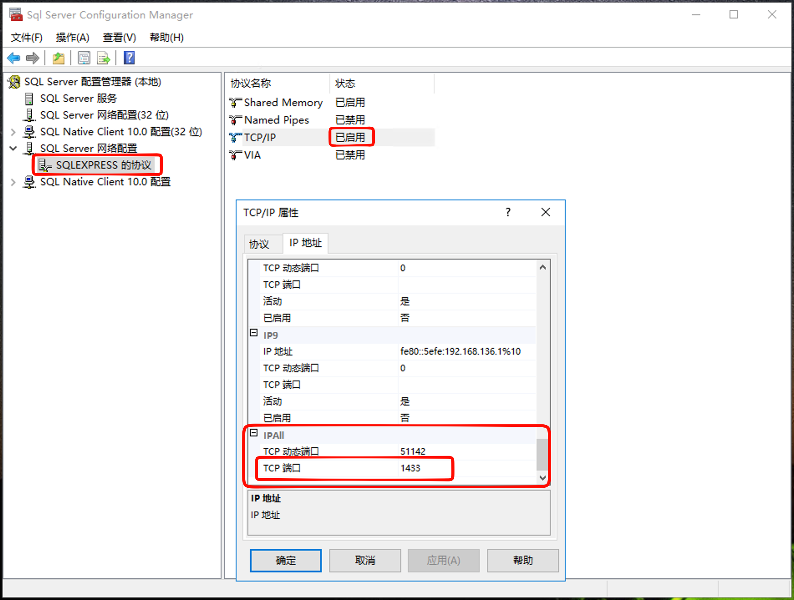
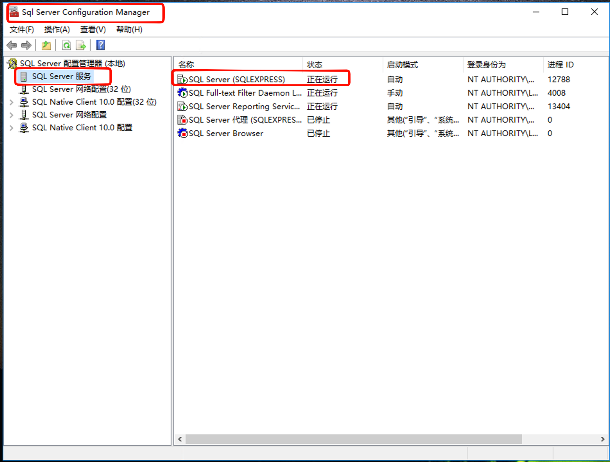

# windows

## 一、启用TCP/IP协议配置端口

- 打开 **SQL Server Configuration Manager**（SQL Server 配置管理器）。
- 展开“SQL Server 网络配置”，选择对应实例的协议（如“MSSQLSERVER 的协议”或“SQLEXPRESS 的协议”）。
- 右键点击 **TCP/IP** 选择“启用”。
- 双击 TCP/IP 进入属性，切换到“IP 地址”选项卡，确认“IPAll”下的 **TCP 端口** 设置为默认的 `1433`（若启用了动态端口，请确保记录实际分配的端口号）。

## 二、配置windows防火墙

## 三、重启启动 SQL Server 服务

