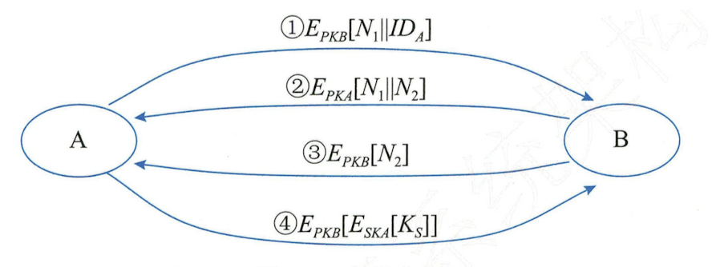

## 密钥管理技术

### 一、对称密钥的分配与管理

#### (一)、密钥的使用控制（密钥标签和控制矢量）

1. **密钥标签**

   > 例如用于 DES 的密钥控制，将 DES 中的 8 个校验位作为控制这个密钥的标签，其中前 3 位分别代表该密钥的不同信息：主/会话密钥、加密、解密。但是长度过于限制，且须经解密方能使用，带来一定的不便性。

2. **控制矢量**

   > 被分配的若干字段分别说明不同情况下密钥是被允许使用或者不允许，且长度可变。它在 密钥分配中心 KDC(Key Distribution Center) 产生密钥时加在密钥之中:首先由一杂凑函数将 控制矢量压缩到加密密钥等长，然后与主密钥异或后作为加密会话密钥的密钥，即:
   > H=h(CV)
   > Kn=KmXORH
   > Kou=EKm XORH[KS]
   > 其恢复过程为:KS=DKm XOR H[EKm XOR H[KS]]
   > 用户只有使用与 K D C 共享的主密钥以及 K D C 发送过来的控制矢量才能恢复会话密钥，因 此，须保证保留会话密钥和他控制矢量之间的对应关系

#### (二)、密钥的分配方法

1. 经过 A 选取的密钥通过物理手段发送给另一方 B。
2. 由第 3 方选取密钥，在通过物理手段分别发送给 A 和 B。
3. A、B 事先已有一个密钥，其中一方选中新密钥后，用已有密钥加密该新密钥后发送给另一方。
4. 三方 A、B、C 各有一个保密信道，C 选取密钥后，分别通过 A、B 各自的保密信道发送。

### 二、公钥加密体制的密钥管理

#### (一)、密钥公开发布的原理

> 公开发布是指用户将自己的公钥发送给每一其他用户，或向某一团体广播。

#### (二)、公用目录表的作用

公用目录表指一个公用的公钥动态目录表，由某个可信的实体或组织（公用目录管理员）承担该共用目录表的建立、维护以及公钥的分布等。管理员为每个用户在目录表中建立一个目录，其中包括用户名和用户的公开钥两个数据项，并且定期公布和更新目录表。每个用户都亲自或以某种安全的认证通信在管理者那里注册自己的公开钥，可通过电子手段访问目录表，还可随时替换新密钥。但是，这种公用目录表的管理员秘密钥一旦被攻击者获取，同样面临被假冒的危险。

#### (三)、公钥管理机构的建立和维护

与公用目录表类似，不过用公钥管理机构来为各用户建立、维护动态的公钥目录，这种对公钥分配更加严密的控制措施可以增强其安全性。特别注意的是，每个用户都可靠地知道管理机构的公开钥，但是只要管理机构自己知道相应的秘密钥。

#### (四)、公钥证书及管理机构（CA）

公钥证书可以从一定程度上解决以上策略存在的一些不足之处。公钥证书是由证书管理机构 CA（Certificat Authority）为用户建立的，其中的数据项有与该用户的秘密钥相匹配的公开钥及用户的身份和时间戳等，所欲的数据项经CA 用自己的秘密钥签字后就形成证书，即证书的形式为 CA = ESKcA[T, DA,PK?]。T 是当前的时间戳，ID 是用户 A 的身份，PKA 是 A 的公钥。SKcA 是 CA 的秘密钥，CA 则是用户 A 产生的证书。

用户将自己的公开钥通过公钥证书发送给另一用户，而接受方则可用 CA 的公钥 PKcA 对证书加以验证。这样通过证书交换用户之间的公钥而无需再与公钥管理机构联系，从而避免了由统一机构管理所带来的不便和安全隐患。

### 三、公钥加密分配单钥密码体制的密钥

#### (一)、单钥密码体制的密钥分配方法

1. A 将用 B 的公钥加密得到的身份 IDA 和一个用于唯一标志这个业务的一次性随机数 N 发往 B。
2. 预使 A 确定对方是 B，则 B 用 A 的公钥加密 N？和另一新产生的随机数 N？，因为只有 B 能解读机密数据。
3. A用B 的公钥PKB对N?加密后返回给B, 以使B 相信对方确是A。
4. A将M=Epkp[ESKA[Ks]]发送给B ,其中Ks为会话密钥，用B 的公开钥加密是为保证 只有B 能解读加密结果，用 A 的秘密钥加密是保证该加密结果只有A 能发送。
5. B 以DpkA[DskB[M]]恢复会话密钥。