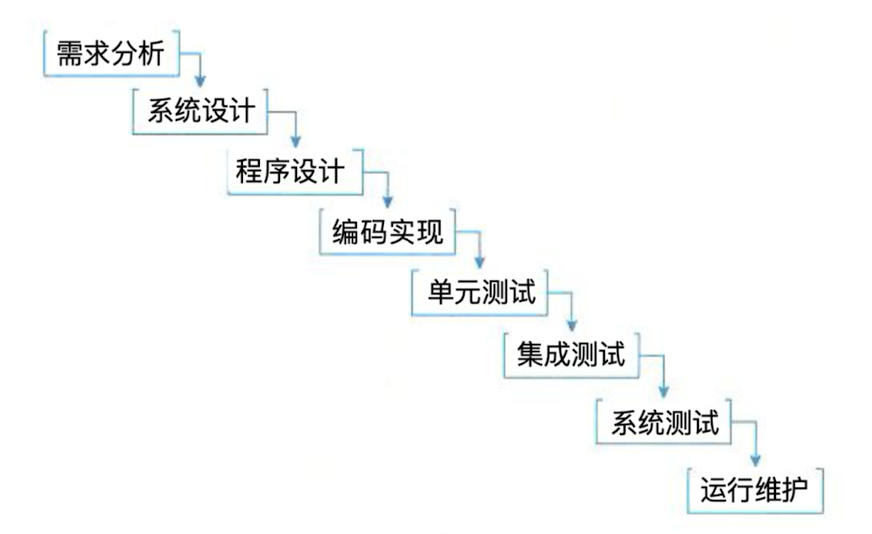
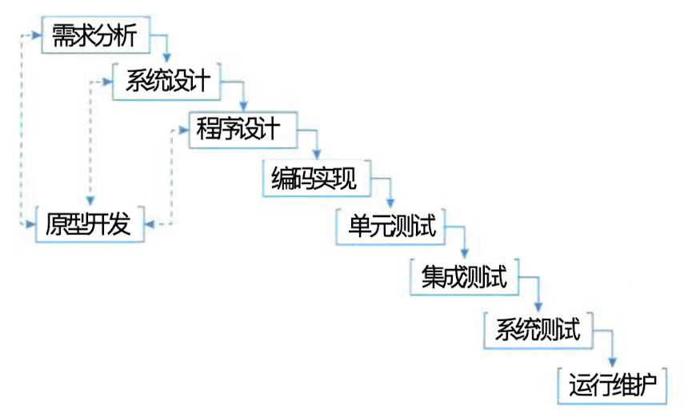
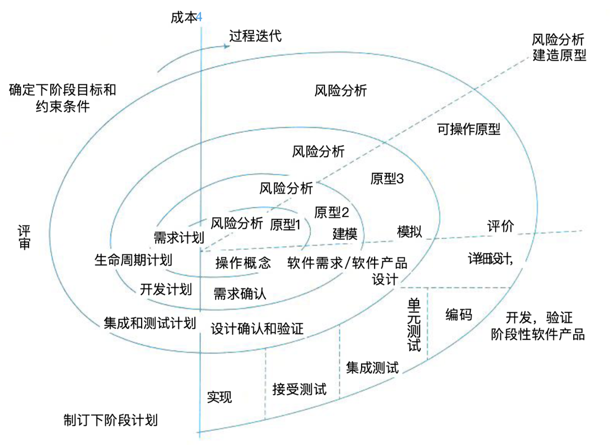

## 软件工程

### 一、软件工程概述

#### (一)、软件工程的发展历程和软件危机

1. **发展历程**
   - 20世纪60年代以前，基本上是个人使用，自给自足的编制程序。
   - 20世纪60年代后，大容量、高速计算机出现，也就带来了各种软件危机，
   - 1968年、1969年 NATO 连续召开了两次会议，提出了软件工程的概念。
2. **软件危机**
   - 软件开发进度难以预测
   - 软件开发成本难以控制
   - 软件功能难以满足用户期望
   - 软件质量无法保证
   - 软件难以维护
   - 软件缺少适当的文档资料

#### (二)、软件工程的定义

> 不同的学者机构对软件工程的定义不同，如下：
>
> - **Barry Boehm**：运用现代科学技术知识来设计并构造计算机程序及为开发、运行和维护这些程序所必须的相关文件资料。
> - **IEEE**：
>   1. 将系统化的，严格约束的、可量化的方法应用于软件开发、运行和维护，即将工程化应用于软件；
>   2. 对 1 中所述方法的研究。
> - **Fritz Bauer**：在 NATO 会议上给出的定义，建立使用完善的工程话原则，1️⃣较经济的手段获得能在实际机器上有效运行的可靠软件的一系列方法。
> - **《计算机科学百科全书》**：软件工程是应用计算机科学、数学、逻辑学及管理科学等于哪里，开发软件的工程。软件工程借鉴传统工程的原则和方法，以提高质量、降低成本和改进算法。其中计算机科学、数学用于构件模型与算法；工程科学用于制定规范、设计范型、评估成本及确定权衡；管理科学用于计划、资源、质量、成本等管理。

### 二、软件过程模型

#### (一)、瀑布模型（原理和特点）

> 瀑布模型（Waterfall Mode）是最早使用的软件过程模型之一，包含一系列活动。这些活动从一个阶段到另一个阶段逐次下降，它的工作流程在形式上很想瀑布，因此被称为瀑布模型。

> 瀑布模型的特点是因果关系紧密相连，前一个阶段工作的输出结果，是后一个阶段工作的输入。每一个阶段都是建筑在前一个阶段正确实施的结果之上。每一个阶段工作完成后都伴随 着一个里程碑(一组检查条件),对该阶段的工作进行审查和确认。历史上，瀑布模型起到了重要作用，它的出现有利于人员的组织管理，有利于软件开发方法和工具的研究。

#### (二)、原型（快速）模型（原理和特点）

> 原型模型(Prototype Model）又称快速原型。由于瀑布型的缺点，人们借鉴建筑师、工程师建造原型的经验，提出了原型模型。
>
> 原型模型主要有两个阶段
>
> 1. 原型开发阶段
> 2. 目标软件开发阶段

#### (三)、增量模型

#### (四)、螺旋模型

> 螺旋模型 (Spiral Model) 是在快速原型的基础上扩展而成。这种模型把整个软件开发流程分成了多个阶段，每一个阶段由 4 部分组成：
>
> - 目标设定
> - 风险分析
> - 开发和有效性验证
> - 评审

#### (五)、构件组装模型

#### (六)、敏捷模型（发展、目的和模型原理）

#### (七)、统一过程模型（RUP）（模型原理、核心概念、特点和工作步骤）

### 三、敏捷模型

#### (一)、敏捷模型的定义、基本原理和特点

> 敏捷型方法主要有两个特点，这也是其区别于其他方法，尤其是计划驱动或重型开发方法 的最主要的特征。
> 敏捷型方法是“适应性” (adaptive) 而非“预设性” (predictive) 的。重型方法试图对一个 软件开发项目在很长的时间跨度内做出详细的计划，然后依计划进行开发。这类方法在计划制 订完成后拒绝变化，而敏捷型方法欢迎变化。其实，敏捷的目的就是成为适应变化的过程，甚 至能允许改变自身来适应变化。
> 敏捷型方法是“面向人的” (People-oriented) 而非“面向过程的” (Process-oriented)。 它们 试图使软件开发工作能够充分发挥人的创造能力。它们强调软件开发应当是一项愉快的活动。

#### (二)、敏捷开发的核心思想（适应型、以人为本和迭代增量）

1. 敏捷方法是适应型，而非可预测型
2. 敏捷方法是以人为本，而非以过程为本
3. )迭代增量式的开发过程

### 四、统一过程模型

#### (一)、RUP 的核心概念和特点

1. **核心概念**

   - 角色 ( R o l e ) : W h o的问题。角色描述某个人或一个小组的行为与职责。 RUP预先 定义了很多角色，如体系结构师 (Architect)、 设计人员 (Designer)、 实现人员 (Implementer)、 测试员 (tester) 和配置管理人员 (Configuration Manager) 等，并对每一个角色的工作和职责都做了详尽的说明。

   - 活动 (Activity):How的问题。活动是一个有明确目的的独立工作单元。

   - 制 品(Artifact):What的问题。制品是活动生成、创建或修改的一段信息。也有些书把Artifact翻译为产品、工件等，和制品的意思差不多。

   - 工作流 (Workflow):When 的问题。工作流描述了一个有意义的连续的活动序列，每个工作流产生一些有价值的产品，并显示了角色之间的关系

2. **特点**

   - 用例驱动
   - 以体系结构为中心
   - 迭代与增量

#### (二)、RUP 的生命周期

1. **初始阶段**：定义最终产品视图和业务结构，指定工作计划及资源要求。
2. **细化阶段**：设计及确定系统的体系结构，指定工作计划及资源要求
3. **构造阶段**：构造产品并继续演进需求、体系结构、计划直至产品提交
4. **移交阶段**：把产品交给用户

#### (三)、4+1 视图模型

- **用例视图**：分析人员和测试人员关系的系统的行为。
- **逻辑视图**：最终用户关心的是系统的功能
- **实现视图**：程序猿关注的是系统的配置、装配等问题
- **进程视图**：系统集成人员关系的是系统的性能、可伸缩性、吞吐率等问题
- **部署视图**：系统工程师关系的是系统的发布、安装、拖布结构等问题。

### 五、软件能力成熟度模型

#### (一)、CMMI 的概述、发展和意义

> 软件能力成熟度模型 (Capability Maturity Model for Software,CMM) 是一个概念模型，模 型框架和表示是刚性的，不能随意改变，但模型的解释和实现有一定弹性。

> CMMI(Capability Maturity Model Integration for Software, 软 件 能 力 成 熟 度 模 型 集 成 ) 是 在 C M M 的基础上发展而来的。 C M M I 是由美国卡耐基梅隆大学软件工程研究所 (Software
> Engineering Institute,SEI) 组织全世界的软件过程改进和软件开发管理方面的专家历时四年而 开发出来的，并在全世界推广实施的一种软件能力成熟度评估标准，主要用于指导软件开发过 程的改进和进行软件开发能力的评估。 C M M I 的推出，为软件产业的发展和壮大做出了巨大的 贡献。

#### (二)、CMMI 的成熟度等级、关键过程和过程目标

1. Level 1 初始级
2. Level 2 已管理级
3. Level 3 已定义级
4. Level 4 量化管理级
5. Level 5 优化级