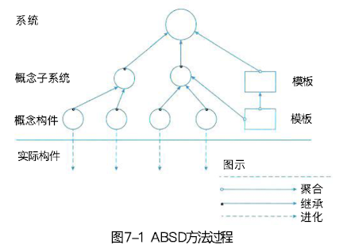

## 基于架构的软件开发方法

### 一、体系结构的设计方法概述

#### (一)、ABSD 方法的定义、适应范围

> 基于体系机构的软件设计（Architecture-Based Software Design, ABSD）方法。ABSD 方法是有体系结构驱动的，即指由体系结构的商业、质量和功能需求的组合驱动的。
>
> 使用 ABSD 方法，设计活动可以从项目总体功能框架明确开始，这意味着需求抽取和分析还没有完成（甚至是远远没有完成），就开始了软件设计。设计活动的开始并不意味着需求抽取和分析活动就可以终止，而是应该与设计活动并行。特别是在不可能预先决定所有需求时（例如，产品线系统或长期运行的系统），快速开始设计是至关重要的。

#### (二)、三个基础

- 功能的分解，在功能分解中，ABSD 方法使用已有的机遇模块的内聚和耦合技术。
- 通过选择体系结构风格来实现质量和商业需求。
- 软件模版的使用，软件模版利用了一些软件系统的结构。

### 二、概念与术语

#### (一)、设计元素、视角与视图、用例和质量场景

1. **设计元素**

   ABSD 方法是一个自顶向下，递归细化的方法，软件系统的体系结构通过该方法得到细化，知道能产生软件构件和类。

   

2. **视角与视图**

   考虑体系结构时，要从不同的视角来观察对架构的描述，这需要软件设计师考虑体系结构的不同属性。选择特定的视角视图可以全方位的考虑体系结构设计。

3. **用例和质量场景**

   用例是系统的一个给予用户一个结果值的功能点，用例用来捕获功能需求。使用用例捕获功能需求的同时，人们通过定义特定场景捕获质量需求，并称这鞋场景为质量场景。

### 三、 基于体系结构的开发模型

#### (一)、传统的软件开发和 ABSD 的差别

- 传统的软件开发过程可以划分为从概念知道实现的若干个阶段，包括问题定义、需求分析、软件设计、软件实现及软件测试等。采用传统软件的开发模型，软件体系结构的建立应位于需求分析之后，概要设计之前。创痛软件开发模型存在开发效率不高，不能很好的支持软件的重用等缺点。
- ABSD 模型把整个基于体系结构的软件过程划分为体系机构需求、设计、文档化、复审、实现和演化 6 个过程。

#### (二)、ABSD 模型涵盖的阶段

- 体系结构需求
- 体系结构设计
- 体系结构文档化
- 体系结构复审
- 体系结构实现
- 体系结构演化

### 四、体系结构需求

#### (一)、需求获取、标识构件、架构需求评审

### 五、体系架构设计

#### (一)、体系机构设计过程模型

### 六、体系结构文档化

#### (一)、体系结构规格说明和测试体系结构需求的质量设计说明书

### 七、体系结构复审

#### (一)、复审的目的、要求和意义

### 八、体系结构实现

#### (一)、体系结构实现过程模型

### 九、体系结构的演化

#### (一)、体系结构演化的定义和作用

#### (二)、演化步骤