## 软件架构风格

### 一、软件架构风格的概述

#### (一)、软件体系结构风格的定义、内涵、分类和作用

1. **定义**

   > 描述某一特定应用领域中系统组织方式的惯用模式。

2. **内涵**

   > 体系结构风格定义了一个系统家族，即一个体系结构定义一个词汇表和一组约束。词汇表中包含一些构件和链接件类型，二这组约束指出系统是如何将这些构件和连接件组合起来的。

3. **分类**

   - 数据流体系结构风格
   - 调用返回体系结构风格
   - 以数据为中心的体系结构风格
   - 虚拟机体系结构风格
   - 独立构件体系结构风格

4. **作用**

   > 体系结构风格反映了领域中众多系统所共有的结构和语义特性，并指导如何将哥哥模块和子系统有效的组织成一个完整的系统。

### 二、数据流体系风格

#### (一)、批处理体系结构风格

> 在批处理风格的软件体系结构中，每个处理步骤是一个单独的程序，每一步必须在前一步结束后才能开始，并且数据必须是完整的，以整体的方式进行传递。它的基本构件是独立的应用程序，连接件是某种类型的媒介。

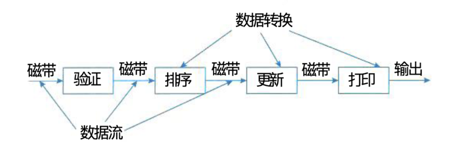

#### (二)、管道-过滤器体系结构风格

> 管道-过滤器风格的基本构件是过滤器、连接件是数据流传输管道，将一个过滤器的输出传到另一个过滤器的输入。

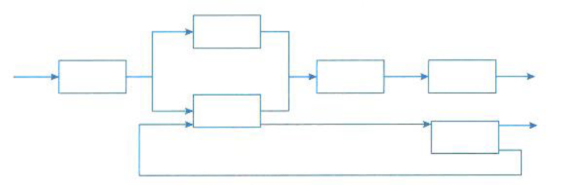

### 三、调用/返回体系结构风格

#### (一)、主程序/字程序风格

> 主程序/子程序风格一般采用单线程控制，把问题划分为若干处理步骤，构件即为主程序 和子程序。子程序通常可合成为模块。过程调用作为交互机制，即充当连接件。调用关系具有 层次性，其语义逻辑表现为子程序的正确性取决于它调用的子程序的正确性。

#### (二)、面向对象体系结构风格

> 抽象数据类型概念对软件系统有着重要作用， 目前软件界已普遍转向使用面向对象系统。这种 风格建立在数据抽象和面向对象的基础上，数据 的表示方法和它们的相应操作封装在一个抽象数 据类型或对象中。这种风格的构件是对象，或者说是抽象数据类型的实。

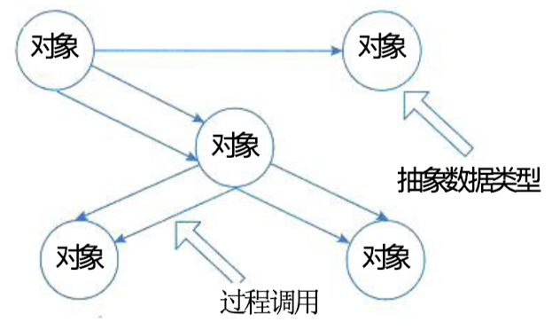

#### (三)、层次型体系结构风格

> 层次系统组成一个层次结构，每一层为 上层提供服务，并作为下层的客户。在一些层次系统中， 除了一些精心挑选的输出函数外，内部的层接口只对相邻 的层可见。这样的系统中构件在层上实现了虚拟机。连接件由通过决定层间如何交互的协议来定义，拓扑约束包括 对相邻层间交互的约束。由于每一层最多只影响两层，同 时只要给相邻层提供相同的接口，允许每层用不同的方法 实现，这同样为软件重用提供了强大的支持。

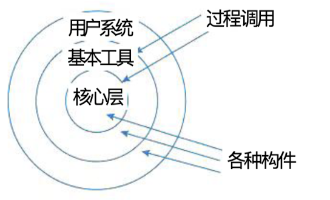

#### (四)、客户端/服务器体系结构风格

> C/S (客户端/服务器)软件体系结构(见图7-11)是基于资源不对等，且为实现共享而提 出的，在20世纪90年代逐渐成熟起来。两层C/S体系结构有3个主要组成部分:数据库服务 器、客户应用程序和网络。服务器(后台)负责数据管理，客户机(前台)完成与用户的交互 任务，称为“胖客户机，瘦服务器”。

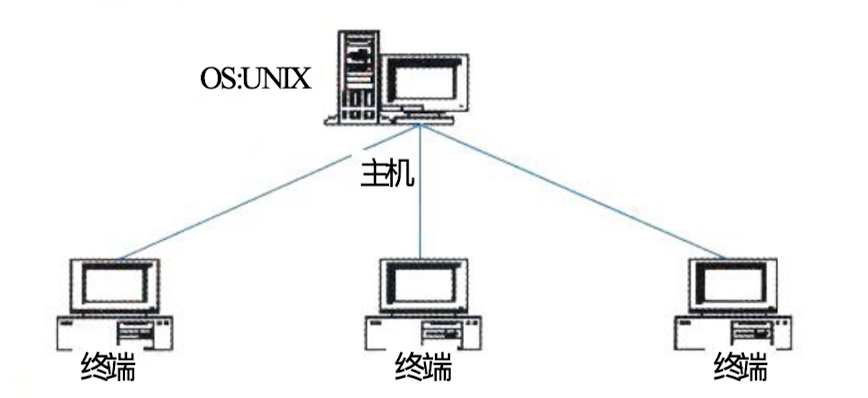

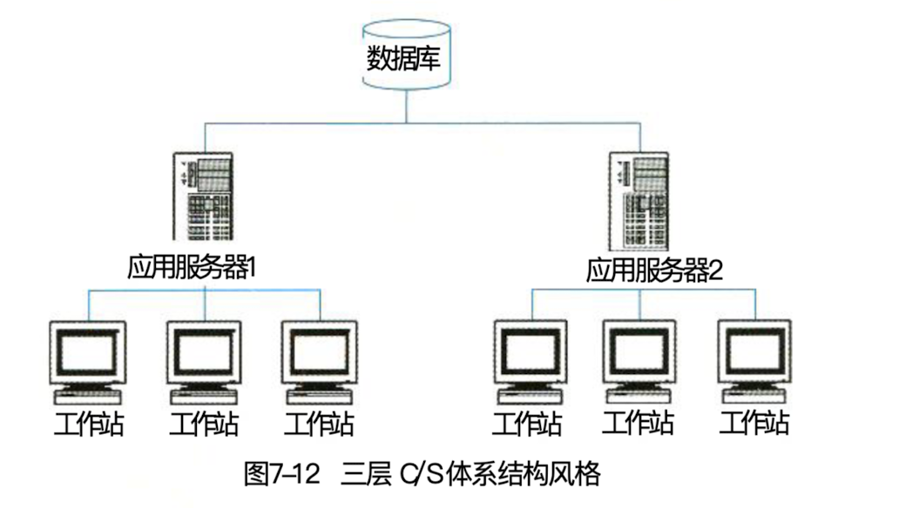

### 四、以数据为中心的体系结构风格

#### (一)、仓库体系结构风格

> 仓 库 (Repository) 是存储和维护数据的中心场所。 在仓库风格中，有两种不同的构件:中央 数据结构说明当前数据的状态以及一组对中央数据进行 操作的独立构件，仓库与独立构件间的相互作用在系统 中会有大的变化。这种风格的连接件即为仓库与独立构 件之间的交互。

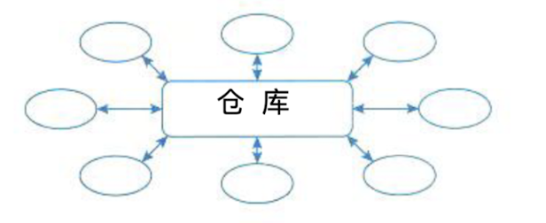

#### (二)、黑板体系结构风格

> 黑板体系结构风格(见图7-14)适用于解决复杂的非结构化的问题，能在求解过程中综合 运用多种不同知识源，使得问题的表达、组织和求解变得比较容易。黑板系统是一种问题求解 模型，是组织推理步骤、控制状态数据和问题求解之领域知识的概念框架

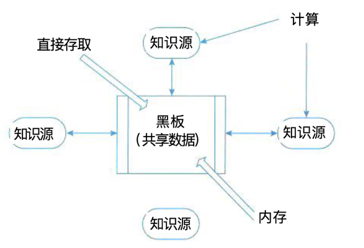

### 五、虚拟机体系结构风格

#### (一)、解释器体系结构风格

> 具有解释器风格的软件中含有一个虚拟机，可以仿真硬件的执行过程和一些 关键应用。解释器通常被用来建立一种虚拟机以弥合程序语义与硬件语义之间的差异。其缺点 是执行效率较低。典型的例子是专家系统。

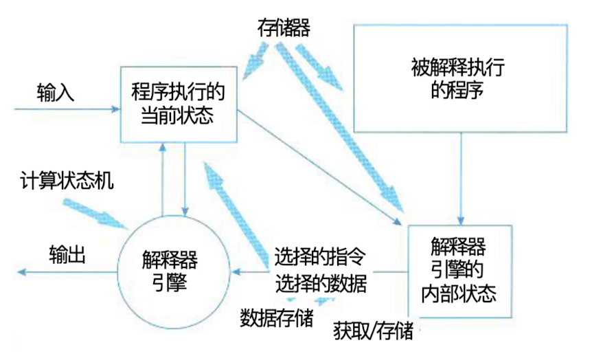

#### (二)、规则体系结构风格

> 基于规则的系统(见图7-16)包括规则集、规则解释器、规则/数据选择器及工作内存。

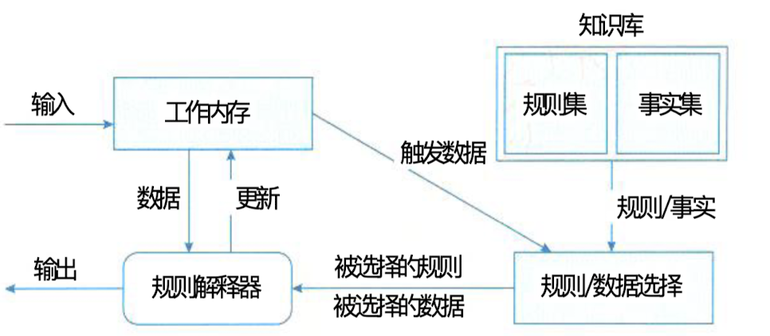

### 六、独立构件体系结构风格

#### (一)、进程通信体系结构风格

> 在进程通信结构体系结构风格中，构件是独立的过程，连接件是消息传递。这种风格的特 点是构件通常是命名过程，消息传递的方式可以是点到点、异步或同步方式及远程过程调用等。

#### (二)、事件系统体系结构风格

> 事件系统风格(见图7-17)基于事件的隐式调用风格的思想是构件不直接调用一个过程， 而是触发或广播一个或多个事件。系统中的其他构件中的过程在一个或多个事件中注册，当一 个事件被触发，系统自动调用在这个事件中注册的所有过程，这样，一个事件的触发就导致了 另一模块中的过程的调用

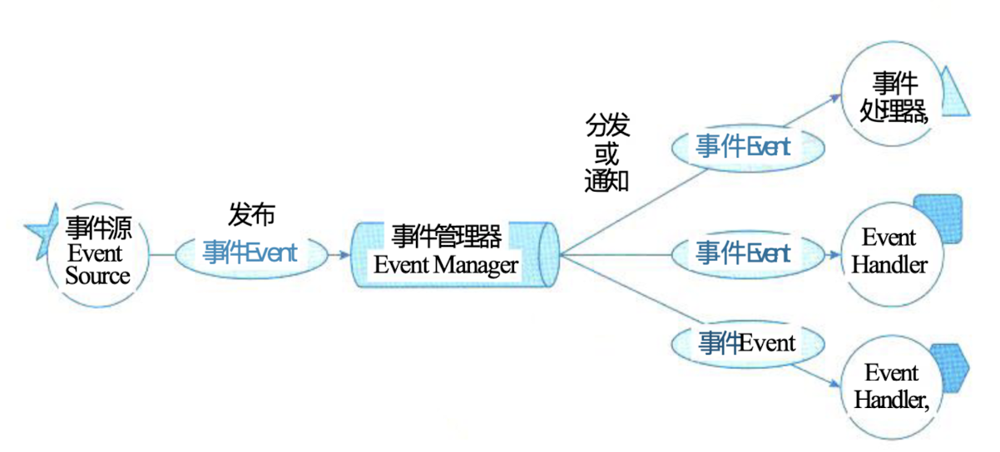