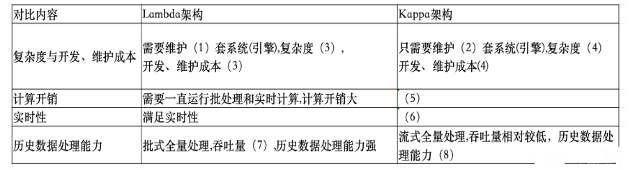
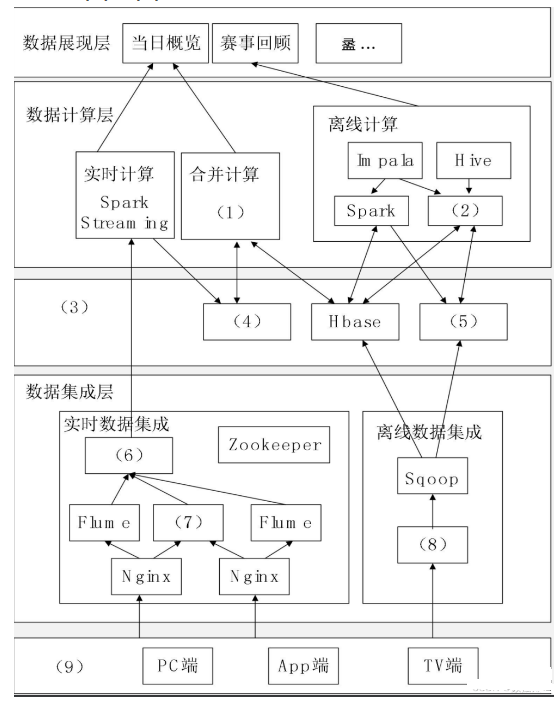

# 试题一

某网作为某电视台在互联网上的大型门户入口，某一年成为某奥运会中国大陆地区的特权转播商，独家全程直播了某奥运会全部的赛事，积累了庞大稳定的用户群，这些用户在使用各类服务过程中产生了大量数据，对这些海量数据进行分析与挖掘，将会对节目的传播及商业模式变现起到重要的作用。该奥运期间需要对增量数据在当日概览和赛事回顾两个层面上进行分析。

其中，当日概览模块需要秒级刷新直播在线人数、网站的综合浏览量、页面停留时间、视频的播放次数和平均播放时间等千万级数据量的实时信息，而传统的分布式架构只采用重新计算的方式分析实时数据在不扩充以往集群规模的情况下，无法在几秒内分析出重要的信意。

赛事回顾模块需要展现自定义时间段内的历史最高在线人数、逐日播放走势、直播最高在线人数和点播视频排行等海量数据的统计信息由于该奥运期间产生的数据通常不需要被经常索引、更新，因此要求采用不可变方式存储所有的历史数据，以保证历史数据的准确性。

### 问题1

请根据Lambda架构和Kappa架构特点，填写一下表格

### 问题2

下图给出了某网奥运的大数据架构图，请根据下面的（a）-（n）的相关技术，判断这些技术属于架构图的哪个部分，补充完善夏目的空白处。

### 问题3

大数据的架构包括了Lambda和Kappa架构，Lambda架构分解为三层：即1、2、3.Kappa架构不同于Lambda同时计算流计算和批计算并合并视图，Kappa只会通过流计算一条的数据链路计算并产生视图。请问该系统的大数据架构师基于哪种架构搭建的大数据平台处理奥运会大规模视频网络观看数据。
