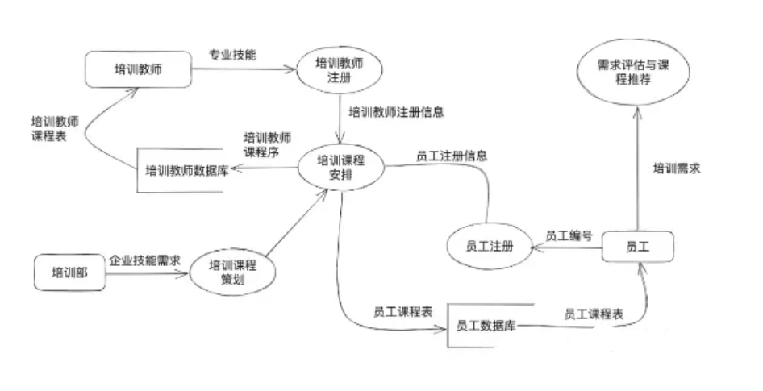

# 试题二

说明:某软件公司为企业开发一套员工在线教育系统支持员工利用业余时间开展专业技术培训，提升员工技能。在项目开展初期，采用结构化分析进行开发并对系统中培训部员工和培训教师的相关功能进行分析，具体需求如下:(1)培训部根据企业技术发展需求负责策划培训课程，并形成课程计划，针对不同的员工设置不同的课程;(2)员工首先在系统进行注册，填写自己的编号，学历，专业，岗位等信息，生成员工注册信息，然后将自己的培训需求录入系统，系统自动评估并进行课程推荐，员工确认后形成课程需求;(3)培训教室也通过系统进行注册，填写自己的编号、学历、专业等信息，形成培训教师注册信息(4)系统根据课程计划、员工注册信息，课程需求和培训教师注册信息，为员工和培训教师生成对应的课程表。工时系统分析师对上述流程进行了审核，并指出需补充数据字典，从而更完整地对系统建。

### 问题1

数据流图（DFD）是结构分析方法的重要工具。请用300字以内的文字描述DFD定义。

### 问题2

项目组针对体感描述的业务需求，初步绘制了系统流图（2-1），请分析图中的三类错误并对每类错误进行简单的解释。

