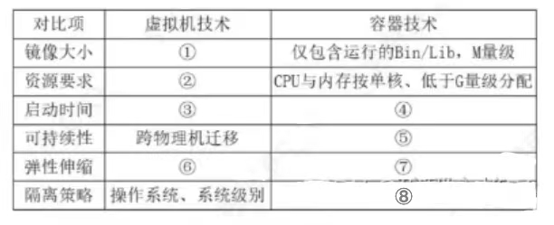

# 试题三

随着嵌入式计算资源快速提升，容器技术Docker发挥重要作用，某哦你公司对原有平台升级，公司将平台升级任务交给了张工，张工经过分析、调研，提出在原嵌入式操作系统平台上采用容器技术的升级方案，但是该方案引发了争议。

### 问题1

争论焦点是采用容器技术还是虚拟机VM技术。李工指出由于容器技术共享主机内核能像虚拟机一样完全隔离，系统存在安全问题；如果采用虚拟机技术除满足需求外，还保证了系统的安全和稳定，会上领导根据系统升级的初衷选择了张工的升级方案，请用300字以内的文字说明容器技术和虚拟技术的含义，并简述公司领导采用容器技术的原因。

### 问题2

下表给出了虚拟技术和容器技术的性能对比表，请根据下面的(a)~(h)的8个性能指标，判断这些指标属于哪类对比项，补充完善 3-1的(1)~(8)的空白处。(a)分钟级、(b)包含Guestos，G 两级以上◎ 跨操作系统平台迁移、(d)CPU与内存按核、按G分配(e)毫秒秒级、(f)Cgroups，进程级别、(g)VM 伸缩，cpu/内存手动伸缩、(h)实例自动伸缩、cpu/内存自动在线伸缩。

