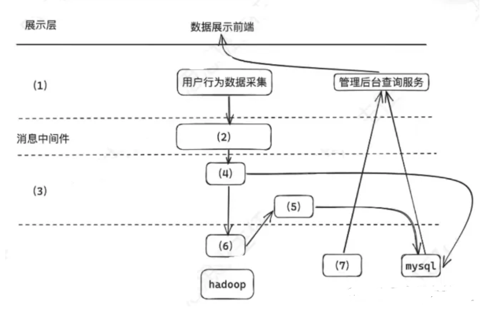

某公司拟开发一个电商平台用户行为分析系统，该系统可支持对电商平台用户行为数据的采集和实时/高效数据处理分析，统计分析用户访问情况。收集PV/UV商品热度等相关数据。系统应具备以下能力。

1. 对海量用户行为数据的存储和处理能力。
2. 为适应用户行为的随机性，保证系统不会被爆发的日子数据压垮，系统应具备对突发流量的处理能力。
3. 对用户数据的隐私保护能力针对项目需求，工时召开会议，会上张工提出买那个对大量数据，传统的文件存储与关系型数据库，无法完全解决当前系统问题，应基于大数据技术设计并实现系统，李工提出可就要求数据脱敏的方法解决用户隐私的问题。

### 问题1

根据项目要求，该系统需考虑电商平台用户行为的随机性，现有应对突发数据，流量数据的处理能力。请根据大数据相关技术的了解，说明可选哪个技术支持流系统应对突发流量暴增情况？并用200字以内的文字说明该技术优势？

### 问题2

根据张工建议，项目组拟采用大数据技术开发该系统。图5给出本项目架构设计方案，请选择(a)-(m)选项中选出合适的内容，完善(1)~(7)处

(a)网络层、(b)业务层、(c)接入层、(d)数据处理(e)数据采集(f) Flink 实时计算、(g)Flink 批处理、(h)Hb(i) Redis、(g)NoSQLase(k)kafka、(l)边缘计算、(m) 设备层

### 问题3

根据李工的建议，项目组拟应用数据脱敏方法对该系统的敏感数据进行脱敏，请用300字以内的文字说明常用的5中数据脱敏方法。
