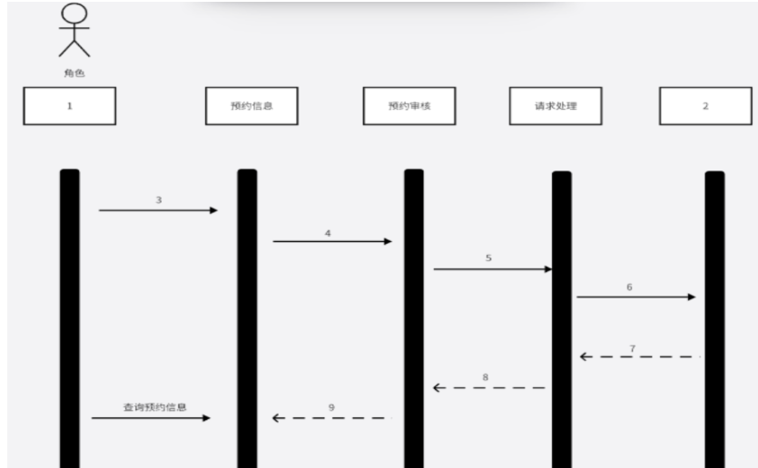

# 试题二

访问者从微信公众号进入xx系统，发送预约申请，预约通过审核后，自动发送给被访问者，被访问者处理完毕后，自动发送给被访问者，被访问者处理完毕后，处理完毕消息回通知访问者和门禁管理人员。

### 问题1

UML时序图的三种消息及其概念

> [!tip]
>
> - 同步消息：消息的发送者把控制传递给消息的接受者，然后停止活动，等待消息的接受者放弃或者返回控制。用来表示同步的意义。
> - 异步消息：消息的发送者通过消息把信号传递给消息的接受者，然后继续自己的活动，不等待接受者返回消息或者控制。异步消息的接受者和发送者时并发工作的。
> - 返回消息：返回消息表示从过程调用返回。

### 问题2

系统分析设计过程中时序图和协作图两种交互图的选取原则

> [!tip]
>
> **时序图的选取原则**：
>
> - 强调时间顺序；适用于展示对象之间消息传递的时间顺序和动态行为，描述系统中的时间发生的顺序。
> - 展示交互时间线：清晰展示用例或场景中各对象在不同时间点的状态变化，帮助理解系统的时间维度行为。
> - 描述复杂的交互场景：适用于多个对象和复杂交互的场景，通过时间线展示消息传递的先后顺序，使复杂的交互过程易于理解。
>
> **协作图的选取原则**：
>
> - 强调对象之间的关系：展示对象子啊贱的链接和关系结构，适用于静态链接和通信路径的展示。
> - 展示对象的结构关系：描述对象如何协作完成任务，强调对象之间的静态结构和协作方式。
> - 突出对象间的通信：适用于展示对象间的通信和交互，而不是时间顺序，清晰展示对象之间的消息传递和关联关系。

### 问题3

UML时序图表示条件分支序列片段有哪些？

> [!tip]
>
> 可选片段：关键字为opt，表示一种单条件分支。
>
> 条件片段：关键字为alt，表示一种多条件分支。
>
> 并行片段：关键字为par，表示片段内有两个或更多的并行子片段。
>
> 循环片段：关键字为loop，表示一个循环。
>
> 中断片段：关键字为break，表示一个含有监护条件的子片段。

> [!caution]
>
> 时序图，有名序列图、顺序图，是一种UML交互图。它通过描述对象之间发送消息的时间顺序显示多个对象之间的动态协作。时序图的元素包括：
>
> - 角色（Actor）：可以是人活着其他系统，子系统，以一个小人图表示。
> - 对象（Object）：对象位于时序图的顶部，以一个矩形表示。
> - 生命线（LifeLine）：每个对象和底部中心都有一条垂直的虚线（对象的时间线）。
> - 控制焦点（Activation）：对象时间线上某段时期执行的操作，以一个很窄的矩形表示。
> - 消息（Message）：对象与角色之间发送的信息。
> - 自关联消息：表示方法的自身调用活着一个对象没的一个方法调用另外一个方法。以一个半闭合的长方形+下方实心箭头表示。
