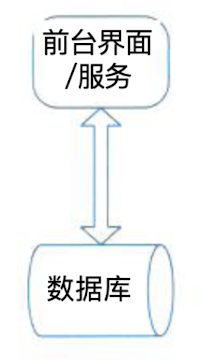
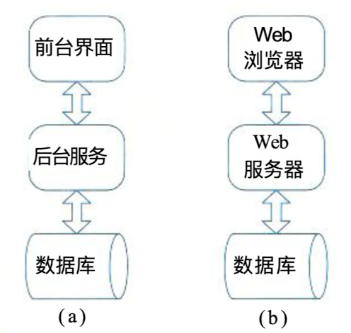
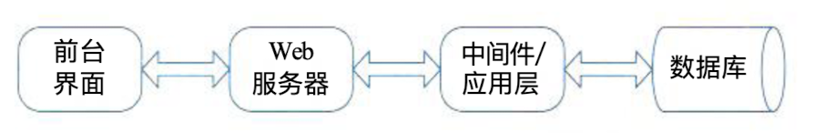
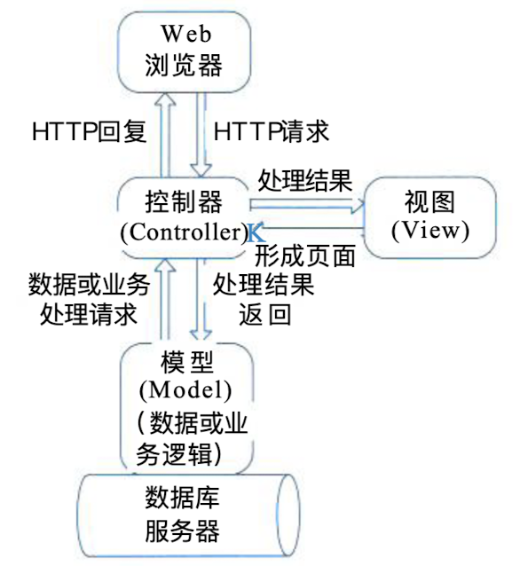
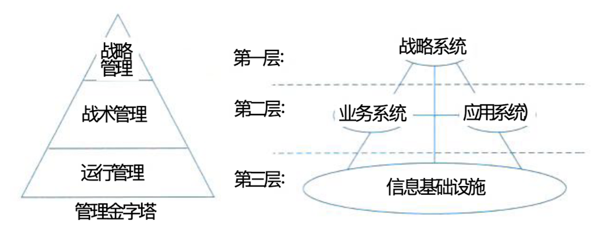

## 信息系统架构概述

### 一、信息系统的定义和发展

> 信息就是对客观事物的反映，从本质上看信息是对社会、自然界的事物特征、现象、本质、及规律的描述。

> 信息系统架构则是指对某一特定内容里的信息进行统筹、规划、设计、安排等一系列有机处理的活动。

### 二、信息系统架构的分类

- 集中式

  >集中式结构是指物理资源在空间上集中配置。
  >
  >**优点**：集中式结构的优点是资源集中，便于管理，资源利用率高。
  >
  >**缺点**：系统规模扩大，维护变得空难；资源过于集中造成系统的脆弱，一旦主机出现故障，就会使整个系统瘫痪。

- 分布式

  > 分布式系统是指通过计算机网络把不同地点的计算机硬件、软件、数据等资源联系在一起，实现不同地点资源的共享。

### 三、信息系统常用的四种架构模型

- 单机应用模式
- 客户机/服务器模式
- 面向服务架构（SOA）模式
- 企业数据交换总线

### 四、单机应用模式

> 是指运行在一台物理机器上的独立应用程序。

### 五、客户机/服务器（C/S）模式（两层CS，三层CS或BS，多层CS、MVC）

> 客户机/服务器模式是信息系统中最常见的一种。C/S概念可理解为基于TCP/IP协议的进程间通信IPC编程的“发送”与“反射”程序结构，即Client向Server发送一个TCP或UDP的包，然后Servre根据接收到的请求向Client回送TCP或UDP数据包，目前C/S架构非常流行。

**两层C/S**

> [!tip]
>
> 两层C/S，其实质就是IPC客户端/服务器结构的应用系统体现。两层C/S结构通俗的说就是人们常说的“胖客户端”模式。在实际的系统设计中，该类结构主要是指前台客户端 + 后台数据库管理系统。
>
> 

**三层C/S与B/S结构**

> [!tip]
>
> 三层C/S结构前台界面送往后台的请求中，除了数据库存取操作以 外，还有很多其他业务逻辑需要处理。三层 C/S 的前台界面与后台服务之间必须通过一种协议 (自开发或采用标准协议)来通信(包括请求、回复、远程函数调用等),通常包括以下7种
>
> (1)基于TCP/IP协议，直接在底层Socket API基础上自行开发。这样做一般只适合需求与 功能简单的小型系统。
> (2)首先建立自定义的消息机制(封装 TCP/IP与 Socket编程),然后前台与后台之间的通 信通过该消息机制来实现。消息机制可以基于 X M L , 也可以基于字节流 (Stream) 定义。虽然 是属于自定义通信，但是，它可以基于此构建大型分布式系统。
> (3)基于RPC编程。
> (4)基于 CORBA/IIOP协议。
> (5)基于 Java RMI。
> (6)基于 J2EE JMS。
> ( 7 ) 基 于 H T T P协议。比如浏览器与 W e b服务器之间的信息交换。这里需要指出的是
> H T T P 不是面向对象的结构，面向对象的应用数据会被首先平面化后进行传输。

> [!tip]
>
> 目前最典型的机遇三层C/S结构的应用模式便是我们最熟悉、较流行的B/S（浏览器/服务器）模式。
>
> Web浏览器是一个用于文档 检索和显示的客户应用程序，并通过超文本传输协议 HTTP (Hyper Text Transfer Protocol) 与 W e b 服务器相连。该模式下， 通用的、低成本的浏览器节省了两层结构的 C/S模式客户端 软件的开发和维护费用。这些浏览器大家都很熟悉，包括M S Internet Explorer、Mozilla FireFox、NetScape 等。

**多层C/S结构**

> [!tip]
>
> 多层C/S结构一般是指三层以上的结构，在实践中主要是三层与四层，四层即前台界面（如浏览器）、Web服务器、中间件（或应用服务器）、数据库服务器。

> [!caution]
>
> 在多层结构中，中间层/应用层主要完成下面的工作。
>
> - 提高系统的可伸缩性、增加并发性能。
> - 中间件/应用层这一层专门完成请求转发或一些与应用逻辑相关的处理，具有这种作用的中间件一般可以作为请求代理，也可以作为应用服务器。
> - 增加数据的安全性。

**MVC**

> [!tip]
>
> MVC实际上是上述多层结构的一种常用的标准化模式，或者可以说是从另一个角度去抽象这种多层C/S结构。
>
> 在J2EE中，VIew表示浏览器层，Controller控制器指Web服务器层。Model模型层指应用逻辑实现及数据持久化的部分。

### 六、面向服务架构（SOA）模式

> [!tip]
>
> 如果两个多层 C/S 结构的应用系统之间需要相 互进行通信，那么，就产生了面向服务架构，称为 应用Service Oriented Architecture, 简称SOA.

> [!caution]
>
> 面向服务架构的本质是消息机制或远程过程调用（RPC）。虽然其具体的实现底层并不一定采用RPC编程技术，但两个应用之间的相互配合确实是通过某种预定义的协议来调用对方的“过程”实现的，这与前节所讲多层架构的单点应用系统中，两个处于不同层的运行实例相互之间通信的协议类型基本是相同的。

### 七、企业数据交换总线

> [!tip]
>
> 这种架构在大型企业不同应用系统进行信息交换时使用较普遍，在国内，主要是银行或电 信等信息化程度较高的行业采用此种结构，其他的许多行业虽然也有类似的需求，但大多都仍 处于半信息化阶段，没有达到“企业数据交换总线”的层次

## 企业信息系统的总体框架

### 一、战略系统

战略系统是指企业中与战略制定，高层决策有关的管理活动和计算机辅助系统。

### 二、业务系统

业务系统是指企业中完成一定业务功能的各部分(物质、能量、信息和人)组成的系统

### 三、应用系统

应用系统即应用软件系统，指信息系统中的应用软件部分。软件按其与计算机硬件和用户 的关系，可以分为系统软件、支持性软件和应用软件，它们具有层次性关系。

对于企业信息系统中的应用软件(应用系统),一般按完成的功能可包含:事务处理系统 TPS、 管理信息系统MIS、 决策支持系统DSS、 专家系统ES、办公自动化系统OAS、 计算机辅助设计/计算机辅助工艺设计/计算机辅助制造CAD/CAPP/CAM、 制造资源计划系统MRPII 等。

### 四、企业信息基础设施

企业信息基础设施是根据企业当前业务和可预见的发展趋势，及对信息采集、处理、存储和流通的要求，构筑由信息设备、通信网络、数据库、系统软件和支持性软件等组成的环境。这里可以将企业信息基础设施分成三部分：技术基础设施、信息资源设施和管理基础设施。

- 技术基础设施由计算机、网络、系统软件、数据交换协议等组成；
- 信息资源设施由数据信息本身、数据交换的形式与标准、信息处理方法等组成；
- 管理基础设施指企业中信息系统部门的组成结构、信息资源设施管理人员的分工、企业信息基础设施的管理方法与规章制度等。

