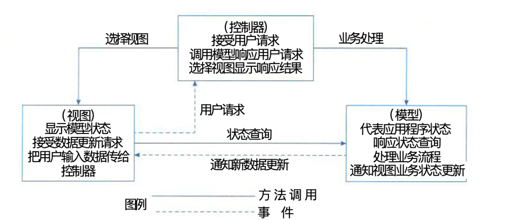
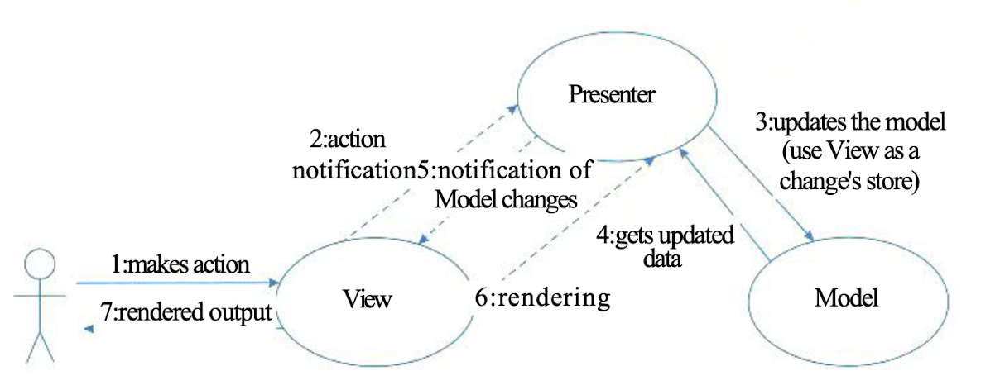
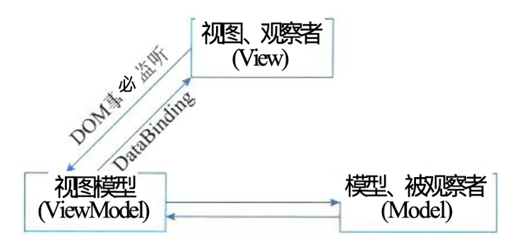

## 表现层框架设计

### 一、设计模式（MVC、MVP和MVVM）

#### (一)、MVC模式

> MVC强制性的把一个应用的输入、处理、输出流程按照视图、控制、模型的方式进行了分离，形成了控制器、模型、视图的三个核心模块。
>
> - **控制器**：接受用户的输入并调用模型和视图去完成用户的需求。
> - **模型**：应用程序的主体部分。模型表示业务数据和业务逻辑。
> - **视图**：用户看到并与之交互的界面。
>
> 
>
> > [!caution]
> >
> > 优点：
> >
> > - 允许多种用户界面的扩展。
> > - 易于维护
> > - 功能强大的用户界面

#### (二)、MVP模式

> MVP是从经典的MVC演变而来的，它们的基本思想有相通的地方，
>
> - Controller/Presenter 负责逻辑处理
> - Model 提供数据
> - View 负责显示
>
> > [!tip]
> >
> > MVP和MVC也是存在区别的。
> >
> > - MVC模式中的元素之间“混乱”的交互主要体现在View和Model直接进行“交流”。
> > - MVP 模式中是不允许存在View 和 Model之间的交互，它们都是通过Presenter来进行交互的。
>
> 
>
> > [!caution]
> >
> > 优点：
> >
> > - 模型与视图完全分离，可以修改视图而不影响模型
> > - 可以更搞笑的使用模型，因为所有的交互都发生在一个地方 presenter内部
> > - 可以将一个 Presenter用户多个视图，而不需要改变Presenter的逻辑，这个特性非常的有用，因为视图的变化总是比模型的变化频繁。
> > - 如果把逻辑放在 Presenter 中，就可以脱离用户接口来测试这些逻辑（单元测试）

#### (三)、MVVM模式

> MVVM 模式正式为了解决MVP中UI种类变多，接口也会不断增加的问题而提出的。
>
> - **Model**
> - **View**
> - **ViewModel**：视图模型，是MVVM的核心，它通过DataBinding实现 View 和 Model的属相数据绑定
>
> 

### 二、XML技术

> XML（可扩展标记语言）与html蕾丝，是一种标记语言。与主要用户控制数据的显示和外观的html标记不同，XML标记用户定义数据本身的结构和数据类型。XML已被公认为是优秀的数据描述语言，并且成为了业内广泛采用的数据描述标准。

### 三、UIP设计思想

> UIP(UserInterface Process Application Block)是微软社区开发的众多Application Block中的其中之一，它是开源的。UIP提供了一个扩展的框架，用于简化用户界面与商业逻辑代码的分离的方法，可以用它来写复杂的用户界面导航和工作流处理，并且它能够复用在不同的场景、并可以随着应用的增加而进行扩展。

### 四、动态生成设计思想

> 基于XML的界面管理技术可实现灵活的界面配置、界面动态生成和界面定制。其思路是用XML生成配置文件及界面所需的元数据，按不同的需求生成界面元素及软件界面。
