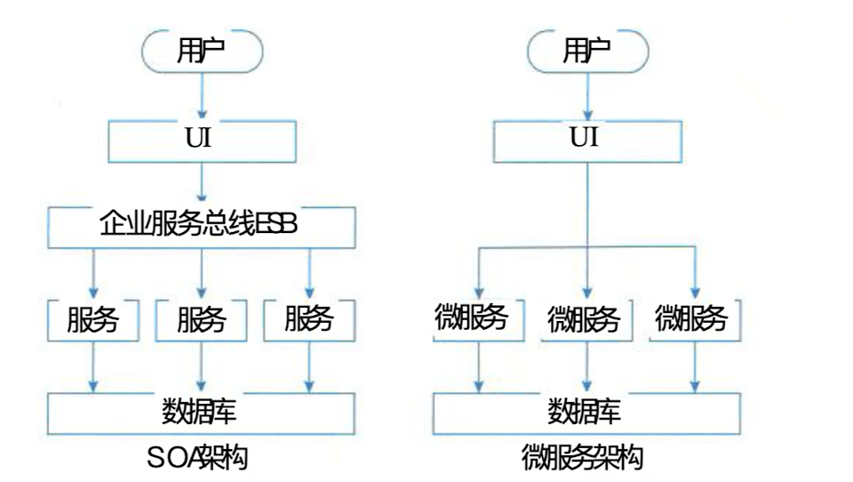

## 面相服务的架构概述

### 一、SOA的定义和发展现状

> **定义**：
>
> 从软件的基本原理定义，可以认为SOA是一个组件模型，它将应用程序的不同功能单元（称为服务）通过这些服务之间定义良好的接口和契约联系起来。接口是采用中立的方式进行定义的，它应该独立于实现服务的硬件平台、操作系统和编程语言。这使得构建在各种这样的系统中的服务可以以一种统一的通用的方式进行交互。

> [!TIP]
>
> 1. 萌芽阶段
> 2. 标准化阶段
> 3. 成熟应用阶段

> [!CAUTION]
>
> **SOA的微服务化发展**【SOA于微服务的区别】
>
> - 微服务相比于SOA更加精细，微服务更多地以独立的进程的方式存在，互相之间并无影响。
> - 微服务提供的接口方式更加通用化，例如HTTP、RESTful方式，各种终端都可以调用，无关语言、平台限制。
> - 微服务更倾向于分布式去中心化的部署方式，在互联网业务场景下更合适。
>
> 

### 二、面向Web服务的业务流程执行语言（BPEL）

> BPEL(Business Process Execution Language For Web Services) 翻译成中文的意思是面向 Web服务的业务流程执行语言，也有的文献简写成BPEL4WS, 它是一种使用Web服务定义和 执行业务流程的语言。使用BPEL, 用户可以通过组合、编排和协调Web服务自上而下地实现 面向服务的体系结构。 BPEL提供了一种相对简单易懂的方法，可将多个Web服务组合到一个
> 新的复合服务(称作业务流程)中。
> BPEL 目前用于整合现有的 Web Services, 将现有的Web Services按照要求的业务流程
> 整理成为一个新的Web Services, 在这个基础上，形成一个从外界看来和单个Service一样的 Service

### 三、SOA的参考架构（IBM的Websphere业务集成参考架构）

> IBM的Websphere业务集成参考架构是典型的以服务为中心的企业集成架构。以服务为中心的企业集成架构采用“关注点分离”的方法规划企业集成重的各种架构元素，同时从服务视角规划每种架构元素提供的服务，以及服务如何被组合在一起完成某种类型的集成。哲理脚骨元素提供的服务既包括狭义的服务（WSDL描述），也包括冠以的服务（某种能力）。

> [!TIP]
>
> **以服务为重的视角来看，企业集成的架构可划分为6大类：**
>
> - **业务逻辑服务**：包括用于实现业务逻辑的服务和执行业务逻辑的能力，其中包括业务应用服务、业务伙伴服务、应用和信息资产。
> - **控制服务**：包括实现人、流程、信息集成的服务，以及执行这些集成逻辑的能力。
> - **连接服务**：通过提供企业服务总线提供分布在各种架构元素中服务间的连接性。
> - **业务创新和优化服务**：用于监控业务系统运行时服务的业务性能，并通过及时了解到的业务性能和变化，采取措施适应变化的市场。
> - **并发服务**：贯彻整个软件开发生命周期的开发平台，从需求分析，到建模、设计、开发、测试和维护等全面的工具支持。
> - **IT服务管理**：支持业务系统运行的各种基础设施管理能力或服务，如安全服务、目录服务、系统管理和资源虚拟化。

### 四、SOA主要遵守的协议和规范（UDDI协议、WSDL规范、SOAP协议和REST规范）

- UDDI协议
  - UDDI(统一描述、发现和集成协议)计划是一个广泛的、开发的行业计划，它使得商业实体能够彼此发现。
  - UDDI同时也是Web服务集成的一个体系框架，包含了服务描述与发现的标准规范。 UDDI 规范利用了W 3 C和Internet工程任务组织的很多标准作为其实现基础，如XML、HTTP和DNS 等协议
- WSDL规范
  - WSDL（服务描述语言），是一个用来描述Web服务和说明如何与Web服务通信的XML语言。
  - 可描述Web的三个基本属性：
    - 服务做些什么--服务所提供的操作（方法）
    - 如何访问服务--和服务交互的数据格式以及必要协议
    - 服务位于何处--协议相关的地址，如URL
- SOAP协议
  - SOAP是在分散或分布的环境中交换信息的简单协议，是一个基于XML的协议。它包括4个部分：
    - SOAP封装，定义了一个描述消息中的内容是什么，是谁发送的，谁应当接受并处理它以及如何处理它们的框架。
    - SOAP编码规则，用于表示应用程序需要使用的数据类型的实例。
    - SOAP RPC表示的是远程过程调用和应答的协定。
    - SOAP绑定是使用低层协议交换信息。
- REST 规范
  - REST是一种架构风格，REST的设计不只是要适用于互联网环境，而是一个普遍的设计理念，目的是为了让不同的软件或者应用程序在任何网络环境下都可以进行消息的互相传递。
  - **资源**
    - REST是以资源为中心构建的，资源可以是一个订单，也可以是一幅图片。将互联网中一切暴露给客户端的事物都可以看做是资源。
    - 一个URI只能对应一种资源，但是一种资源可以对应多个URI
  - **表述**
    - REST中用表述描述资源在Web中某一个时间的状态。客户端和服务端借助RESTful API传递数据，实际就是在进行资源表示的交互。表述在Web中常用的表现形式有HTML、JSON、XML、纯文本等，但是资源表述返回客户端的形式只是统一格式，是开发阶段根据实际需求设计一个统一的表述格式。
  - **状态转移**
    - REST定义的状态分为两种
      - **应用状态**：是对某个时间内用户请求回话信息的快照，保存在客户端，有客户端自身维护，可以和缓存配合降低服务端并发请求压力。
      - **资源状态**：在服务端保存，是对某个时间资源请求表述的快照，保存在服务端，如果一段时间内没有对资源状态进行改变，客户端对同一资源请求返回的表述一致。
  - **超链接**
    - 超链接是通过在页面中嵌入链接和其他资源建立联系，这里的资源可以是文本、图片、文件等。

### 五、SOA的作用

> 在一个企业内部，可能存在不同的应用系统，而这些应用系统由于开发的时间不同，采用的开发工具不同，一个业务请求很难有效地调用所有的应用系统。用简单的语言来表述，这些已有应用系统是孤立的，也就是我们常说的“信息孤岛”。
>
> SOA凭借其松耦合的特性，使得企业可以按照模块化的方式来添加新服务或更新现有服务，以解决新的业务需要，提供选择从而可以通过不同的渠道提供服务，并可以把企业现有的或已有的应用作为服务，从而保护了现有的IT基础建设投资。

> [!TIP]
>
> SOA对应实现企业资源共享，打破“信息孤岛”的步骤如下：
>
> - 把应用和资源转换成服务。
> - 把这些服务编程标准的服务，形成资源的共享。

