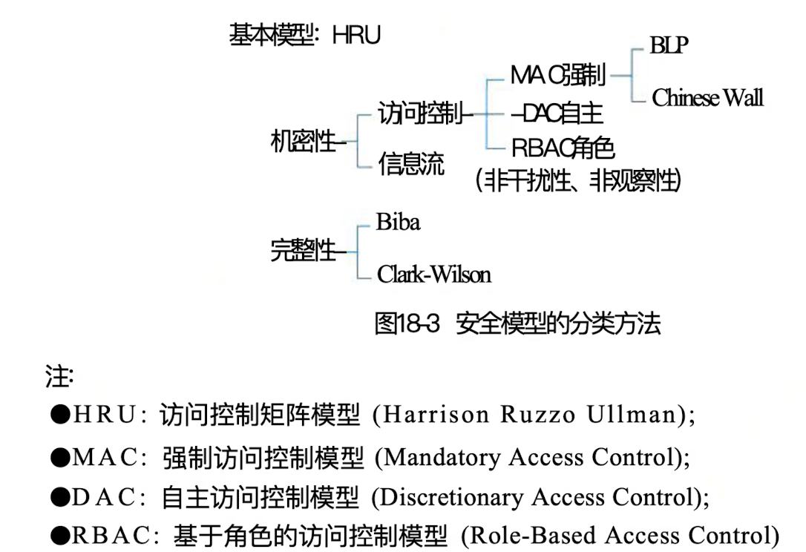

## 安全架构概述

### 一、信息安全面临的威胁

- 信息泄露：信息被泄露或透漏给某个非授权的实体
- 破坏信息的完整性：数据被非授权的进行增删，修改或破坏而受到损失
- 拒绝服务：对信息或其他资源的的合法访问被无条件的阻止
- 非法使用（非授权访问）：某一资源被某个非授权的人活非授权的方式使用
- 窃听：用各种可能的合法或非法的授权窃取系统中的信息资源和敏感信息。
- 业务流分析：通过对系统进行长期监听，利用统计分析方法对诸如通信频度、通信的信息流向、通信总量的变化等态势进行研究，从而发现有价值的信息和规律。
- 假冒：通过欺骗通信系统（或用户）达到非法用户冒充称为合法用户，或者特权小的用户冒充称为特权大的用户的母的。黑客大多是采用假冒进行攻击。
- 旁路控制：攻击者利用系统的安全缺陷或者安全性上的脆弱指出获取非授权的权利或特权。
- 授权侵犯：被授权以某一目的使用某一系统或资源的某个人，却将此特权限用户其他非授权的目的，也称为“内部攻击”。
- 特洛伊木马：软件中含有一个察觉不出的或者无害的程序段，当它被执行时，会破坏用户的安全。这种应用程序称为特洛伊木马。
- 陷阱门：在某个系统或者某个部件中设置了“机关”，使得当提供特定的输入数据时，允许违反安全策略。
- 抵赖：这是一种来自用户的攻击。例如，否认自己曾经发布过的某条消息、伪造一份对方来信。
- 重放：所截获的某次合法的通信数据备份，处于非法的目的而被重新发送。
- 计算机病毒：所谓计算机病毒，是一种在计算机系统运行过程中能够实现传染和侵害的功能程序。
- 人员渎职：一个授权的人为了钱或利益、或由于粗心，将信息泄露给一个非授权的人。
- 媒体废弃：信息被从废弃的磁盘或打印过的存储介质中获得。
- 物理侵入：侵入者通过绕过物理控制而获得对系统的访问。
- 窃取：重要的安全物品，如令牌或身份卡被盗。
- 业务欺骗：某一伪系统或系统部件欺骗合法的用户或系统资源的放弃敏感信息。

### 二、安全架构的定义和范围（产品安全架构、安全技术体系架构和审计架构）

> 安全架构是架构面向安全性方向上的一种细分，比如细分领域含有运维架构、数据库架构等。

- 产品安全架构：构建产品安全质量属性的主要组成部分以及它们之间的关系。产品安全架构的目标是如何在不依赖外部防御系统的情况下，从源头打造自身安全的产品。
- 安全技术体系架构：构建安全技术体系的主要组成部分以及它们之间的关系。安全技术体系架构的任务是构建通用的安全技术基础设施，包括安全基础设施、安全工具和技术、安全组件与支持系统等，系统性的增强各产品的安全防御体能力。
- 审计架构：独立的审计部分或其所能提供的风险发现能力，审计的范围主要包括安全风险在内的所有风险。

### 三、信息安全相关的国内外标准及组织

- 国外标准（P635）
- 国内标准（P636）
- 相关标准化组织
  - 国际标准化组织 ISO
  - 国际电工委员会 IEC
  - 中国国家标准化管理委员会 SAC
  - 全国信息技术标准化技术委员会

### 四、主要安全模型

> 信息系统的安全目标是控制和管理注意（用户和进程）对客体（数据和程序）的访问。作为信息系统安全目标，就是要实现：
>
> - 保护信息系统的可用性
> - 保护网络系统服务的连续性
> - 防范资源的非法访问及非授权访问
> - 防范入侵者的恶意攻击和破坏
> - 保护信息通过网上传输过程中的机密性、完整性
> - 防范病毒的侵害
> - 实现安全管理

> 安全模型的一种分类方法
>
> 

- 状态机模型（BLP）**P639**
- Bell-LaPadula模型 **P640**
- Biba模型 **P641**
- Clark-Wilson（CWM）模型 **P642**
- ChineseWall模型 **P643**