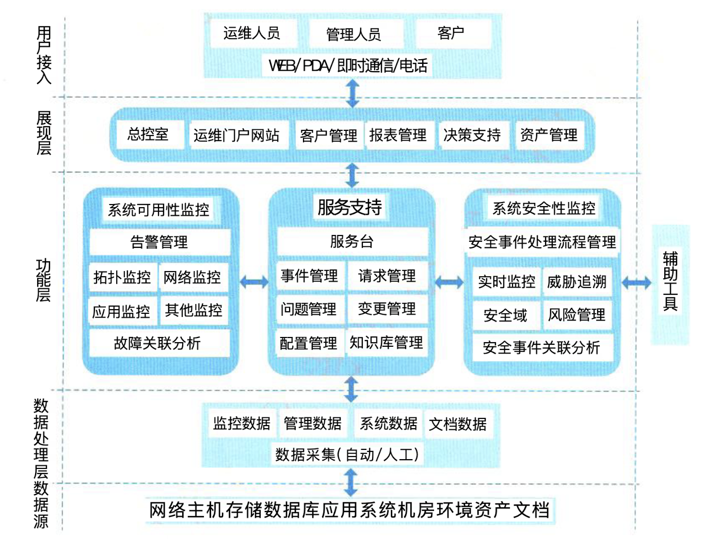

## 信息安全整体架构设计

> 构建信息安全保障体系框架应包括技术体系、组织机构体系和管理体系等三部分，也就是说：人、管理和技术手段是信息安全架构设计的三大要素，而构成动态的信息与网络安全保障体系框架是实现系统的安全保障。

### 一、WPDRRC体系架构模型概述（6个环节和3大要素）

**6个环节**

- **预警**：主要是指利用远程安全评估系统提供的模拟攻击技术来检查系统存在的、可能被利用的薄弱环节，手机和测试网络与信息的安全风险所在，并以直观的方式进行报告，提供解决方案的建议，在经过分析后，分解网络的风险变化趋势和严重风险点，从而有效降低网络的总体风险，保护关键业务和数据。
- **保护**：防护通常是通过采用成熟的信息安全技术及方法来实现网络与信息的安全。
- **检测**：通过检测和监控网络以及系统，来发现新的威胁和弱点，强制执行安全策略。
- **响应**：指在检测到安全漏洞和安全事件之后必须及时作出正确的响应，从而把系统调整到安全状态。
- **恢复**：当前网络、数据、服务收到黑客攻击并遭到破坏或影响后，通过必要技术手段，在尽可能短的时间内使系统恢复正常。
- **反击**：指采用一切可能的高新技术手段，侦查、提取计算机犯罪分子的作案线索与犯罪证据，形成强有力的取证能力和依法打击手段。

> 3大要素包括：人员、策略和技术。人员是核心，策略是桥梁，技术是保证。

### 二、信息安全体系架构设计方法

- 系统安全保证体系
  - 安全区域策略的确定：根据安全区域的划分，主观部门应指定针对性的安全策略。
  - 统一配置和管理防病毒系统：主管部门应当建立整体防御策略，以实现统一的配置和管理。
  - 网络安全管理：在网络安全中，除了采用一些技术措施外，加强网络安全管理，指定有关规章制度。
- 信息安全体系架构
  - 物理安全
  - 系统安全
  - 网络安全
  - 应用安全
  - 安全管理

### 三、面相企业安全控制系统的安全架构设计

架构采用了传统的层次架构，分为数据层、功能层和展现层。

- 数据层主要对企业数据进行统一管理，按数据的不同安全特性进行存储、隔离与保护等；
- 功能层是系统安全防范的主要核心功能，包括可信性监控、服务支持和安全性监控。
  - 可信性监控主要实现网络安全、系统安全和应用安全中的监控能力；
  - 服务支持主要正对安全管理功能而设计的，实现安全管理平台的大多数功能；
  - 安全性监控主要针对系统重发现的任何不安全现象进行相关处理，涵盖了威胁追溯、安全域审计评估、授权、认证等，以及风险分析与评估等。
- 展现层主要完成系统安全架构的使用、维护、决策等功能的实现。

