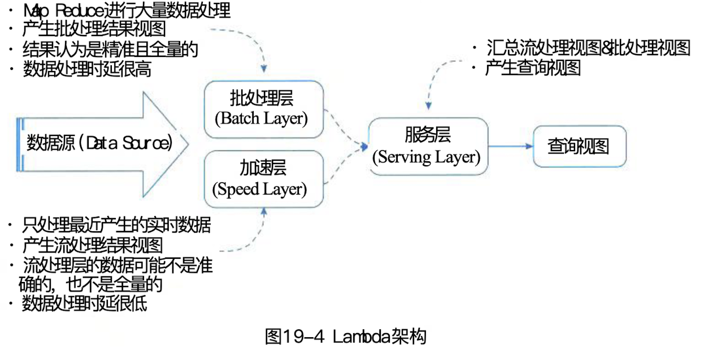
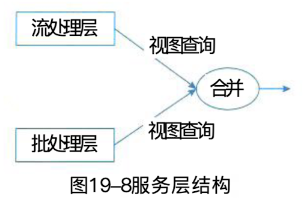

## 典型的大数据架构

### 一、Lambada 架构

#### (一)、Lambda的来源、定义、应用场景和优缺点

**1. 来源定义**

> Lambda 架构由 Storm 的作者 Nathan Marz 提出，其设计的目的在于提供一个能满足大数据系统关键特性的架构，包括高容错、低延迟、可扩展等。其整合离线计算与实时计算，融合不可变性、读写分离和复杂性隔离等原则，可集成 Hadoop、Kafaka、Spark、Storm 等各类大数据组件。Lambda 是用于同时处理离线和实时数据的，可容错的，可扩展的分布式系统。他具备强鲁棒性，提供低延迟和持续更新。

**2. 应用场景**

> - 机器学习中的 Lambda 架构。
> - 物联网的 Lambda 架构
> - 流处理的 Lambda 架构挑战

**3. 优缺点**

> 1. **优点**
>    - 容错性好
>    - 查询灵活度高
>    - 易伸缩
>    - 易扩展
> 2. **缺点**
>    - 全场景覆盖带来的编码开销
>    - 针对具体场景重新离线训练一遍益处不大
>    - 重新部署和迁移成本高

#### (二)、Lambda 的体系结构

1. **批处理层（Batch Layer）**：存储数据集，Batch Layer 在数据集上预先计算查询函数，并构建查询所对应的 View。Batch Layer 可以很好的处理离线数据，但有很多的场景数据不断实时生成且需要实时查询处理，对于这种情况，Speed layer 更为合适。

   > Batch Layer 有两个核心功能：存储数据集和生成 Batch View。
   >
   > 改成负责管理主数据集。主数据集中的数据必须具备一下三个属性。
   >
   > - 数据是原始的
   > - 数据是不可变的
   > - 数据永远是真实的

2. **加速层（Speed Layer）**：Batch Layer 处理的事全体数据集，而 Speed Layer 处理的事最近的增量数据流。Speed Layer 为了效率，在接受到新的数据后会不断更新 Peal-tineView，而 Batch Layer 是更具全体离线数据集直接得到的 Batch View。

3. **服务层（Serving Layer）**：Serving Layer 用于合并 Batch Layer 和 Peal-tineView 中的结果数据集到最终数据集。

   

   

### 二、Kappa 架构

#### ( 一)、Kappa 的来源、定义、应用场景和优缺点

> Kappa架构由Jay kreps提出，不同于Lambda同时计算流计算和批计算并合并视图，Kappa只会通过流计算一条的数据链路计算并产生视图。Kappa同样采用了重新处理事件的原则，对于历史数据分析类的需求，Kappa要求数据的长期存储能够以有序日志流的方式重新流入流计算引擎，重新产生历史数据的视图。本质上是通过改进Lambda架构中的Speed Layer，使它既能够进行实时数据的处理，同时也有能力在业务逻辑更新的情况下重新处理以前处理过的历史数据。

> [!tip]
>
> Kappa架构的原理就是：在Lambda的基础上进行了优化，删除了Batch Layer的架构，将数据通道以消息队列进行替代。因此对于Kappa架构来说，依旧以流处理为主，但是数据却在数据库层面进行了存储，当需要进行离线分析或再次计算的时候，则将数据湖的数据再次经过消息队列重播一次则可。

> [!caution]
>
> **优点**：
>
> Kappa脚骨的优点在于将实时和离线代码统一起来，方便维护而且同意了数据口径的问题，避免了Lambda架构中与李现数据合并的问题，查询历史数据的时候只需要重放存储的历史数据即可。
>
> **缺点**：
>
> - 消息中间件缓冲的数据量和回溯数据由性能瓶颈。通常算法需要过去180天的数据，如果都存在消息中间件，无疑有非常大的压力。同时，一次性回溯180天级别的数据，对实时计算的资源消耗也非常大。
> - 在实时数据处理时，遇到大量不同的实时流进行关联时，非常依赖实时计算系统的能力，很可能因为数据流先后顺序问题，导致数据丢失。
> - Kappa在抛弃了离线数据处理模块的时候，同时抛弃了离线计算更加稳定可靠的特点。Lambda虽然保证了离线计算的额稳定性，但双系统的维护成本高且两套代码带来后期运维空难。

#### (二)、Kappa 的体系结构

> P688

#### (三)、常见Kappa 架构的变形架构

> P689

