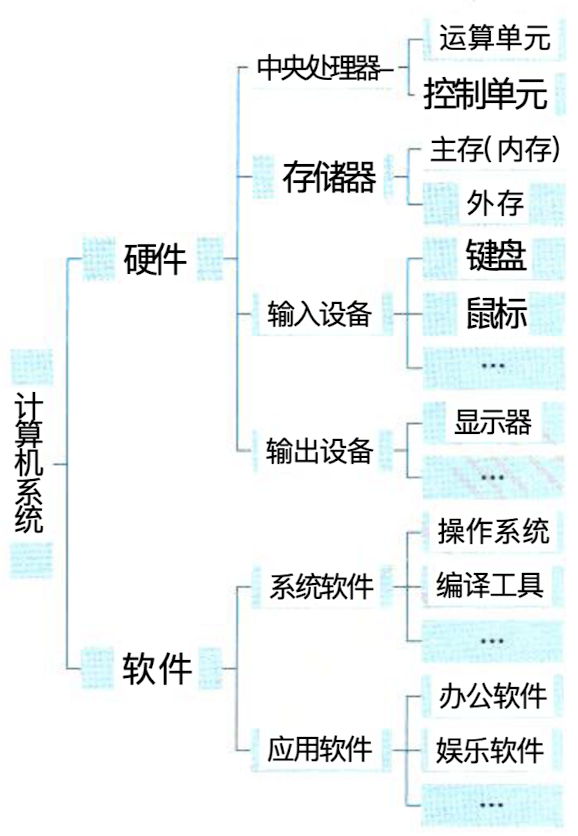
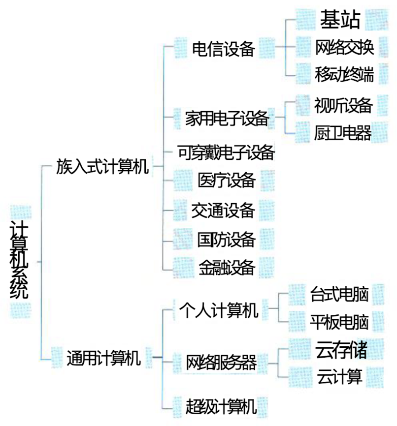

## 计算机系统概述

#### 计算机系统的定义、组成和分类

##### 定义

> 计算机系统是指用于数据管理的计算机硬件、软件及网络组成的系统。

##### 组成

> 计算机系统可划分为硬件(子系统)和软件(子 系统)两部分。硬件由机械、电子元器件、磁介质和 系统 光介质等物理实体构成，例如处理器(含运算单元和 控制单元)、存储器、输入设备和输出设备等。软件 是一系列按照特定顺序组织的数据和指令，并控制硬 件完成指定的功能。可将计算机软件进一步分为系统 软件和应用软件，系统软件是指支持应用软件的运 行，为用户开发应用软件提供平台支撑的软件，而应 用软件是指计算机用户利用计算机的软、硬件资源为 某一专门的应用目的而开发的软件。
>
> 

##### 分类

