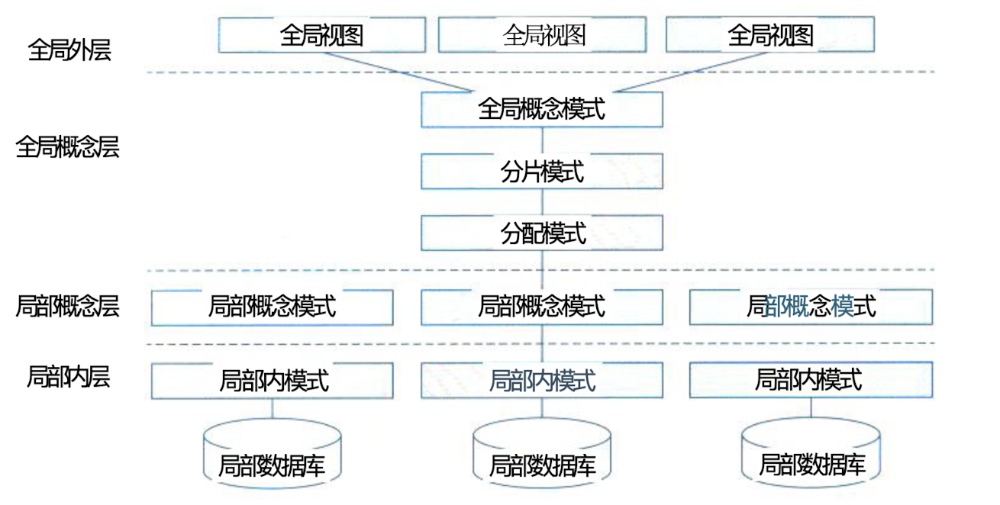

## 计算机软件

### 一、计算机软件概述

#### (一)、计算机软件的定义和作用

> 软件系统是指在计算机硬件系统上运行的程序、相关的文档资料和数据集合。
>
> 计算机软件用来扩充计算机系统的功能，提高计算机系统的效率。按照软件所起的作用和需要的运行环境的不同，通常将计算机软件分为系统软件和应用软件两大类。

#### (二)、计算机软件的分类：系统软件和应用软件

- **系统软件**

  > 系统软件是为了整个计算机系统配置的不依赖特定应用领域的通用软件。这些软件对计算机系统的硬件和软件资源进行控制和管理，并为用户使用和其他应用软件的运行提供服务。

- **应用软件**

  > 应用软件是指为某类应用需要或解决某个特定问题而设计的软件，如图形图像处理软件、财务软件、游戏软件和各类软件包等。

### 二、操作系统

#### (一)、操作系统的组成、作用和类型

- **组成**

  > 操作系统是一种大型、复杂的软件产品，它们通常由操作系统内核 (Kernel) 和其他许多 附加的配套软件所组成，包括图形用户界面程序、常用的应用程序(如日历、计算器、资源管 理器和网络浏览器等)、实用程序(任务管理器、磁盘清理程序、杀毒软件和防火墙等)以及为 支持应用软件开发和运行的各种软件构件(如应用框架、编译器和程序库等)。

- **作用**

  - 管理计算机中运行的程序和分配各种软硬件资源。
  - 为用户提供友善的人机界面。
  - 为应用程序的开发和运行提供一个高效率的平台。

- **类型**

  - 批处理操作系统
  - 分时操作系统
  - 实时操作系统
  - 网络操作系统
  - 分布式操作系统
  - 微型计算机操作系统
  - 嵌入式操作系统

#### (二)、操作系统的特点

- 并发性
- 共享性
- 虚拟性
- 不确定性

#### (三)、操作系统的基本原理

> 操作系统是计算机系统的资源管理者，它包含对系统软、硬件资源实施管理的一组程序， 其首要作用就是通过 C P U 管理、存储管理、设备管理和文件管理对各种资源进行合理地分配， 改善资源的共享和利用程度，最大限度地发挥计算机系统的工作效率，提高计算机系统在单位 时间内处理工作的能力。操作系统是配置在计算机硬件上的第1层软件，它向下管理裸机及其 中的文件，向上为其他的系统软件(汇编程序、编译程序、数据库管理系统等)和大量应用软件提供支持，以及为用户提供方便使用系统的接口。

#### (四)、批处理操作系统和分时操作系统

#### (五)、网络操作系统及分布式操作系统

#### (六)、嵌入式操作系统与实时操作系统

### 三、数据库系统

#### (一)、数据库的定义、作用和类型

> 在信息处理领域，由于数据量庞大，如何有效组织、存储数据对实现高效率的信息处理至关重要。数据库技术是目前最有效的数据管理技术。数据库是指长期存储在计算机内、有组织的、有益管理的相关数据的集合。它不仅描述实物的数据本身，而且还包括相关实物之间的联系。数据库可以直观的理解为存放数据的仓库，只不过这个仓库是在计算机的存储设备上而且数据是按照一定的格式存放的，具有小小的冗余度、较高的数据库独立性和易扩展性，可为多个用户共享。
>
> 早期数据库种类有 3 中，分别是层次式数据库、网络式数据库和关系型数据库。
>
> 根据数据库的存储体系分类，可以分为
>
> - 关系型数据库
> - 键值数据库
> - 列存储数据库
> - 文档数据库
> - 搜索引擎数据库。

#### (二)、数据库管理系统的基本原理

#### (三)、关系型数据库系统（数据模型、关系描述和数据库设计）

> 数据模型是数据库特真的抽象，它是对数据库组织方式的一种模型化表示，是数据库系统的核心与基础。它具有数据结构、数据操作和完整性约束条件三要素。
>
> 关系可以理解为二维表。一个关系模型就是指用若干关系表示实体及其联系，用二维表的形式存储的数据的。

#### (四)、分布式数据库系统（结构和应用）

> 分布式数据库系统是针对的地理上分散，而管理上又需要不同程度集中管理的需求而提出的一种数据管理信息系统。满足分布性、逻辑相关性、场地透明性和场地自治性的数据库系统被称为完全分布式数据库系统。
>
> 分布式数据库系统的特点是数据的集中控制性、数据独立性、数据冗余可控性、场地自治性和存取的有效性。
>
> 

#### (五)、数据管理系统（定义、特点和产品（oracle、IBM DB2、Sybase 等））

- **大型数据库管理系统的特点**

  > 1. 基于网络环境的数据库管理系统，可以用户 C/S 结构的数据库应用系统，也可以用于 B/S 结构的数据库应用系统。
  > 2. 支持大规模应用。可支持数千并发用户、多达上百万事物处理和超过数百 GB 的数据容量
  > 3. 提供自动锁功能是的并发用户可以安全而高效的访问数据。
  > 4. 可以保证系统的高度安全性。
  > 5. 提供方便而灵活的数据备份和恢复方法及设备镜像功能，还可以利用操作系统提供容错功能，取保设计良好的应用中的数据在发生意外的情况下可以最大限度的被恢复。
  > 6. 提供多种维护数据完整性的手段。
  > 7. 提供了方便易用的分布式处理功能。

  

### 四、文件系统

#### (一)、文件系统的定义、作用和类型

- 定义

  > 文件是具有符号名的、在逻辑上具有完整意义的一组相关信息项的集合。

- 类型

  > 1. 按文件的性质和用途分类可以将文件分为系统文件、库文件和用户文件。
  > 2. 按信息保存期限分类可以将文件分为临时文件、档案文件和永久文件。
  > 3. 按文件的保护分类可以将文件分为只读文件、读写文件、可执行文件和不保护文件。
  > 4. UNIX 系统将文件分为普通文件、目录文件和设备文件（特殊文件）。

#### (二)、文件系统的组成和基本原理

> 文件的结构是指文件的组织形式。从用户的角度看到的文件组织形式称为文件的逻辑结构，文件系统的用户只要知道所需文件的文件名就可以存取文件中的信息，而无需知道这些文件究竟存放在什么地方。从现实的角度看，文件在文件存储器上的存放方式称为文件的物理结构。
>
> - 文件的逻辑机构
>
>   > 文件的逻辑机构可以分为两大类
>   >
>   > - 有结构的记录式文件：它是由一个以上的记录构成的文件。
>   > - 无结构的流式文件：它是由一串顺序字符流构成的文件。
>
> - 文件的物理结构
>
>   - 连续结构
>   - 链接结构
>   - 索引结构
>   - 多个屋里块的索引表

#### (三)、文件系统的存取方式和存储管理

- 文件存取方法

  > 文件的存取方法是指读/写文件存储器上的一个物理块的方法。通常有顺序存取和随机存 取两种方法。顺序存取方法是指对文件中的信息按顺序依次进行读/写;随机存取方法是指对 文件中的信息可以按任意的次序随机地读/写

- 文件存储空间的管理

  > - 空闲表区
  > - 位示图
  > - 空闲块链
  > - 成组链接法

### 五、网络协议

#### (一)、局域网协议（LAN）

#### (二)、广域网协议（WAN）

#### (三)、无线网协议

#### (四)、移动网协议

### 六、中间件

#### (一)、中间件的定义、作用和类型

> 由于应用软件是在系统软件基础上开发和运行的，而系统软件又有多种，如果每种应用软 件都要提供能在不同系统上运行的版本，开发成本将大大增加。因而出现了一类称为“中间件” (Middleware) 的软件，它们作为应用软件与各种操作系统之间使用的标准化编程接口和协议， 可以起承上启下的作用，使应用软件的开发相对 独立于计算机硬件和操作系统，并能在不同的系 统上运行，实现相同的应用功能。中间件是基础 软件的一大类，属于可复用软件的范畴。

- 中间件的分类
  - ‘通信处理中间件
  - 事物处理中间件
  - 数据存取管理中间件
  - web 服务器中间件
  - 安全中间件
  - 跨平台和架构的中间件
  - 专用平台中间件
  - 网络中间件

#### (二)、中间件的典型软件产品（IBM MQSeries、BEA Tuxedo）

### 七、软件构件

#### (一)、软件构件的定义和作用

> 构件又称为组件，是一个自包容、可复用的程序集。构件是一个程序集，或者说是一组程序的集合。这个集合可能会以各种方式体现出来，如源程序或二进制的代码。这个集合整体向外提供统一的访问接口，构件外部智能通过机构来访问构件，而不能直接操作构件的内部。构件的两个最重要的特性是自包容和可重用。

#### (二)、软件构件的组装模型

> 在构件的组装模型中，当经过需求分析定义出软件的功能后，将对构件的组装机构进行设计，将系统划分称为一组构件的集合，明确构件之间的关系。在确定了系统构件后，则将独立完成每一个构件，这时既可以开发软件构件，也可以重用已有的构件当然也可以购买或选用第三方的构件。构件是独立的、自包容的，因此构件的开发也是独立，构件之间通过接口相互协作。

#### (三)、商用构件标准规范

### 八、应用软件

#### (一)、通用软件的定义、范围和类别

#### (二)、专用软件的定义、范围和类别