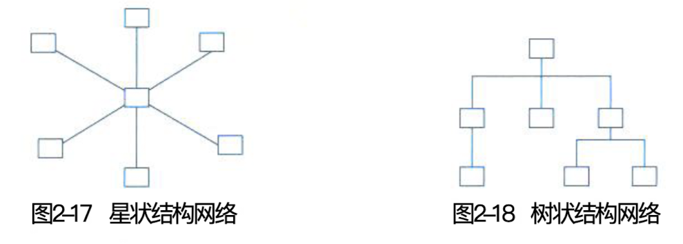
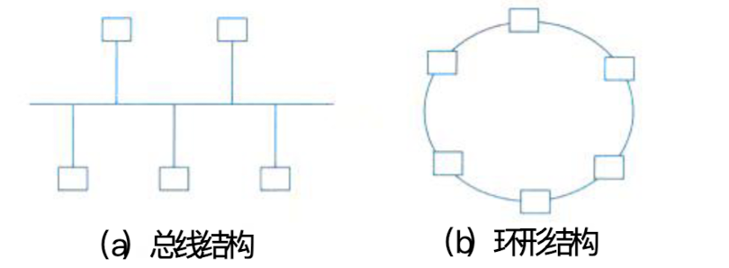

## 计算机网络

### 一、网络的基本概念

#### (一)、计算机网络发展的四个阶段

1. 诞生阶段
2. 形成阶段
3. 互联互通阶段
4. 高速发展阶段

#### (二)、基本功能：

- 数据通信
- 资源共享
- 管理集中化、
- 分布式处理
- 负荷均衡

#### (三)、基本指标

- 速率
- 带宽
- 吞吐量
- 时延
- 利用率

### 二、通信技术

#### (一)、基本知识

- 信道
- 信号交换
- 复用
- 多址
- 5G 通信网

### 三、网络技术

#### (一)、局域网（LAN）（五类拓扑和以太网技术）

> 局域网的专用性很强，具有比较稳定和规范的拓扑结构。

> **网络拓扑**：
>
> - 星状结构
> - 树状结构
> - 总线结构
> - 环形结构
> - 网状结构
>
> 
>
> 

> 以太网 (Ethernet) 是一种计算机局域网组网技术。 I E E E 制定的 IEEE 802.3 标准给出了以 太网的技术标准。它规定了包括物理层的连线、电信号和介质访问层协议的内容。以太网是当 前应用最普遍的局域网技术

#### (二)、无线局域网（WLAN）（WLAN 标准和三类拓扑）

> 无线局域网WLAN(Wireless Local Area Networks) 利用无线技术在空中传输数据、话音 和视频信号。无线局域网所使用的关键技术，除了红外传输技术、扩频技术、窄带微波技术外 还有一些其他技术，如调制技术、加解扰技术、无线分集接收技术、功率控制技术和节能技术。 无线局域网在室外主要有以下几种结构:点对点型、点对多点型、多点对点型和混合型。与有 线网络相比，无线局域网具有安装便捷、使用灵活、经济节约、易于扩展等优点。

> **WLAN 拓扑结构**：
>
> - 点对点型
> - HUB 型
> - 完全分不型

#### (三)、广域网（WAN）（特点、分类和相关技术）

> 广域网是一种将分布于更广区域(比如一个城市、一个国家甚至国家之间)的计算机设备 联接起来的网络。它通常是电信部门负责组建、经营和管理，并向社会公众提供通信服务

#### (四)、城域网（MAN）

> 城域网是在单个城市范围内所建立的计算机通信网，简称MAN(Metropolitan Area Network)。 由于采用有源交换元件的局域网技术，网络中传输时延较小，它的传输媒介主要 采用光缆，传输速率在100 Mb/s以上。M A N基于一种大型的LAN, 通常使用与LAN相似的 技术，但M A N的标准称为分布式队列双总线DQDB(Distributed Queue Dual Bus), 即IEEE 802.6。DQDB是由双总线构成，将加入M A N的所有计算机都连接起来

#### (五)、移动通信网（发展、特征和服务化架构）

### 四、组网技术

#### (一)、网络设备

- 集线器
- 中继器
- 网桥
- 交换机
- 路由器
- 防火墙

#### (二)、交换技术、路由技术及相关协议

#### (三)、开放系统互连参考模型（OSI/RM）

- 分层参考模型
- OSI 协议集
- TCP/IP 协议集
- 协议集比较

### 五、网络工程

#### (一)、网络规划、网络设计和网络实施

