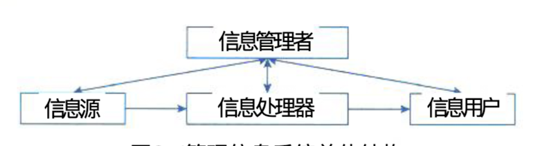
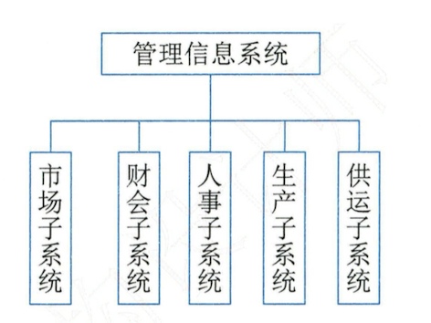
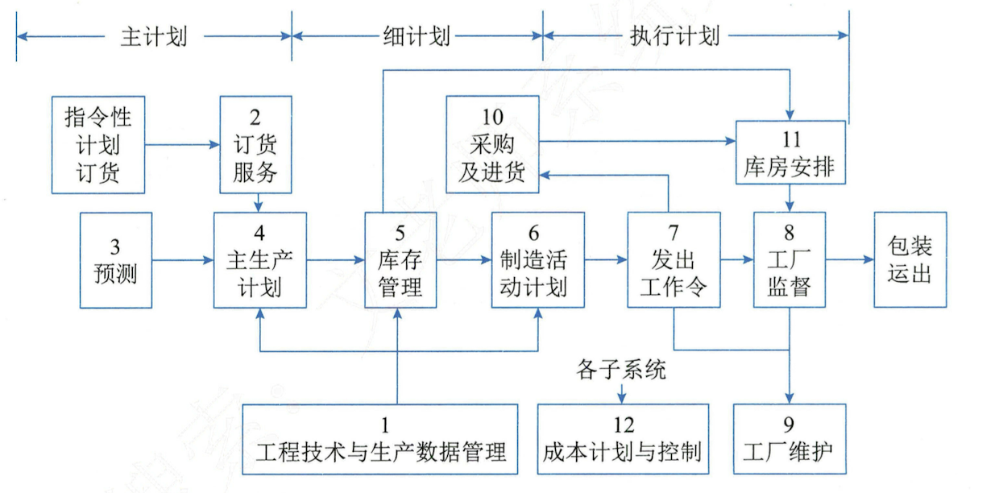
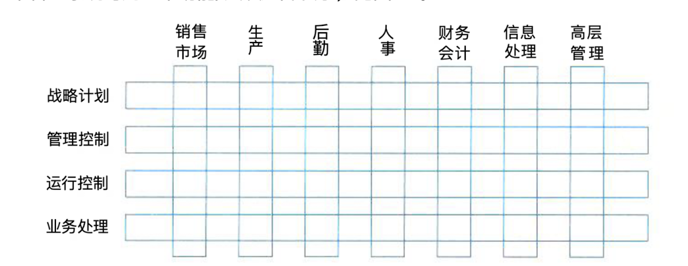

## 管理信息系统（MIS）

### 一、管理信息系统的概念

#### (一)、管理信息系统的定义和总体结构

> 管理信息系统（MIS）是由业务处理系统发展而成的，是在 TPS 基础上引进大量管理方法对企业整体信息进行处理，并利用信息进行预测、控制、计划、辅助企业全面管理的信息系统。

> 从管理信息系统的概念出发，管理信息系统由四大部件组成：
>
> - 信息源
> - 信息处理器
> - 信息用户
> - 信息管理者

#### (二)、信息源、信息处理器、信息用户和信息管理者

### 二、管理信息系统的功能

#### (一)、功能结构

#### (二)、功能过程结构图

### 三、管理信息系统的组成

#### (一)、功能/层次矩阵

#### (二)、七个基本子系统

1. **销售市场子系统**
2. **生产子系统**
3. **后勤子系统**
4. **人事子系统**
5. **财务和会计子系统**
6. **信息处理子系统**
7. **高层管理子系统**