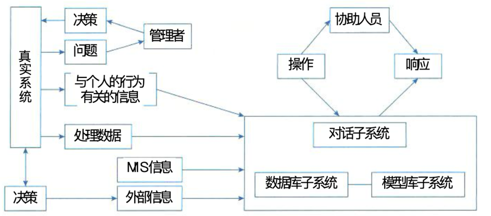

## 决策支持系统 DSS

### 一、决策支持系统的概念

#### (一)、DSS 的发展、定义和特征

1. **DSS 发展**

> - 20世纪70年代中期，首次提出了决策支持系统一词，标志着利用计算机与信息支持决策的研究与应用进入了一个新的阶段，并形成了决策支持系统的新科学。
> - 20世纪70年代末期，DSS 大都由模型库、数据库及人机交互系统3个部件组成。
> - 20世纪80年代初，DSS 增加了知识库与方法库，构成了三库系统或四库系统。
> - 80年代后期，人工智能技术与 DSS 相结合，充分利用两者有点，形成了智能决策支持系统。
> - 近年来，DSS 与计算机网络技术结合，构成了新型的能供异地决策者共同参与决策的群体决策支持系统。

2. **定义和特征**

   > 定义一：DSS 是一个由语言系统、知识系统和问题处理系统3个互相关联的部分组成的，基于计算机的系统。
   >
   > 特征：
   >
   > - 数据和模型是 DSS 的主要资源
   > - DSS 用来支援用户作决策而不是代替用户作决策
   > - DSS 主要用于解决半结构化及非结构化问题
   > - DSS 的作用在于提高决策的有效性而不是提高决策的效率

   > 定义二：DSS 应当是一个交互式的、灵活的、适应性强的基于计算机的信息系统，能够为解决非结构化管理问题提供支持，以改善决策质量。DSS 使用数据，提供您容易使用的用户界面，并可以提现决策者的意图。DSS 可以提供即时创建的模型，支持整个决策过程中的活动，并可能包括知识部分。
   >
   > 特征：
   >
   > - 主要针对上层管理人员经常面临的结构化程度不高、说明不够充分的问题。
   > - 界面友好，容易被非计算机人员所接受。
   > - 将模型、分析技术与传统的数据存取与检索技术结合起来。
   > - 具有对环境及决策方法改变的灵活性与适应性。
   > - 支持但不是代替高层决策者进行决策。
   > - 充分利用先进信息技术快速传递和处理信息。

#### (二)、DSS 的基本模式

#### (三)、DSS 的基本结构：两库结构和基于知识的结构

> 两库结构由数据库子系统、模型库子系统和对话子系统形成三角形分布的结构。

### 二、决策支持系统的功能

#### (一)、DSS 支撑九项基本功能

- 决策支持系统用来整理和提供本系统与决策问题有关的各种数据。各种不同的待决策的问题可能需要不同方面、不同层次的数据，如生产数据，库存数据、财务数据、设备运行数据等。
- 决策支持系统要尽可能地收集、存储和及时提供与决策有关的外部信息。外部信息是决策保证正确决策的重要依据，如市场需求、商品价格、原材料供应、竞争对手的经营状况等。
- 决策支持系统能及时收集和提供有关各项活动的反馈信息，包括系统内和系统相关的信息，如计划完成情况、产品销售情况、用户反映信息等。
- 决策支持系统对各种与决策有关的模型具有存储和管理的能力。不同的决策内容需要不同的决策模型的支持，如库存控制模型、生产调度模型、投入产出模型等。
- 决策支持系统提供对常用的数学方法、统计方法和运筹方法的存储和管理，如统计检验方法、回归分析方法、线性规划方法等。
- 决策支持系统能对各种数据、模型、方法进行有效的管理，为用户提供查找、变更、增加、删除等操作功能，一使用户可以对系统所提供的数据、模型和方法进行有效而灵活的运用，如数据的变更、模型的修改、方法的增删等，都可以通过系统来完成。
- 决策支持系统运用所提供的模型和方法对数据进行加工，并得出有效支持决策的信息，如对数据进行汇总、分析、预测等。
- 决策支持系统具有人-机对话接口和图形加工、输出功能，不仅用户可以对所需要的数据进行查询，而且可以输出响应的图形，如回答 “what……if……” 等类型的问题和输出各种统计、分析图表。
- 决策支持系统应能支持分布使用方式，提供有效的传输功能，以保证分散在不同地点的用户能共享系统所提供的模型、方法和可共享的数据，如系统在局域网的环境中运行，并提供了可共享的数据、模型和方法。

### 三、决策支持系统的特点

- 决策支持系统面向决策者，系统在开发中遵循的需求和操作是设计系统的依据和原则。系统的收集、存储和输出的一切信息，都是为决策者服务。
- 决策支持系统支持对半机构化问题的决策。半结构化问题的复杂性致使传统的计算机信息系统，如电子数据处理系统、管理信息系统都难以解决，而决策支持系统则可以辅助决策者对决策信息过程和方案进行较系统且全面的分析。
- 决策支持系统的作用是辅助决策者、支持决策者。由于决策过程的复杂性和决策过程中的重要作用，系统不可能取代人而做出决策。在这个决策过程中系统不可能也不应该提供答案，也不应该强加给决策者预先规定的决策顺序。
- 决策支持系统提现决策过程的动态性。用户或者用户通过模型，根据决策层次、决策环境、问题理解、知识积累等多方面辩护的情况来动态的确定问题的解答，并在决策的动态运行过程中完善的调整系统。
- 决策支持系统提倡交互处理。通过人机对话的方式将决策人的经验、观念和判断纳入系统，进而将人们主观的、经验的判断与客观的信息反映想结合，最后确定解决方案。

### 四、决策支持系统的组成

- **数据的重组和确认**
- **数据字典的建立**
- **数据挖掘和智能体**
- **模型建立**