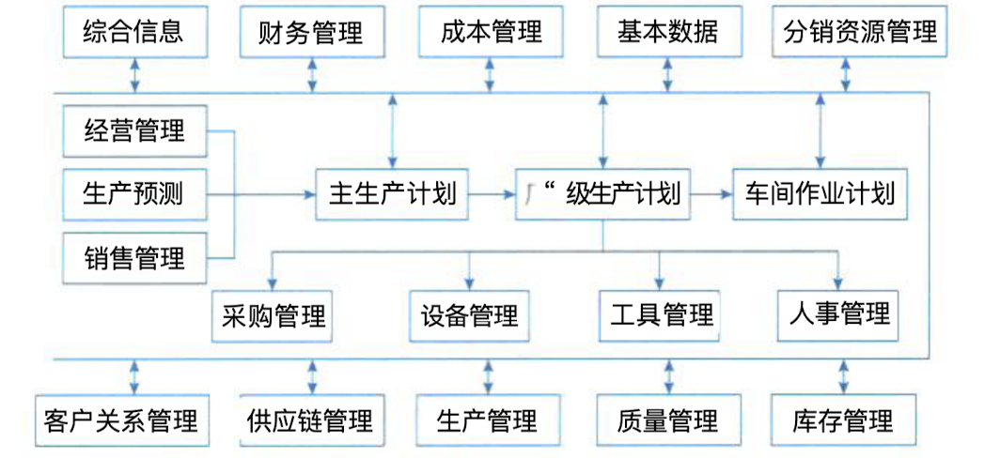

## 企业资源规划 ERP

### 一、企业资源规划的概念

#### (一)、ERP 的目标、定义、范围和发展

> 企业的所有资源包括三大流：物流、资金流和信息流。
>
> ERP 也就是对这3中资源进行全面集成管理的管理信息系统。
>
> ERP 是建立在信息技术的基础上，利用现代企业的先进管理思想，全面地的集成了企业的所有资源信息,并为企业提供决策、计划、控制与经营业绩评估的全方位和系统化的管理平台。
>
> ERP 系统是一种管理理论和管理思想，不仅仅是信息系统。它利用企业的所有资源，包括内部资源与外部市场资源，为企业制造产品或提供服务创造最优的解决方案，最终达到企业的经营目标。

### 二、企业资源规划的结构

#### (一)、ERP 的结构原理

> ERP 中的企业资源包括企业的 “三流” 资源，即物流资源、资金流资源也信息流资源。ERP 实际上就是对这 “三流” 资源进行全面集成管理的管理信息系统。
>
> - 生产预测
> - 销售管理（计划）
> - 经营计划（生产计划大纲）
> - 主生产计划
> - 物料需求计划
> - 能力需求计划
> - 车间作业计划
> - 采购与库存管理
> - 质量与设备管理
> - 财务管理
> - ERP 有关扩展应用模块

### 三、企业资源规划的功能

#### (一)、支持决策的功能，不同行业的针对性 IT 解决方案、全行业和跨行业的供应链

- **支持决策的功能**：ERP 在 MRP II 的基础上扩展了管理范围，给出了新的结构，将企业内部业务流程划分成几个相互协同作业的支持子系统，如财务、市场经营、生产制造、质量控制、服务维护和工程基础等，并在功能上增加了质量控制、运输、分销、售后服务于维护，以及市场开发、人事管理等功能，把企业的制造系统、营销系统、财务系统等都紧密地结合在一起，可以实现全球范围内的多工厂、多地点的扩过经营运作。
- **为处于不同行业的企业提供有针对性的 IT 解决方案**：ERP 打破了 MRP III 只局限在传统制造业的格局，把应用扩展到其他行业，并逐渐形成了针对于某种行业的解决方案。
- **从企业内部的供应链发展为全行业和跨行业的供应链**：当前企业只有联合该行业中其他上下游企业，建立一条业务关系密切、经济利益相连的供应链实现优势互补，才能适应社会化大生产的竞争环境，共同增强市场竞争实力。

#### (二)、PDM、CRM 在企业的应用

