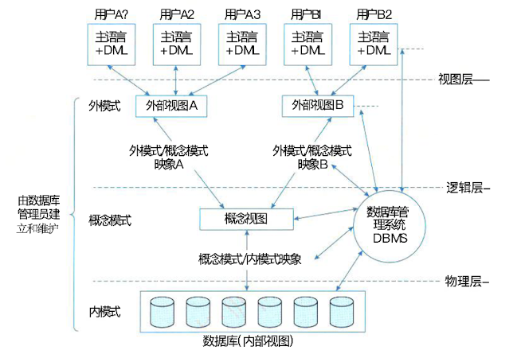

## 数据库基本概念

### 一、数据库技术的发展以及分类

#### (一)、数据库的定义和发展阶段

##### 1. 数据库定义

> 数据库系统 (DataBase System,DBS) 是一个采用了数据库技术，有组织地、动态地存储 大量相关联数据，从而方便多用户访问的计算机系统。广义上讲， DBS 包括了数据库管理系统 (DataBase Management System,DBMS)。

##### 2. 数据库发展阶段

> 1. 人工管理阶段
> 2. 文件系统阶段
> 3. 数据库系统阶段

#### (二)、DB、DBS 和 DBMS 区分方法

| 概念 | 主要内容                 | 作用                       |
| ---- | ------------------------ | -------------------------- |
| DB   | 数据集合                 | 提供数据存储和基础支持     |
| DBMS | 数据库管理工具           | 管理和操作数据库           |
| DBS  | 数据库+管理工具+应用程序 | 提供全面的数据管理解决方案 |

##### 1. DB（Database，数据库）

- **定义**：数据库是一个有组织的、可以共享的数据集合。
- **内容**：存储数据及其内在的逻辑关系。
- **作用**：为多用户或多应用程序提供共享数据存储。

##### 2. DBS（Database System，数据库系统）

- **定义**：数据库系统是由数据库（DB）、数据库管理系统（DBMS）、相关应用程序及用户组成的完整系统。
- **组成**：
  - **DB**：存储和管理的数据。
  - **DBMS**：用于操作数据库的软件。
  - **用户**：与系统交互的人员或应用程序。
- **功能**：提供统一的数据存储、管理和服务。

##### 3. DBMS（Database Management System，数据库管理系统）

- **定义**：DBMS是用于定义、操作、管理和维护数据库的软件。
- **功能**：
  - 数据定义（创建表、定义字段）。
  - 数据操作（增删改查）。
  - 数据控制（权限管理、并发控制）。
  - 数据维护（备份恢复）。
- **作用**：是用户和数据库之间的桥梁。

#### (三)、数据库分类（分布式数据库系统、并行数据库系统、数据仓库与数据挖掘）

### 二、数据模型

> 数据模型的三要素是 数据结构、数据操作和数据的约束条件。

#### (一)、层次和网状数据库系统

> 层次模型采用树形结构表示数据与数据间的联系。在层次模型中，每个结点表示一个记录 类型(实体),记录之间的联系用结点之间的连线表示，并且根结点以外的其他结点有且仅有一 个双亲结点。上层和下一层类型的联系是1: n联系(包括1:1联系)。

> 网状模型是一个比层次模型更具有普遍性的数据结构，层次模型是网状模型的一个特例。 网状模型可以直接地描述现实世界，因为去掉了层次模型的两个限制，允许两个结点之间有多 种联系(称之为复合联系)。需要说明的是，网状模型不能表示记录之间的多对多联系，需要引 入联结记录来表示多对多联系。

二者的共同特点如下。 

- 支持三级模式的体系结构;
-  用存取路径来表示数据之间的联系;
- 独立的数据定义语言;
- 导航的数据操纵语言

#### (二)、关系数据库系统

> 关系模型 (Relation Model) 是目前最常用的数据模型之一。关系数据库系统采用关系模型作为数据的组织方式，在关系模型中用表格结构表达实体集以及实体集之间的联系，其最大特 色是描述的一致性。关系模型是由若干个关系模式组成的集合。一个关系模式相当于一个记录 型，对应于程序设计语言中类型定义的概念。关系是一个实例，也是一张表，对应于程序设计 语言中变量的概念。变量的值随时间可能会发生变化，类似地，当关系被更新时，关系实例的内容也发生了变化。

#### (三)、第三代数据库系统

> 从20世纪80年代开始，出现了许多新型应用，数据管理出现了许多新的数 据模型，如面向对象模型、语义数据模型、 X M L 数据模型、半结构化数据模型等。数据模型的 发展，需要数据库系统支持日益复杂的数据类型。**其中最典型的是No SQL(Not Only of SQL)**。

### 三、数据库管理系统

#### (一)、DBMS的定义和范围

> DBMS是一种软件系统，用于定义、创建、维护和操作数据库。它是用户和数据库之间的桥梁，提供了统一的接口以管理数据并确保数据的一致性、完整性和安全性。

> 范围就是功能点。

#### (二)、DBMS的功能及特点

##### 1. 功能

- **数据定义**：DBMS 提供数据定义语言 (Data Definition Language,DDL), 可以对数据库的结构进行描 述，包括外模式、模式和内模式的定义;数据库的完整性定义;安全保密定义，如口令、级别 和存取权限等。这些定义存储在数据字典中，是 DBMS 运行的基本依据。
- **数据库操作**：DBMS 向用户提供数据操纵语言 (Data Manipulation Language,DML), 实现对数据库中数据的基本操作，如检索、插入、修改和删除。
- **数据库运行管理**：数据库在运行期间，多用户环境下的并发控制、安全性检查和存取控制、完整性检查和执行、运行日志的组织管理、事务管理和自动恢复等都是 DBMS 的重要组成部分。这些功能可以 保证数据库系统的正常运行。
- **数据组织、存储和管理**：DBMS 分类组织、存储和管理各种数据，包括数据字典、用户数据和存取路径等。要确定 以何种文件结构和存取方式在存储级别上组织这些数据，以提高存取效率。实现数据间的联系、 数据组织和存储的基本目标是提高存储空间的利用率。
- **数据库的建立和维护**：数据库的建立和维护，包括数据库的初始建立、数据的转换、数据库的转储和恢复、数据
  库的重组和重构、性能监测和分析等。
- **其他功能**：如 DBMS 与网络中其他软件系统的通信功能，一个 DBMS 与另一个 DBMS 或文件系统的 数据转换功能等。

##### 2. 特点

- **数据结构化且统一管理**：数据库中的数据由 DBMS 统一管理。
- **有较高的数据独立性**：数据的独立性是指数据与程序独立，将数据的定义从程序中分 离出去，由 D B M S 负责数据的存储，应用程序关心的只是数据的逻辑结构，无须了解数据在磁 盘上的存储形式，从而简化应用程序，大大减少应用程序编制的工作量。数据的独立性包括数 据的物理独立性和数据的逻辑独立性。
- **数据控制功能**：DBMS 提供了数据控制功能，以适应共享数据的环境。数据控制功能 包括对数据库中数据的安全性、完整性、并发和恢复的控制。

### 四、数据库三级模式

#### (一)、数据库三级模式的定义和划分

#### (二)、数据库系统的体系结构（物理层、逻辑层和视图层）

- **视图层**：最高层次的抽象，描述整个数据库的某个部分的数据。因为数 据库系统的很多用户并不关心数据库中的所有信息，而只关心所需要的那部分数据。可以通过 构建视图层来实现用户的数据需求，这样做不仅使用户与系统交互简化，而且还可以保证数据 的保密性和安全性。
- **逻辑层**：描述数据库中存储的数据以及这些数据间存在的关系。逻辑层通过相对简单的结构描述了整个数据库。尽管逻辑层简单结构的 实现涉及了复杂的物理层结构，但逻辑层的用户不必知道这些复杂性。因为，逻辑层抽象是数 据库管理员的职责，管理员确定数据库应保存哪些信息。
- **物理层**：描述数据在存储器中是如何存储的。物 理层详细地描述复杂的底层结构。

#### (三)、数据库的单机模式（外模式、概念模式和内模式）

- **外模式**：式也称用户模式或子模式，是用户与数据库系统的接口，是用户需要使用的部分数据 的描述。它由若干个外部记录类型组成。用户使用数据操纵语言对数据库进行操作，实际上是 对外模式的外部记录进行操作。
- **概念模式**：式也称模式，是数据库中全部数据的逻辑结构和特征的描述，它由若干个概念记录 类型组成，只涉及“型”的描述，不涉及具体的值。
- **内模式**：也称存储模式，是数据物理结构和存储方式的描述，是数据在数据库内部的表示方 式。定义所有的内部记录类型、索引和文件的组织方式，以及数据控制方面的细节。
