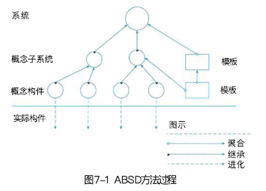

## 基于架构的软件开发方法

### 一、体系结构的设计方法概述

#### (一)、ABSD 方法的定义、适应范围

> 基于体系机构的软件设计（Architecture-Based Software Design, ABSD）方法。ABSD 方法是有体系结构驱动的，即指由体系结构的商业、质量和功能需求的组合驱动的。
>
> 使用 ABSD 方法，设计活动可以从项目总体功能框架明确开始，这意味着需求抽取和分析还没有完成（甚至是远远没有完成），就开始了软件设计。设计活动的开始并不意味着需求抽取和分析活动就可以终止，而是应该与设计活动并行。特别是在不可能预先决定所有需求时（例如，产品线系统或长期运行的系统），快速开始设计是至关重要的。

#### (二)、三个基础

- 功能的分解，在功能分解中，ABSD 方法使用已有的机遇模块的内聚和耦合技术。
- 通过选择体系结构风格来实现质量和商业需求。
- 软件模版的使用，软件模版利用了一些软件系统的结构。

### 二、概念与术语

#### (一)、设计元素、视角与视图、用例和质量场景

1. **设计元素**

   ABSD 方法是一个自顶向下，递归细化的方法，软件系统的体系结构通过该方法得到细化，知道能产生软件构件和类。

   

2. **视角与视图**

   考虑体系结构时，要从不同的视角来观察对架构的描述，这需要软件设计师考虑体系结构的不同属性。选择特定的视角视图可以全方位的考虑体系结构设计。

3. **用例和质量场景**

   用例是系统的一个给予用户一个结果值的功能点，用例用来捕获功能需求。使用用例捕获功能需求的同时，人们通过定义特定场景捕获质量需求，并称这鞋场景为质量场景。

### 三、 基于体系结构的开发模型

#### (一)、传统的软件开发和 ABSD 的差别

- 传统的软件开发过程可以划分为从概念知道实现的若干个阶段，包括问题定义、需求分析、软件设计、软件实现及软件测试等。采用传统软件的开发模型，软件体系结构的建立应位于需求分析之后，概要设计之前。创痛软件开发模型存在开发效率不高，不能很好的支持软件的重用等缺点。
- ABSD 模型把整个基于体系结构的软件过程划分为体系机构需求、设计、文档化、复审、实现和演化 6 个过程。

#### (二)、ABSD 模型涵盖的阶段

- 体系结构需求
- 体系结构设计
- 体系结构文档化
- 体系结构复审
- 体系结构实现
- 体系结构演化

### 四、体系结构需求

#### (一)、需求获取、标识构件、架构需求评审

1. **需求获取**：体系结构的需求一般来自 3 个方面，分别是系统的质量目标、系统商业目标 和 系统开发人员的商业目标。
2. **标识构件**：一般分为 3 步，生成类图、对类进行分组、把类打包成构件。
3. **架构需求评审**：组织一个由不同代表（分析人员、客户、设计人员、测试人员）组成的小组，对体系结构需求及相关构件进行仔细的评审。

### 五、体系架构设计

#### (一)、体系机构设计过程模型

- 提出软件体系结构模型
- 把已标识的构件映射到软件体系结构中
- 分析构件之间的相互作用
- 产生软件体系结构
- 设计评审

### 六、体系结构文档化

#### (一)、体系结构规格说明和测试体系结构需求的质量设计说明书

> 文档时在系统演化的每一个阶段，系统设计与开发人员的通信媒介，是为验证系统结构设计和提炼或修改这些设计所执行预先分析的基础。体系结构文档化过程的主要输出结构由两个文档：
>
> - 体系结构规格说明书
> - 测试体系结构需求的质量设计说明书

### 七、体系结构复审

#### (一)、复审的目的、要求和意义

1. **目的**

   标识潜在的风险，及早发现体系结构设计中的缺陷和错误，包括体系结构能否满足需求、质量需求是否在设计中得到体现、层次是否清晰、构件划分是否合理、文档表达是否明确、构件的设计是否满足功能与性能的要求能。

2. **要求**

   要安排由外部人员（用户代表和领域专家）参加复审。

3. **意义**

   用户评估和测试体系架构是否满足需要，是否存在可识别的技术和协作风险。

### 八、体系结构实现

#### (一)、体系结构实现过程模型

1. 分析与设计
2. 构件实现
3. 构件组装
4. 系统测试

### 九、体系结构的演化

#### (一)、体系结构演化的定义和作用

> 体系结构演化是使用系统演化步骤去修改应用，以满足新的需求。
>
> 软件开发过程中，用户的需求可能还有变动。在软件开发完毕正常运行之后，由一个单位移植到另外一个单位，需求也会发生变化。在这两种情况下，就必须响应的修改软件体系结构，以适应已发生变化的需求。

#### (二)、演化步骤

1. 需求变化归类
2. 指定体系结构演化计划
3. 修改、增加或删除构件
4. 更新构件的相互作用
5. 构件组装与测试
6. 技术评审