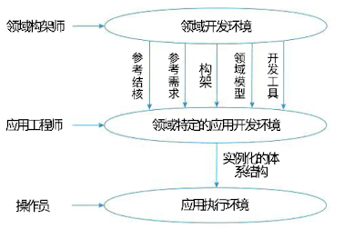

## 特定领域的软件架构

### 一、DSSA 的定义

#### (一)、DSSA 的定义和适应场景

- **简单说**：DSSA (Domain Specific Software Architecture) 就是在一个特定应用领域中为一组应用提供组织结构参考的标准软件体系结构。
- **Hayes Roth对DSSA的定义如下**：DSSA 就是专用于一类特定类型的任务（领域）的、在整个领域中能有效使用的、为成功构造应用系统限定了标准的组合结构的软件构件的集合。
- **Tracz 的定义为**：DSSA 就是一个特定的问题领域中支持一组应用的领域模型、参考需求、参考体系结构等组成的开发基础，其目标就是支持在一个特定领域中多个应用的生成。

> DSSA 必备特征：
>
> 1. 一个严格定义的问题和问题解域
> 2. 具有普遍性，使其可以用于领域中某个特定应用的开发。
> 3. 对整个领域的构件组织模型的恰当抽象。
> 4. 具备该领域固定的、典型的在开发过程中可重用元素。

#### (二)、垂直域和水平域

- **垂直域**：定义了一个特定的系统族，包含整个系统族内的多个系统，结果是在该领域中可作为系统的可行方案的一个通用软件体系结构。
- **水平域**：定义了在多个系统和多个系统族中功能区共有部分。在子系统上涵盖多个系统族的特定部分功能。

### 二、DSSA 的基本活动

#### (一)、领域分析、领域设计和领域实现

- **领域分析**：这个阶段的主要目标是获得领域模型。领域模型描述领域中系统之间的共同需求，即领域模型所描述的需求为领域需求。
- **领域设计**：这个阶段的主要目标是获得DSSA。DSSA 描述在领域模型中表示的需求的解决方案，它不是单个系统的表示，而是能够适应领域中多个系统的需求的一个高层次的设计。
- **领域实现**：这个阶段的主要目标是依据领域模型和DSSA开发和组织可重用的信息。

### 三、参与 DSSA 的人员

#### (一)、4 中角色：领域专家、领域分析师、领域设计人员和领域实现人员

- **领域专家**：包括领域中系统的有经验的用户、从事该领域中系统的需求分析、设计实现一机项目管理的有经验的软件工程师等。
- **领域分析人员**：由具有知识工程背景的有经验的系统分析员来担任。
- **领域设计人员**：由有经验的软件设计人员来担任。
- **领域实现人员**：由有经验的程序设计人员来担任。

### 四、DSSA 的建立过程

#### (一)、五个阶段

- **定义领域范围**：本阶段的重点是确定什么在感兴趣的领域中一机本过程到何时结束。这个阶段的一个主要输出是领域中的应用需要满足一系列用户的需求。
- **定义领域元素**：本阶段的目标是编译领域字典和领域术语的同义词词典。在领域工程过程的前一个阶段产生的高层块圈将被增加更多的细节，特别是识别领域中应用的共同性和差异性。
- **定义领域设计和实现需求约束**：本阶段的主要目标是描述解空间中有差别的特性。不仅要识别出约束。并且要记录约束对设计和实现决定造成的后果，还要记录对处理这些问题时产生的所有问题的讨论。
- **定义领域模型和体系结构**：本阶段的目标是产生一般的体系结构，并说明构成它们的模块或构件的语法和语义。
- **产生、收集可重用的产品单元**：本阶段的目标是为 DSSA 增加构件，使它可以被用来产生问题域中的新应用。

#### (二)、DSSA 的三层次系统模型

