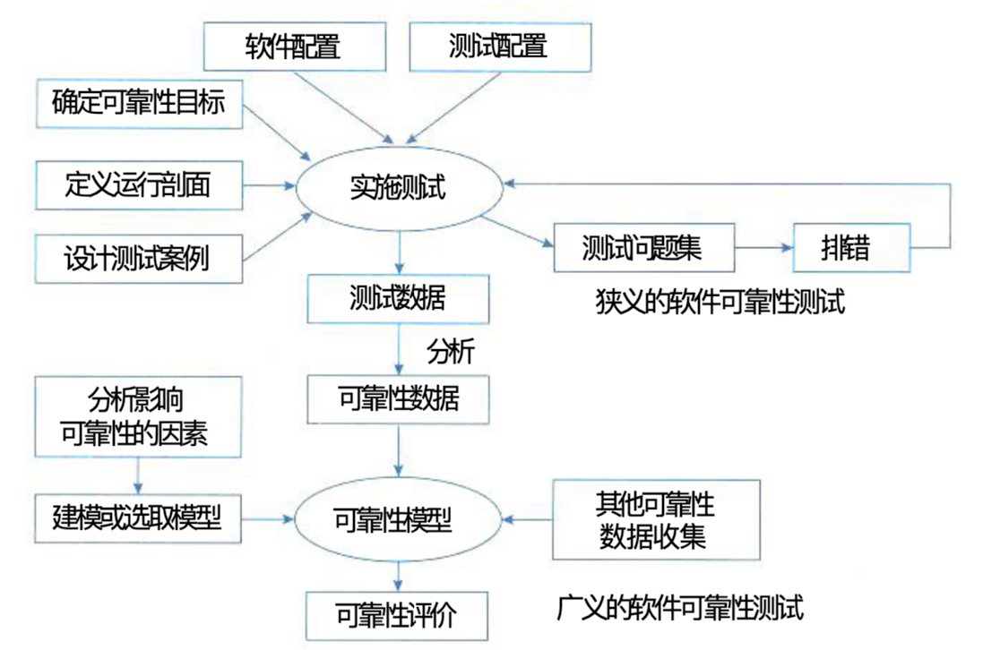

## 软件可靠性基本概念

### 一、软件可靠性定义

#### (一)、软件可靠性的定义、目标与硬件可靠性的区别

> 软件可靠性是软件产品在规定的条件下和规定的时间区间完成规定功能的能力。
>
> - **规定的条件**：指直接与软件运行相关的使用该软件的计算机系统的状态和软件的输入条件,或统称为软件运行时的外部输入条件。
> - **规定的时间区间**：指软件的实际运行时间区间。
> - **规定的功能**：指为提供给定的服务，软件产品所必须具备的功能。

> 与硬件可靠性的区别：
>
> - **复杂性**：
> - **物理退化**
> - **唯一性**
> - **版本更新较快**

#### (二)、软件可靠性的框架性定义

- **规定的时间**：软件可靠性知识体现在其运行阶段，所以将“运行时间”作为“规定的时间”的度量。“运行时间”包括软件系统运行后工作与挂起（开启但空闲）的累积时间。由于软件运行的环境与程序路径选去的随机性，软件的失效为随机事件，所以运行时间属于随机变量。
- **规定的条件**：规定的条件主要指软件的运行环境。它涉及软件系统运行时所需订的各种支持要素，如支持硬件平台（服务器、台式机和网络平台等）、操作系统、数据库管理系统、中间件，以及其他支持软件、输入数据格式和范围及操作规程等。
- **所要求的功能**：软件可靠性还与规定的任务和功能有关。由于要完成的任务不同，软件的运行情况会有所区别，则调用的子模块就不同（包括程序选择路径不同），其可靠性也就可能不同。所以要准确度量软件系统的可靠性，必须先明确它的任务和功能。

#### (三)、软件可靠性工程的定义和阶段

- 分配
- 设计
- 分析
- 测试
- 评估

### 二、软件可靠性的定量描述

#### (一)、软件可靠性的度量方法和意义

#### (二)、主要度量指标

- 规定的时间
- 失效概率
- 可靠度
- 失效强度
- 平均失效前时间
- 平均恢复前时间
- 平均故障间隔时间

### 三、可靠性目标

#### (一)、失效严重程度（按成本影响）的等级分类

| 失效严重程度类 | 定义（人民币（万元）） |
| :------------: | ---------------------- |
|       1        | 成本 > 100             |
|       2        | 10 < 成本 < 100        |
|       3        | 1 < 成本 < 10          |
|       4        | 0.1 < 成本 < 1         |
|       5        | 成本 < 0.1             |

### 四、可靠性测试的意义

#### (一)、软件可靠性测试的目的意义

- 软件失效可能造成灾难性的后果
- 软件的失效在整个计算机系统失效中的比例较高
- 相比硬件可靠性技术，软件可靠性技术很不成熟，这就加剧了软件可靠性问题的重要性。
- 与硬件与器件成本急剧下降形成鲜明对比的是，软件费用呈有增无减的势头，而软件可靠性问题是造成费用增长的主要原因之一。
- 计算机技术获得日益广泛的应用，随着计算机应用系统中软件成分的不断增加，使得系统对于软件的依赖性越来越强，软件对生产活动和社会生活的影响越来越大，从而增加了软件可靠性问题在软件工程领域乃至整个计算机工程领域的重要性。

#### (二)、软件可靠性测试的发展

### 五、广义的可靠性测试与狭义的可靠性测试

#### (一)、广义的可靠性测试定义

> 广义软件可靠性测试是指为了最终评价软件系统的可靠性而运用建模、统计、试验、分析和评价等一系列手段对软件系统实施的一种测试。

#### (二)、狭义的可靠性测试定义

> 狭义的软件可靠性测试是指为了获取可靠性数据，按预先确定的测试用例，在软件的预期使用环境中，对软件实施的一种测试。
>
> 狭义的软件可靠性测试也叫“软件可靠性试验”，他是面向缺陷的测试，以用户将要使用的方式来测试软件，每一次测试代表用户将要完成的一组操作，使测试成为最终产品使用的预演。这就使得所获得的测试数据与软件的实际运行的数据比较接近，可用于软件的可靠性评价。
