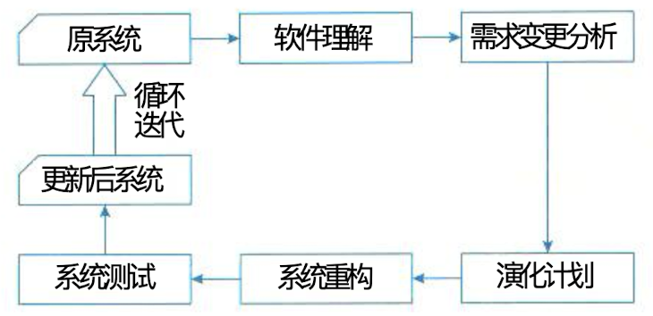

## 软件架构的演化分类

### 三种典型分类方法

1. 按照软件架构的实现方式和实施粒度分类：
   - 基于过程和函数的演
   - 面向对象的演化
   - 基于组件的演化
   - 基于架构的演化
2. 按照研究方法将软件架构演化方式分为 4 类：
   - 演化的支持
   - 版本和工程的管理工具
   - 架构变换的形式方法
   - 架构演化的成本收益分析
3. 针对软件架构的演化过程是否处于系统的运行时期，可以将软件架构演化分为静态演化和动态演化

### 一、软件架构演化时期

#### (一)、演化的四个时期

1. **设计时演化**：是指发生在体系结构模型和预支相关的代码编译之前的软件架构演化。
2. **运行前演化**：是指发生在执行之前、编译之后的软件架构演化，这时由于应用程序并未执行，修改时可以不考虑应用程序的状态，但需要考虑系统的体系结构，且系统需要具有添加和删除组件的机制。
3. **有限制运行时演化**：是指系统在设计时就规定了演化的具体条件，将系统置于“安全”模式下，演化只发生在某些特定约束满足时，可以进行一些规定好的演化操作。
4. **运行时演化**：是指系统的体系结构在运行时不能满足要求时发生的软件架构演化，包括添加组件、删除组件、升级替换组件、改变体系结构的拓扑结构等。此时的演化时最难的。

### 二、软件架构静态演化

#### (一)、软件架构静态演化基本概念

>  软件架构静态演化时系统停止运行期间的修改和更新，即一般意义上的软件修复和升级。

#### (二)、静态演化需求

1. **设计时演化需求**：在架构开发和实现过程中对原有的架构进行调整，保证软件实现与架构的一致性以及软件开发过程的顺利进行。
2. **运行前演化需求**：软件发布之后由于运行环境的变化，需要对软件进行修改升级，在此期间软件的机构同样需要进行演化。

#### (三)、一般过程

软件的静态演化一般包括如下 5 个步骤：

- 软件理解
- 需求变更分析
- 演化计划
- 系统重构
- 系统测试

#### (四)、原子演化操作

> 一次完整软件架构演化过程可以看作经过一系列原子演化操作组合而成。所谓原子演化操 作是指基于U M L模型表示的软件架构，在逻辑语义上粒度最小的架构修改操作

#### (五)、正交软件架构的演化实例

正交体系的演化过程概括如下:

1. 需求变动归类，使需求的变化和现有组件及线索 相对应，判断重用情况;
2. 制订架构演化计划;
3. 修改、增加或删除组件;
4. 更新组件之间的 相互作用;
5. 产生演化后的软件架构，作为系统更新的详细设计方案和实现基础

### 三、软件架构动态演化

#### (一)、软件架构动态演化基本概念

> 动态演化是在系统运行期间的演化，需要在不停止系统功能的情况下完成演化，较之静态 演化更加困难。具体发生在有限制的运行时演化和运行时演化阶段。

#### (二)、动态演化需求

架构的动态演化主要来自两类需求:

1. 软件内部执行所导致的体系结构改变，例如，许多 服务器端软件会在客户请求到达时创建新的组件来响应用户需求;
2. 软件系统外部的请求对软 件进行的重配置，例如，操作系统在升级时无须重新启动，在运行过程中就完成对体系结构的 修改

#### (三)、动态演化的等级和内容

**软件动态性的等级**

> 1. **交互动态行**：要求数据在固定的结构下动态交互。
> 2. ***结构动态性***：允许对结构进行修改，通常的形式时组件和连接件实例的添加和删除，这种动态性时研究和应用的主流
> 3. **架构动态性**：允许软件架构的基本结构的变动，即结构可以被重定义，如新的组件类型的定义。

**动态演化的内容**

> - 属性改名：目前宿友的 ADL 都支持对非功能属性的分析和规约，而在运行过程中，用户可能会对这些指标进行重定义（如服务器相应时间）
> - 行为变化：在运行过程中，用户需求变化或系统自身服务质量的调节都将因为软件行为的变化。诸如：为了提高安全级别而更换加密算法；将 HTTP 协议改为 HTTPS 协议；组件和连接件的替换和重新配置。
> - 拓扑结构改变：如增删组件，增删连接件，改变组件与连接件之间的关联关系等。
> - 风格变化：一般软件演化后起架构风格应当保持不变，如果非要改变软件的架构风格，也只能将架构风格变为起衍生风格。

#### (四)、动态软件架构（DSA）

>  动态软件架构 ( D S A ) 可以修改自身的架构，并在系 统执行期间进行修改。
> DSA的意义主要在于能够减少系统开发的费用和风险。由于采用DSA, 一些具有特殊使命 的系统能够在系统运行时根据需求对系统进行更新，并降低更新的费用和风险。此外， D S A能 增强用户自定义性和可扩展性，并可为用户提供更新系统属性的服务

#### (五)、动态重配置（DR）

基于软件动态重配置的软件架构动态演化主要是指在软件部署之后对配置信息的修改，常 常被用于系统动态升级时需要进行的配置信息修改。一般来说，动态重配置可能涉及的修改有: 

1. 简单任务的相关实现修改;
2. 工作流实例任务的添加和删除;
3. 组合任务流程中的个体修改; 
4. 任务输入来源的添加和删除;
5. 任务输入来源的优先级修改;
6. 组合任务输出目标的添加和 删除;
7. 组合任务输出目标的优先级修改等