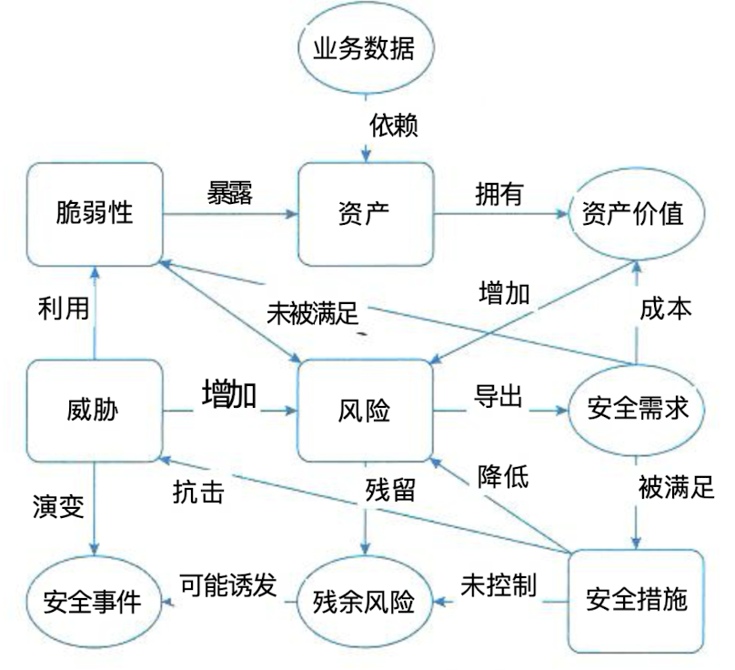

## 信息安全的保障体系与评估方法

### 一、计算机信息系统的安全保护等级

#### (一)、安全保护能力的5个等级

- 第一级：用户自主保护级
- 第二级：系统审计保护级
- 第三级：安全标记保护级
- 第四级：结构化保护级
- 第五级：访问验证保护级

#### (二)、安全性规章与保护私有信息规则

- 信息系统安全法规与制度
- 计算机防病毒制度
- 保护私有信息规则

#### (三)、安全保密管理及协议

- 防泄露
- 数字水印
- 安全协议（SSL、PGP、IPSec）

### 二、安全风险管理

#### (一)、安全风险管理的定义、作用和重要性

> 信息系统的安全风险，是指由于系统存在的脆弱性，人为或自然的威胁导致安全事件发生 所造成的影响。信息安全风险评估，则是指依据国家有关信息安全技术标准，对信息系统及由 其处理、传输和存储的信息的保密性、完整性和可用性等安全属性进行科学评价的过程，它要 评估信息系统的脆弱性、信息系统面临的威胁以及脆弱性被威胁源利用后所产生的实际负面影响，并根据安全事件发生的可能性和负面影响的程度来识别信息系统的安全风险。信息安全风 险评估是信息安全保障体系建立过程中重要的评价方法和决策机制

#### (二)、风险评估的基本要素及其关系

- 脆弱性
- 资产
- 威胁
- 风险
- 安全措施

#### (三)、安全威胁的定义和内涵

> 安全威胁是一种对机构及其资产构成潜在破坏的可能性因素或者事件。无论对于多么安全的信息系统，安全威胁都是一个客观存在的事物，它是风险评估的重要因素之一。产生安全威 胁的主要因素可以分为人为因素和环境因素。人为因素又可区分为有意和无意两种。环境因素 包括自然界的不可抗的因素和其他物理因素。威胁作用形式可以是对信息系统直接或间接的攻 击，例如非授权的泄露、篡改、删除等，在保密性、完整性或可用性等方面造成损害。也可能 是偶发的或蓄意的事件。一般来说，威胁总是要利用网络、系统、应用或数据的弱点才可能成 功地对资产造成伤害。安全事件及其后果是分析威胁的重要依据。但是有相当一部分威胁发生 时，由于未能造成后果或者没有意识到，而被安全管理人员忽略。这将导致对安全威胁的认识 出现偏差。在威胁评估过程中，首先就要对组织需要保护的每一项关键资产进行威胁识别。在 威胁识别过程中，应根据资产所处的环境条件和资产以前遭受威胁损害的情况来判断。一项资 产可能面临着多个威胁，同样一个威胁可能对不同的资产造成影响。

#### (四)、脆弱性评估方法

> 脆弱性评估是安全风险评估中的重要内容。弱点包括物理环境、组织、过程、人员、管理、 配置、硬件、软件和信息等各种资产的脆弱性。弱点是资产本身存在的，它可以被威胁利用、 引起资产或商业目标的损害。值得注意的是，弱点虽然是资产本身固有的，但它本身不会造成 损失，它只是一种条件或环境，可能导致被威胁利用而造成资产损失。如果没有相应的威胁发 生，单纯的弱点并不会对资产造成损害。那些没有安全威胁的弱点可以不需要实施安全保护措 施，但它们必须记录下来以确保当环境、条件有所变化时能随之加以改变。需要注意的是不正 确的、起不到应有作用的或没有正确实施的安全保护措施本身就可能是一个安全薄弱环节。脆 弱性评估将针对每一项需要保护的信息资产，找出每一种威胁所能利用的脆弱性，并对脆弱性 的严重程度进行评估，即对脆弱性被威胁利用的可能性进行评估，最终为其赋相对等级值。在 进行脆弱性评估时，提供的数据应该来自于这些资产的拥有者或使用者，来自于相关业务领域 的专家以及软硬件信息系统方面的专业人员。脆弱性评估所采用的方法主要有问卷调查、人员 问询、工具扫描、手动检查、文档审查、渗透测试等。脆弱性主要从技术和管理两个方面进行 评估，涉及物理层、网络层、系统层、应用层、管理层等各个层面的安全问题。其中在技术方 面主要是通过远程和本地两种方式进行系统扫描，对网络设备和主机等进行人工抽查，以保证技术脆弱性评估的全面性和有效性;管理脆弱性评估方面可以按照BS7799 等标准的安全管理 要求对现有的安全管理制度及其执行情况进行检查，发现其中的管理漏洞和不足。