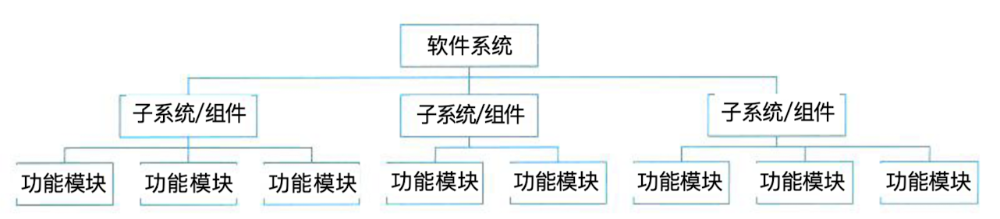
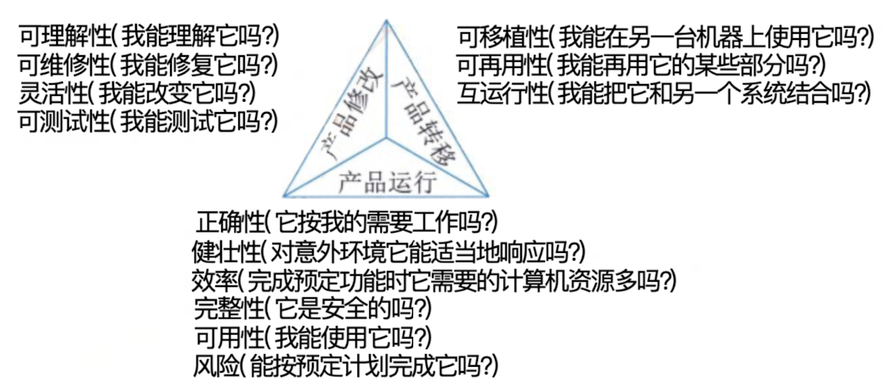

## 软件项目管理

### 一、项目管理概述

#### (一)、项目管理的发展历史

> 软件项目管理的提出是在20世纪70年代中期的美国，当时美国国防部专门研究了软件开发不能按时提交、预算超支和质量达不到用户要求的原因，结果发现70&的项目是因为管理不善引起的，而非技术原因。于是软件开发者开始逐渐重视起软件开发中的各项管理。到了210世纪90年代中期，软件研发项目管理不善的问题依然存在。

#### (二)、项目管理的目标、范围、时间和成本

软件项目管理的对象软件工程项目。它所涉及的范围覆盖了整个软件工程过程。为使软件项目开发获得成功，关键问题是必须对软件项目的工作范围、可能风险、需要资源（人、硬件/软件）、要实现的任务、经历的里程碑、花费工作量（成本）、进度安排等进行预先计划和执行。这种管理在技术工作开始之前就应该开始，在软件从概念到实，的过程中继续进行，当软件工程过程最后结束时才终止。

#### (三)、软件项目管理的主要内容

- 进度
- 配置
- 质量
- 风险管理

### 二、软件进度管理

#### (一)、进度的定义和活动

> 按时完成软件项目是项目经理最大的挑战之一。所谓进度，指的是对执行活动和里程碑所 制定的工作计划，而进度管理指的是为了确保项目按期完成所需要的管理过程。在软件进度管 理过程中，一般包括:活动定义、活动排序、活动资源估计、活动历时估计、制定进度计划和 进度控制。

#### (二)、WBS 和任务活动图

- **WBS**

工作分解结构 (Work Breakdown Structure,WBS) 如图5-7所示，就是把一 个项目，按一定的原则分解成任务，任务再分解成一项项工作，再把一项项工作分配到每个人 的日常活动中，直到分解不下去为止。

W B S常见的分解方式包括:按产品的物理结构分解、按产品或项目的功能分解、按照实施 过程分解、按照项目的实施单位分解、按照项目的目标分解、按部分或只能进行分解等。不管 采用哪种分解方式，最终都要满足以下对任务分解的基本要求。

1. W B S 的工作包是可控和可管理的，不能过于复杂。 
2. 任务分解也不能过细，一般原则W B S的树形结构不超过6层。 
3. 每个工作包要有一个交付成果。 
4. 每个任务必须有明确定义的完成标准。 
5. WBS必须有利于责任分配。

- **任务活动图**

经过工作分解之后，会得到一组活动任务，这是需要对每个活动进行定义，并确定活动之 间的关系。
活动定义是指确定完成项目的各个交付成果所必须进行的各项具体活动，需要明确每个活 动的前驱、持续时间、必须完成日期、里程碑或交付成果。前驱指的是该活动开始之前必须发 生的事件或事件集;持续时间是指完成该活动的时间长度(一般单位为天或周);必须完成日期 指的是该活动必须完成的具体日期;里程碑指的是判定该活动完成的一组条件。
每个活动在明确了前驱、必须完成日期等内容后，就确定了活动之间的相互关系，也就是 活动执行的前后顺序。根据活动顺序就可以得到对应的任务活动图。任务活动图是项目进度管 理、项目成本管理等一系列项目管理活动的基础。
在项目管理中，目前通常采用甘特图等方式来展示和管理项目活动

### 三、软件配置管理（SCM）

#### (一)、软件配置管理的定义、目标和活动

> 软件配置管理 (Software Configuration Management,SCM) 是一种标识、组织和控制修改 的技术。软件配置管理应用于整个软件工程过程。在软件建立时变更是不可避免的，而变更加 剧了项目中软件开发者之间的混乱。 S C M活动的目标就是为了标识变更、控制变更、确保变更 正确实现并向其他有关人员报告变更。从某种角度讲， S C M 是一种标识、组织和控制修改的技 术，目的是使错误降为最小并最有效地提高生产效率。

#### (二)、SCM 核心内容：版本控制和变更控制

1. **版本控制 (Version Control)。** 版本控制是指对软件开发过程中各种程序代码、配置文 件及说明文档等文件变更的管理，是软件配置管理的核心思想之一。版本控制最主要的功能就 是追踪文件的变更。
2. **)变更控制 (Change Control)。** 变更控制的目的并不是控制变更的发生，而是对变更进 行管理，确保变更有序进行。对于软件开发项目来说，发生变更的环节比较多，因此变更控制 显得格外重要。

### 四、软件质量管理

#### (一)、软件质量管理的目标、范围和活动

> 软件质量就是软件与明确地和隐含地定义的需求相一致的程度，更具体地说，软件质量是 软件符合明确地叙述的功能和性能需求、文档中明确描述的开发标准以及所有专业开发的软件都应具有的隐含特征的程度。
>
> 从管理角度出发，可以将影响软件质量的因素划分为3组，分别反映用户在使用软件产品时的3种不同倾向和观点。这3组分别是:产品运行、产品修改和产品转移

#### (二)、软件质量保证（SQA）的主要任务

- **SQA审计与评审**。 SQA审计包括对软件工作产品、软件工具和设备的审计，评价这几
  项内容是否符合组织规定的标准。 S Q A评审的主要任务是保证软件工作组的活动与预定的软件 过程一致，确保软件过程在软件产品的生产中得到遵循。
- **S Q A 报告**。 SQA 人员应记录工作的结果，并写入到报告之中，发布给相关的人员。 S Q A报告的发布应遵循三条原则: S Q A和高级管理者之间应有直接沟通的渠道; S Q A报告必 须发布给软件工程组，但不必发布给项目管理人员;在可能的情况下向关心软件质量的人发布SQA 报告。
- **处理不符合问题**。这是 S Q A 的一个重要的任务， S Q A人员要对工作过程中发现的问题进行处理及时向有关人员及高级管理者反映。

### 五、软件风险管理

#### (一)、软件风险管理的目标和方法

> 软件项目风险管理是软件项目管理的重要内容。在进行软件项目风险管理时，要辨识风险， 评估它们出现的概率及产生的影响，然后建立一个规划来管理风险。风险管理的主要目标是预 防风险。软件项目风险是指在软件开发过程中遇到的预算和进度等方面的问题以及这些问题对 软件项目的影响。软件项目风险会影响项目计划的实现，如果项目风险变成现实，就有可能影 响项目的进度，增加项目的成本，甚至使软件项目不能实现。

#### (二)、Boehm 的软件风险管理体系

1. 风险估计：风险识别、风险分析和风险排序
2. 风险控制：风险管理计划、风险处理和风险监督

#### (三)、Charette 的风险分析和管理体系

1. 分析：辨识、估计和评价
2. 管理：计划、控制和监督