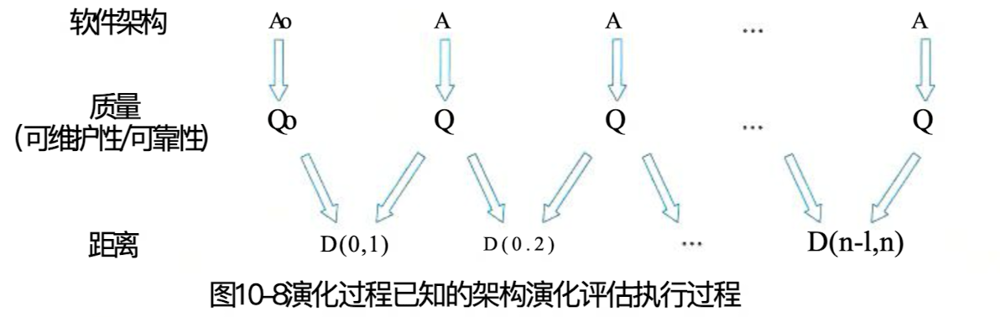
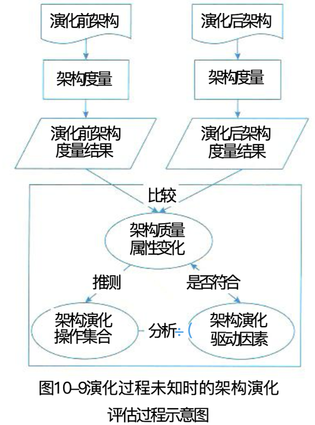

## 软件架构演化评估方法

### 一、演化过程已知的评估

#### (一)、演化过程已知的评估方法内涵

> 演化过程已知的评估其目的在于通过对架构演化过程进行度量，比较架构内部结构上的差异以及由此导致的外部质量属性上的变化，对该演化过程中相关质量属性进行评估。

#### (二)、评估流程、中间版本度量、质量属性距离和演化评估

1. 评估流程
2. 架构演化中间版本度量
3. 架构质量属性距离
4. 架构演化评估

### 二、演化过程未知的评估

#### (一)、演化过程未知的评估方法内涵

> 当演化过程未知时，我们无法像演化过程已知时那样追踪架构在演化过程中的每一步变化，只能更具架构演化强留的度量结果逆向推测出架构发生了哪些改变，并分析这些改变与架构相关质量属性的关联关系。

#### (二)、架构演化的评估过程

