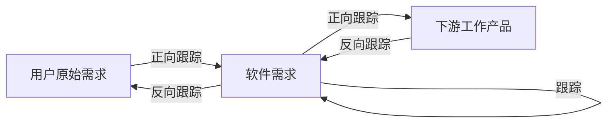
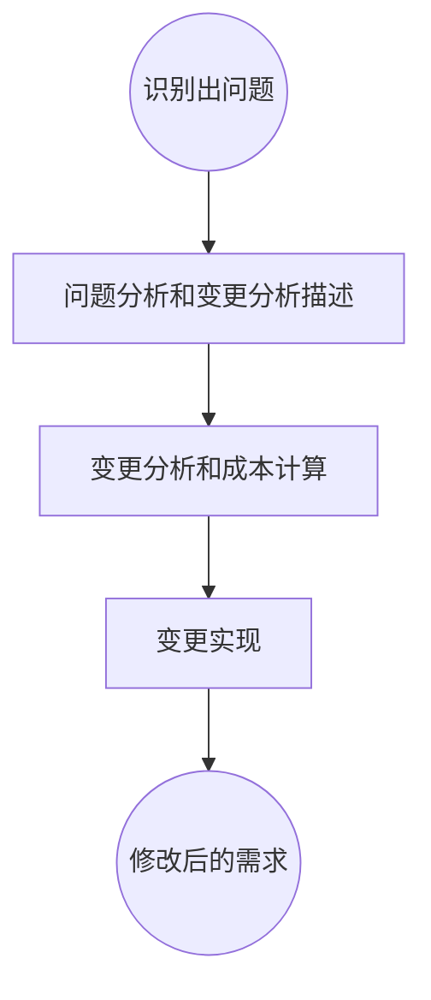

#### UML图
1. 静态图
    - 类图
    - 对象图
    - 构件图
    - 部署图
    - 制品图
    - 包图
    - 组合结构图
2. 动态图
    - 用例图
    - 顺序图
    - 通信图
    - 状态图
    - 活动图
    - 定时图
    - 交互概览图

#### 4+1视图
- 逻辑视图：系统分析人员、设计人员
- 实现视图：程序员
- 进程视图：系统集成人员
- 部署视图：系统和网络工程师
- **用例视图**：最终用户

## 需求工程

### 一、需求开发
#### (一)、需求定义【67】
1. 严格定义法
    - 所有的需求都能够被预先定义
    - 开发人员与用户之间能够准确而清晰的交流
    - 采用图形/文字可以从分体现最终系统
2. 原型法
    - 并非所有的需求都能在开发前被准确的说明
    - 项目参与者之间通常都存在交流上的困难
    - 需要实际的、可供用户参与的系统模型
    - 有合适的系统开发环境
    - 反复是完全需要和值得提倡的，需求一旦确定，就应遵从严格的方法

#### (二)、需求验证【68】

1. 需求评审
2. 需求测试

#### (三)、需求跟踪【69】

#### (四)、需求变更管理过程【70】

### 二、软件系统建模【71】

### 三、人机界面设计【72】

1. 置于用户的控制之下
2. 减少用户的记忆负担
3. 保持界面的一致性