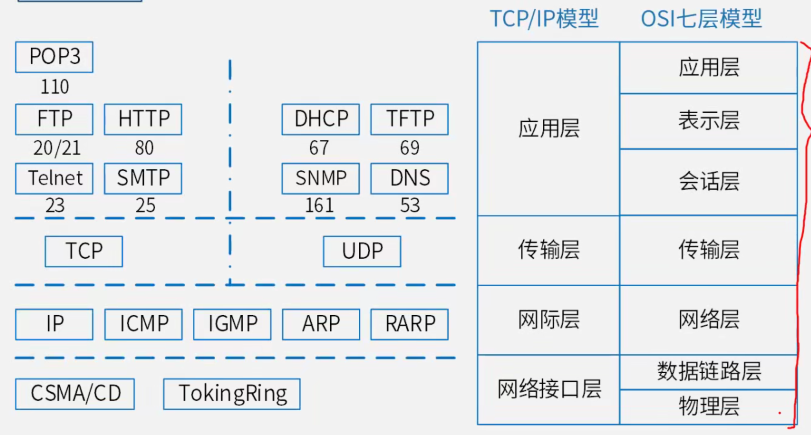

## 计算机网络【288】

- 计算机网络技术概念
  - 计算机网络概述
- 组网技术【重点】
  - OSI 七层协议
  - **TCP/IP 协议**
  - DHCP
  - DNS
- 网络规划与设计
  - 网络冗余设计

## 计算机网络技术概述与计算机网络性能指标【289】

### 计算机网络概述

#### 计算机网络功能

- 数据通信
- 资源共享
- 管理集中化
- 实现分布式处理
- 负载均衡

### 计算机网络性能指标

> 计算机网络性能指标可以从 速率、带宽、吞吐量和时延等不同方面来度量计算机网络性能。

#### 时延

> 网络延迟 = 处理延迟+排队延迟+发送延迟+传播延迟。

> 路由器的发送时延大于交换机。

## 计算机网络技术【290】

#### 按分布范围分：

- 局域网（LAN）
- 城域网（MAN）
- 广域网（WAN）
- 因特网

#### 按拓扑结构分：

- 总线型
- 星型
- 环型
- 树型

### 移动通信技术 - 5G

#### 特征

- 服务化架构
- 网络切片

## OSI 七层模型【291】

| 层次 | 名  称     | 主要功能                   | 主要设备协议                                               |
| ---- | ---------- | -------------------------- | ---------------------------------------------------------- |
| 7    | 应用层     | 实现具体的应用功能         | 【同下】                                                   |
| 6    | 表示层     | 数据格式与表达，加密、压缩 | 【同】POP3、FTP、HTTP、Telnet、SMTP、DHCP、TFTP、SNMP、DNS |
| 5    | 会话层     | 建立、管理和终止会话       | 【同上】                                                   |
| 4    | 传输层     | 端到端的连接               | TCP、UDP                                                   |
| 3    | 网络层     | 分组传输和路由选择         | 三层交换机，路由器。IP、ARP、RARP、ICMP、IGMP              |
| 2    | 数据链路层 | 传送以帧为单位的信息       | 网桥、交换机、网卡。PPTP、L2TP、SLIP、PPP                  |
| 1    | 物理层     | 二进制传输                 | 中继器、集线器                                             |

#### 交换机需要实现的功能如下：

1. 转发路近该学习。更具收到数据中的源 MAC地址建立该地址同交换机端口的映射写入 MAC 地址表中。
2. 数据转发。如果交换机根据数据中的目的 MAC 地址在建立好的MAC 地址表中查询到了，就像对应的端口进行转发。
3. 数据泛洪。如果数据中的目的的 MAC 地址不在 MAC 地址表中，则向所有端口转发也就是泛洪。
4. 链路地址更新。MAC 地址表每隔一定时间更新一次。

> 注：交换机初始状态时地址表为空；交换机重启或手动清空地址表会清空。

## TCP-IP协议组族【292】

- POP3：110 端口，邮件收取
- SMTP：25 端口，邮件发送
- FTP：20 数据端口/21 控制端口，文本传输协议
- HTTP：80 端口，超文本输出协议，网页传输
- DHCP：67 端口，IP 地址自动分配
- SNMP：161 端口，简单网络管理协议
- DNS：53 端口，域名解析协议，记录域名与 IP 的映射关系
- TCP：可靠的传输层协议
- UDP：不可靠的传输层协议
- ICMP：因特网控制协议，PING 命令就来自该协议
- IGMP：组播协议
- ARP：地址解析协议，IP 地址转换 MAC 地址
- RARP：反向地址解析协议，MAC地址转 IP 地址

## TCP-IP协议族习题补充【293】

## DHCP应用服务【294】

> DHCP ： 动态主机配置协议

#### 分配方式

- 固定分配【管理员分配】
- 动态分配【有效期的 IP 地址】
- 自动分配【无限长的 IP 地址】

## DNS服务应用【295】

#### 查询的方式

- 递归查询：服务器必须回答目标 IP 与域名的映射关系。
- 迭代查询：服务器收到一次迭代查询恢复一次结果，这个结果不一定是目标 IP 与域名映射关系，也可以是其他 DNS 服务器的地址。

> - 主机向本地域名服务器的查询采用递归查询
>
> - 本地域名服务器向根域名服务器的查询通常采用迭代查询

#### 浏览器输入域名

#### 主机域名服务器接收到域名请求

## DNS服务应用习题补充【296】

## 网络冗余设计【297】

> 在网络冗余设计中，对于通信线路常见的设计目标主要有两个，一个是备用路径个，一个是负载分担。

## 磁盘阵列Raid【298】

## IPV6【299】

## 网络规划与设计【300】

#### 1. 需求分析

- 确定需求，包括业务需求、用户需求、应用需求、计算机平台需求、网络通信需求等。
- 产物：需求规范

#### 2. 通信规范分析

- 现有的网络体系分析，估计和测量通信量及设备利用率
- 产物：通信规范

#### 3. 逻辑网络设计

- 选择符合需求的设计，确定网络逻辑结构。
- 产物：逻辑设计文档

#### 4. 物理网络设计

- 将逻辑设计应用到物理空间确定网络物理结构。
- 产物：物理结构设计文档

#### 5. 实施阶段

- 实现物理网络设计，安装和维护

## 层次网络设计【301】

- 核心层
- 汇聚层
- 接入层

