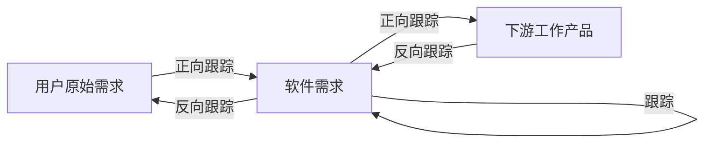
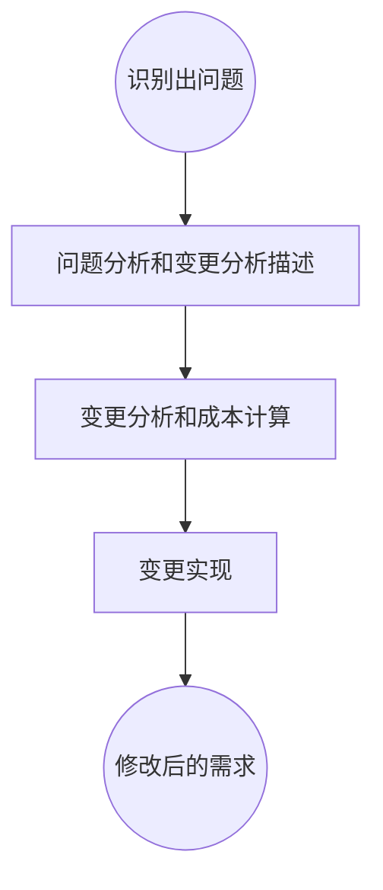
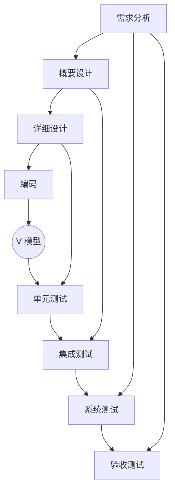

#### UML图
1. 静态图
    - 类图
    - 对象图
    - 构件图
    - 部署图
    - 制品图
    - 包图
    - 组合结构图
2. 动态图
    - 用例图
    - 顺序图
    - 通信图
    - 状态图
    - 活动图
    - 定时图
    - 交互概览图

#### 4+1视图
- 逻辑视图：系统分析人员、设计人员
- 实现视图：程序员
- 进程视图：系统集成人员
- 部署视图：系统和网络工程师
- **用例视图**：最终用户

## 需求工程

### 一、需求开发
#### (一)、需求定义【67】
1. 严格定义法
    - 所有的需求都能够被预先定义
    - 开发人员与用户之间能够准确而清晰的交流
    - 采用图形/文字可以从分体现最终系统
2. 原型法
    - 并非所有的需求都能在开发前被准确的说明
    - 项目参与者之间通常都存在交流上的困难
    - 需要实际的、可供用户参与的系统模型
    - 有合适的系统开发环境
    - 反复是完全需要和值得提倡的，需求一旦确定，就应遵从严格的方法

#### (二)、需求验证【68】

1. 需求评审
2. 需求测试

#### (三)、需求跟踪【69】

#### (四)、需求变更管理过程【70】

### 二、软件系统建模【71】

### 三、人机界面设计【72】

1. 置于用户的控制之下
2. 减少用户的记忆负担
3. 保持界面的一致性

## 结构化设计【73】

1. 概要设计【外部设计】：功能需求分配给软件模块，确定每个模块的功能和调用关系，形成模块结构图。
2. 详细设计【内部设计】：为每个具体任务选择适当的技术手段和处理方法。

> **结构化设计的原则：**
>
> - 模块独立性原则（高内聚、低耦合）
> - 保持模块的大小适中
> - 多扇入，少扇出
> - 深度和宽度都不宜过高

#### 内聚类型【75】

| 内聚类型             | 描述说明                                     |
| -------------------- | -------------------------------------------- |
| 功能内聚             | 完成一个单一功能，各个部分协同工作，缺一不可 |
| 顺序内聚             | 处理元素相关，而且必须顺序执行               |
| 通信内聚             | 所有处理元素集中在一个数据结构的区域上       |
| 过程内聚             | 处理元素相关，而且必须按照特定的次序执行     |
| 时间内聚（瞬时内聚） | 所包含的任务必须在同一个时间间隔内完成       |
| 逻辑内聚             | 完成逻辑上相关的一组任务                     |
| 偶然内聚             | 完成一组没有关系或 松散关系的任务            |

#### 耦合类型【75】

| 耦合类型   | 描述说明                                                     |
| ---------- | ------------------------------------------------------------ |
| 非直接耦合 | 连个模块之间没有直接的关系，他们之间的联系完全是通过主模块的控制和调用来实现的。 |
| 数据耦合   | 一组模块借助参数表传递简单数据                               |
| 标记耦合   | 一组模块通过参数表传递记录信息（数据结构）                   |
| 控制耦合   | 模块之间传递的信息中包含用于控制模块内部逻辑的信息           |
| 外部耦合   | 一组模块都访问同一全局简单变量，而且不是通过参数表传递该全局变量的信息。 |
| 公共耦合   | 多个模块都访问同一个公共数据环境                             |
| 内容耦合   | 一个模块直接访问另一个模块的内部数据；一个模块不通过正常入口转到另一个模块的内部；两个模块有一部分程序代码重叠；一个模块有多个入口 |

#### 模块的四要素【76】

1. **输入和输出**：模块的输入来源和输出去向都是同一个调用者，即一个模块从调用者那儿取得输入，进行加工后再把输出返回给调用者。
2. **处理功能**：指模块把输入转换成输出所做的工作。
3. **内部数据**：指仅供该模块本身应用的数据。
4. **程序代码**：指用来实现模块功能的程序。

## 面向对象设计

#### 基本过程【77】

#### 类的分类【78】

- 边界类

  > - 机器接口（API 接口）
  > - 人机交互（用户界面）

- 控制类

  > - 应用逻辑
  > - 业务逻辑
  > - 数据访问逻辑

- 实体类

  > 数据

#### 设计原则【79】

- **单一职责原则：**设计目的单一的类
- **开闭原则：**对扩展开放，对修改关闭
- **里氏替换原则：**子类可以替换父类
- **依赖倒置原则：**要依赖于抽象，而不是具体的实现；针对接口编程，不要针对实现编程。
- **接口隔离原则：**使用多个专门的接口比使用单一的总接口要好。
- **组合重用原则**：要尽量使用组合，而不是继承关系达到重用的目的。
- **迪米特原则（最少知识原则）：**一个对象应当对其他对象有尽可能少的了解。

## 软件测试类型【80】

1. **动态测试**：计算机运行
   - 白盒测试
   - 黑盒测试
   - 灰盒测试
2. **静态测试**：人工检测和计算机辅助分析
   - 桌前检查
   - 代码审查
   - 代码走查

> **静态测试都是做的静态分析**
>
> - 控制流分析
> - 数据流分析
> - 接口分析
> - 表达式分析

#### 白盒测试与黑盒测试【81】

1. 白盒测试【结构测试】：主要用于单元测试阶段

   > - 控制流测试【逻辑覆盖测试（语句覆盖最弱，路径测试覆盖最强）】
   > - 数据流测试
   > - 程序变异测试【错误驱动测试】

2. 黑盒测试【功能测试】：主要用于集成测试、确认测试和系统测试阶段

   > - 等价类划分：不同等价类，揭示不同问题；有效等价类/无效等价类。
   >
   > - 边界值分析：1<= x <= 10,可取 x 的值为 0、1、10和 11 作为测试数据。
   > - 错误推测：依靠测试人员的经验和直觉
   > - 判定表
   > - 因果图

#### 动态测试和静态测试习题讲解【82，83】

## 软件测试阶段【84】

> 这个是一个 V 模型
>
> **测试阶段**：
>
> - 单元测试：一句【详细设计】，模块测试，模块功能、性能、接口等
> - 集成测试：一句【概要设计】，模块之间的功能
> - 系统测试：依据【需求文档】，在真实的环境下，验证完整的软件配置项能否和系统正确连接
> - 确认测试：依据【需求文档】，验证软件与需求的一致性。内部确认测试，alpha 测试、Beta 测试、验收测试（和用户一块进行测试）

> 回归测试：测试软件变更之后，变更部分的正确性和对变更需求的符合性进行的测试。

#### 集成测试的策略【85】

#### 软件系统测试【86】

- **功能测试**
- **性能测试**
  - 负载测试：各种工作负载下的系统性能
  - 压力测试【测上限】：系统的瓶颈或不能接受的性能点
  - 强度测试【测下限】：系统资源特别低的情况下运行
  - 容量测试【并发测试】：同时在线的最大用户数
  - 可靠性测试：MTTF 之类的参数
- 健壮性测试
- 用户界面测试
- 安全性测试
- 安装与反安装测试

#### 单元测试习题【87】

#### 性能测试习题【88】

## 遗留系统处置策略【89】

> 从技术水平和业务价值上来区分系统，以及各种系统的改造方式

1. 高水平、低价值 【集成】（信息孤岛）
2. 高水平、高价值 【改造】
3. 低水平、低价值 【淘汰】
4. 低水平、高价值 【继承】

## 新老系统的转换问题【90】

- 直接转换策略
- 并行转换策略
- 分段转换策略

## 系统数据迁移【91】

## 软件维护【影响可维护性的因素】【92】

- 可理解性
- 可修改性
- 可测试性
- 可靠性
- 可移植性

## 软件维护类型【93】

- 正确性维护【修bug】：识别和纠正软件错误/缺陷，测试不可能发现所有错误。
- 适应性维护【应变】：指使应用软件适应环境变化【外部环境、数据环境】而进行修改。
- 完善性维护【新需求】：扩充功能和改善性能而进行的修改。
- 预防性维护【正对未来】：为了适应未来的软硬件环境变化，应主动增加预防性的新的功能。

## 软件维护习题讲解【94】

